<div class="cover-shell">
  <div class="eyebrow">Slidev deck · based on <code>docs/en</code> + <code>web</code> visual system</div>
  
  # Learn Claude Code
  
  <div class="hero-sub">
    从 <strong>The Agent Loop</strong> 到 <strong>MCP &amp; Plugin</strong>：
    用一套按章节展开的课程 slides，把单代理内核、生产级加固、任务运行时、再到多代理平台讲完整。
  </div>

  <div class="metric-grid">
    <div class="metric-card">
      <div class="metric-label">Deck Scope</div>
      <div class="metric-value">19</div>
      <p>覆盖 <code>s01</code> 到 <code>s19</code>，严格按教程顺序推进。</p>
    </div>
    <div class="metric-card">
      <div class="metric-label">Teaching Lens</div>
      <div class="metric-value">4x</div>
      <p>每章都看 <strong>问题</strong>、<strong>机制</strong>、<strong>代码变化</strong>、<strong>下一步</strong>。</p>
    </div>
    <div class="metric-card">
      <div class="metric-label">Visual Reference</div>
      <div class="metric-value">Web</div>
      <p>沿用现有站点的蓝 / 绿 / 橙分层配色、卡片感和深色代码面板。</p>
    </div>
  </div>

  <div class="badge-row">
    <span class="layer-chip core">Core Single-Agent</span>
    <span class="layer-chip hardening">Production Hardening</span>
    <span class="layer-chip runtime">Task Runtime</span>
    <span class="layer-chip platform">Multi-Agent Platform</span>
  </div>
</div>

---
layout: two-cols-header
---

## 怎么读这套课件

::left::

<div class="surface tight-list">
  <div class="kicker">Reading Pattern</div>
  <v-clicks>

  - 先看 **这一章解决了什么痛点**，避免只记 API 和名词。
  - 再看 **新增了哪一层结构**，例如 `dispatch map`、`TodoManager`、`TaskManager`。
  - 然后看 **代码里真正新增的核心几行**，不是把整份实现照搬。
  - 最后看 **这一章如何自然长到下一章**，理解课程递进关系。

  </v-clicks>

  <div class="takeaway">
    <strong>主线不是不断重写 Agent。</strong> 而是在同一个 loop 外面，一层一层外挂能力。
  </div>
</div>

::right::

<div class="surface">
  <div class="kicker">What the deck emphasizes</div>
  <ul class="no-bullets">
    <li><strong>概念层</strong>：为什么这个机制存在</li>
    <li><strong>控制层</strong>：它插在 query / tool / prompt 的哪一段</li>
    <li><strong>实现层</strong>：真正改变了哪段代码路径</li>
    <li><strong>教学层</strong>：这一章最容易混淆的边界是什么</li>
  </ul>
  <div class="hr-soft"></div>
  <div class="small">
    源内容来自 `learn-claude-code/docs/en`，
    视觉语言参考 `web/src/app/globals.css` 与 `web/src/lib/constants.ts`。
  </div>
  <div class="badge-row">
    <span class="ghost-chip">流程图</span>
    <span class="ghost-chip">代码高亮</span>
    <span class="ghost-chip">点击渐进展示</span>
    <span class="ghost-chip">章节分段总结</span>
  </div>
</div>

---
layout: default
---

## 课程地图：这 19 章到底在长什么

<div class="stage-grid" style="grid-template-columns: repeat(4, minmax(0, 1fr));">
  <div class="stage-card core">
    <div class="layer-chip core">Stage 1 · Core</div>
    <h3>单代理内核</h3>
    <p><code>s01-s06</code></p>
    <ul class="dense-list">
      <li><code>s01</code> loop 闭环</li>
      <li><code>s02</code> 工具调度与沙箱</li>
      <li><code>s03</code> session 计划</li>
      <li><code>s04</code> 子代理隔离上下文</li>
      <li><code>s05</code> skill 按需加载</li>
      <li><code>s06</code> 长会话压缩</li>
    </ul>
  </div>
  <div class="stage-card hardening">
    <div class="layer-chip hardening">Stage 2 · Hardening</div>
    <h3>治理与工程化</h3>
    <p><code>s07-s11</code></p>
    <ul class="dense-list">
      <li><code>s07</code> permission pipeline</li>
      <li><code>s08</code> hooks 扩展点</li>
      <li><code>s09</code> durable memory</li>
      <li><code>s10</code> prompt assembly</li>
      <li><code>s11</code> recovery branches</li>
    </ul>
  </div>
  <div class="stage-card runtime">
    <div class="layer-chip runtime">Stage 3 · Runtime</div>
    <h3>任务运行时</h3>
    <p><code>s12-s14</code></p>
    <ul class="dense-list">
      <li><code>s12</code> task graph (DAG)</li>
      <li><code>s13</code> background threads</li>
      <li><code>s14</code> cron scheduler</li>
    </ul>
  </div>
  <div class="stage-card future">
    <div class="layer-chip platform">Stage 4 · Platform</div>
    <h3>多代理平台</h3>
    <p><code>s15-s19</code></p>
    <ul class="dense-list">
      <li><code>s15</code> agent teams</li>
      <li><code>s16</code> team protocols</li>
      <li><code>s17</code> autonomous agents</li>
      <li><code>s18</code> worktree isolation</li>
      <li><code>s19</code> MCP &amp; plugin</li>
    </ul>
  </div>
</div>

<div class="slide-caption">
  站点的四层颜色体系：蓝色 core、绿色 hardening、橙色 runtime、红色 platform。本 deck 完整覆盖 <code>s01-s19</code>。
</div>

---
layout: section
class: section-core
---

<div class="section-hero">
  <div class="layer-chip core">Core Single-Agent · s01-s06</div>
  
  # Stage 1 · 先把 Agent 内核搭起来
  
  <div class="section-subtitle">
    这一段的目标不是"功能很多"，而是让 Agent 具备一个能长期工作的最小 kernel：
    <strong>会循环、会调工具、会规划、会上下文隔离、会按需加载知识、会压缩上下文</strong>。
  </div>

  <div class="badge-row">
    <span class="ghost-chip">messages[] 累积</span>
    <span class="ghost-chip">tool_result write-back</span>
    <span class="ghost-chip">context boundary</span>
    <span class="ghost-chip">prompt token economy</span>
  </div>
</div>

---
layout: two-cols-header
---

## s01 · The Agent Loop

::left::

<div class="surface tight-list">
  <div class="chapter-pill core">Minimal Closed Loop</div>
  <h3>这一章回答的核心问题</h3>
  <v-clicks>

  - 没有 loop 时，**人类就是 loop**：模型说一句，你执行一次，再把结果贴回去。
  - 一旦任务需要 10 次、20 次工具调用，人工中转马上崩掉。
  - 最小解法非常朴素：**模型请求工具 → harness 执行 → 结果回写 → 再问模型**。
  - 关键不是 while 语法，而是 **write-back**：工具结果必须重新进入 `messages[]`。

  </v-clicks>

  <div class="takeaway">
    <strong>Key insight</strong>：An agent is just a loop.
  </div>
</div>

::right::

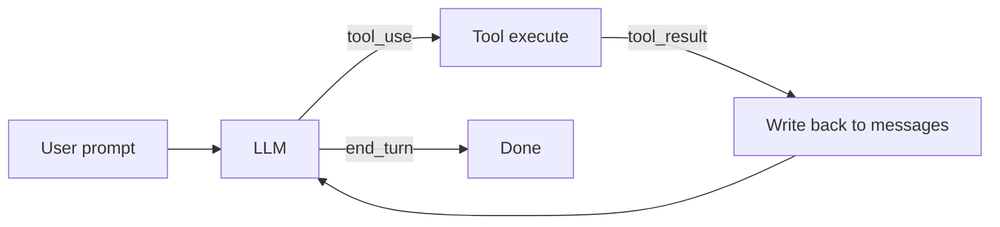

<div class="code-note small">
  <strong>本章新增对象：</strong> `messages`、`stop_reason`、`tool_use` / `tool_result`。
</div>

---
layout: two-cols-header
---

## s01 · 核心变化代码：把结果写回去

::left::

<div class="surface tight-list">
  <h3>看代码时只盯三件事</h3>
  <ul class="dense-list">
    <li><strong>入口</strong>：用户 query 先进入 `messages`</li>
    <li><strong>分叉</strong>：`stop_reason != "tool_use"` 就结束</li>
    <li><strong>闭环</strong>：工具执行结果再 append 回 `messages`</li>
  </ul>
  <div class="code-note">
    这 20 多行就是整门课的地基，后面章节几乎都在它外面加层，而不是推翻它。
  </div>
  <div class="chapter-source">Run it: <span class="command-pill">python agents/s01_agent_loop.py</span></div>
</div>

::right::

```python {1-3|4-8|10-11|13-22|all}
def agent_loop(query):
    messages = [{"role": "user", "content": query}]
    while True:
        response = client.messages.create(
            model=MODEL,
            system=SYSTEM,
            messages=messages,
            tools=TOOLS,
        )
        messages.append({"role": "assistant", "content": response.content})

        if response.stop_reason != "tool_use":
            return

        results = []
        for block in response.content:
            if block.type == "tool_use":
                output = run_bash(block.input["command"])
                results.append({
                    "type": "tool_result",
                    "tool_use_id": block.id,
                    "content": output,
                })
        messages.append({"role": "user", "content": results})
```

---
layout: two-cols-header
---

## s02 · Tool Use

::left::

<div class="surface tight-list">
  <div class="chapter-pill core">Route Intent into Action</div>
  <h3>为什么不能只靠 bash</h3>
  <v-clicks>

  - `cat`、`sed`、shell quoting 都很脆，长输出也容易炸上下文。
  - 更严重的是：没有边界，模型可以乱读文件、乱写路径、乱执行命令。
  - 需要把"工具"从 bash 字符串，升级成 **有 schema、有 handler、有路径沙箱** 的控制面。
  - 关键新增物是 **dispatch map**：loop 不需要知道每个工具怎么实现。

  </v-clicks>

  <div class="takeaway">
    <strong>Key insight</strong>：Adding a tool means adding one handler. The loop never changes.
  </div>
</div>

::right::

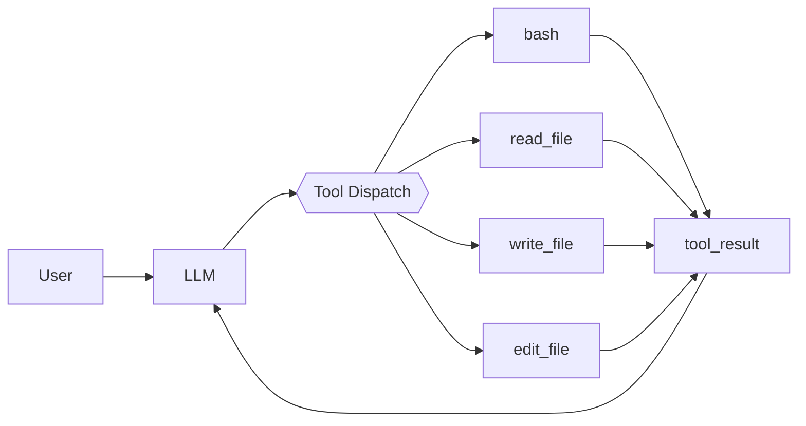

<div class="code-note small">
  这一章真正引入的是：<strong>工具路由层</strong> 和 <strong>路径安全边界</strong>。
</div>

---
layout: two-cols-header
---

## s02 · 核心变化代码：`safe_path()` + `TOOL_HANDLERS`

::left::

<div class="surface tight-list">
  <h3>代码里新增了哪两层</h3>
  <ul class="dense-list">
    <li><strong>路径沙箱</strong>：所有文件 I/O 先过 `safe_path()`</li>
    <li><strong>统一调度</strong>：`tool name -> handler`，替代 if/elif 链</li>
  </ul>
  <div class="code-note">
    这就是教程一直强调的"保持 loop 形状不变"：新增能力时，尽量把变化限制在 loop 外侧。
  </div>
  <div class="chapter-source">Run it: <span class="command-pill">python agents/s02_tool_use.py</span></div>
</div>

::right::

```python {1-5|7-12|14-19|all}
def safe_path(p: str) -> Path:
    path = (WORKDIR / p).resolve()
    if not path.is_relative_to(WORKDIR):
        raise ValueError(f"Path escapes workspace: {p}")
    return path

TOOL_HANDLERS = {
    "bash": lambda **kw: run_bash(kw["command"]),
    "read_file": lambda **kw: run_read(kw["path"], kw.get("limit")),
    "write_file": lambda **kw: run_write(kw["path"], kw["content"]),
    "edit_file": lambda **kw: run_edit(kw["path"], kw["old_text"], kw["new_text"]),
}

handler = TOOL_HANDLERS.get(block.name)
output = handler(**block.input) if handler else f"Unknown tool: {block.name}"
results.append({"type": "tool_result", "tool_use_id": block.id, "content": output})
```

---
layout: two-cols-header
---

## s03 · TodoWrite

::left::

<div class="surface tight-list">
  <div class="chapter-pill core">Session Planning</div>
  <h3>为什么复杂任务会漂移</h3>
  <v-clicks>

  - 多步任务不是"模型笨"，而是 **working memory 会被工具输出淹没**。
  - 任务做到一半，模型看不见前面的计划，就会跳步、重复、即兴发挥。
  - 解法不是让 prompt 更长，而是给它一个 **结构化 checklist 状态**。
  - 再加一个轻量 nag：几轮不更新 plan，就注入 `<reminder>`。

  </v-clicks>

  <div class="takeaway">
    <strong>Key insight</strong>：结构化状态比自由文本计划更抗漂移。
  </div>
</div>

::right::

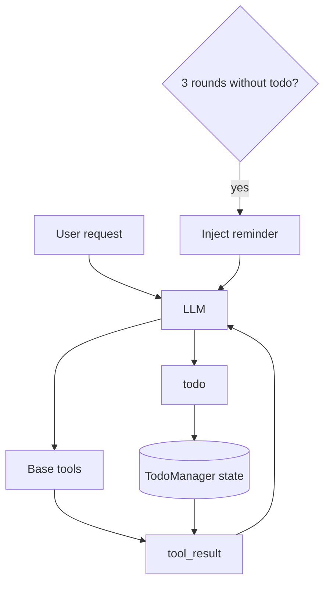

---
layout: two-cols-header
---

## s03 · 核心变化代码：状态化 checklist + nag injection

::left::

<div class="surface tight-list">
  <h3>本章新增的约束</h3>
  <ul class="dense-list">
    <li>同一时刻只允许 <code>1</code> 个 <code>in_progress</code></li>
    <li><code>todo</code> 只是当前会话计划，不是长期任务数据库</li>
    <li>提醒通过 <strong>write-back</strong> 技巧注入，而不是另起机制</li>
  </ul>
  <div class="chapter-source">Run it: <span class="command-pill">python agents/s03_todo_write.py</span></div>
</div>

::right::

```python {1-7|9-12|14-19|all}
class TodoManager:
    def update(self, items: list) -> str:
        validated, in_progress_count = [], 0
        for item in items:
            status = item.get("status", "pending")
            if status == "in_progress":
                in_progress_count += 1
        if in_progress_count > 1:
            raise ValueError("Only one task can be in_progress")
        self.items = items
        return self.render()

TOOL_HANDLERS = {
    "todo": lambda **kw: TODO.update(kw["items"]),
}

if rounds_since_todo >= 3:
    results.insert(0, {
        "type": "text",
        "text": "<reminder>Update your todos.</reminder>",
    })
messages.append({"role": "user", "content": results})
```

---
layout: two-cols-header
---

## s04 · Subagent

::left::

<div class="surface tight-list">
  <div class="chapter-pill core">Fresh Context per Subtask</div>
  <h3>为什么需要子代理</h3>
  <v-clicks>

  - 侧向探索很脏：为了回答"测试框架是什么"，父代理可能读 5 个文件。
  - 但父代理真正只需要一句答案：`pytest`。
  - 子代理的本质不是并发，而是 **context boundary**。
  - 子代理拿全新 `messages=[]`，做完只把摘要带回来，其余历史直接丢弃。

  </v-clicks>

  <div class="takeaway">
    <strong>Key insight</strong>：A subagent is a disposable scratch pad.
  </div>
</div>

::right::

```mermaid
flowchart LR
  subgraph Parent agent
    P1[messages = [...]] --> P2[task tool]
    P2 --> P3[summary result only]
  end
  subgraph Child subagent
    C1[messages = []] --> C2[read/search/explore]
    C2 --> C3[final text summary]
  end
  P2 --> C1
  C3 --> P3
```

---
layout: two-cols-header
---

## s04 · 核心变化代码：`task` 只在父级出现

::left::

<div class="surface tight-list">
  <h3>实现时要守住的边界</h3>
  <ul class="dense-list">
    <li>父级有 <code>task</code>，子级没有，避免递归繁殖</li>
    <li>子代理完整跑自己的 loop</li>
    <li>父级只拿到最终文本摘要，拿不到子级历史</li>
  </ul>
  <div class="chapter-source">Run it: <span class="command-pill">python agents/s04_subagent.py</span></div>
</div>

::right::

```python {1-8|10-18|20-24|all}
PARENT_TOOLS = CHILD_TOOLS + [{
    "name": "task",
    "description": "Spawn a subagent with fresh context.",
    "input_schema": {
        "type": "object",
        "properties": {"prompt": {"type": "string"}},
        "required": ["prompt"],
    }
}]

def run_subagent(prompt: str) -> str:
    sub_messages = [{"role": "user", "content": prompt}]
    for _ in range(30):
        response = client.messages.create(
            model=MODEL,
            system=SUBAGENT_SYSTEM,
            messages=sub_messages,
            tools=CHILD_TOOLS,
        )
        # ... execute child tool calls ...

    return "".join(
        b.text for b in response.content if hasattr(b, "text")
    ) or "(no summary)"
```

---
layout: two-cols-header
---

## s05 · Skills

::left::

<div class="surface tight-list">
  <div class="chapter-pill core">Discover Cheap, Load Deep</div>
  <h3>为什么不能把所有领域知识塞进 system prompt</h3>
  <v-clicks>

  - 10 个 skill × 2000 tokens = 每一轮都在重读大段无关说明。
  - 真正需要的是两层：**便宜的目录** + **昂贵的正文**。
  - 第一层常驻系统提示，只放 skill 名称和一句描述。
  - 第二层通过工具按需加载：模型自己决定何时取正文。

  </v-clicks>

  <div class="takeaway">
    <strong>Key insight</strong>：Advertise cheaply, load on demand.
  </div>
</div>

::right::

```mermaid
flowchart TD
  A[System prompt] --> B[Skill names + descriptions]
  B --> M[Model decides]
  M -->|load_skill("git")| T[Tool call]
  T --> F[Full SKILL.md body]
  F --> M
```

<div class="code-note small">
  Skill 文件的最小单元是：<code>skills/&lt;name&gt;/SKILL.md</code> + YAML frontmatter。
</div>

---
layout: two-cols-header
---

## s05 · 核心变化代码：`SkillLoader` 的两层读取

::left::

<div class="surface tight-list">
  <h3>这里最值得记住的接口</h3>
  <ul class="dense-list">
    <li><code>get_descriptions()</code>：给 system prompt 的便宜目录</li>
    <li><code>get_content(name)</code>：通过工具回传的昂贵正文</li>
    <li><code>SKILL.md</code>：frontmatter 负责可发现性，body 负责真正 SOP</li>
  </ul>
  <div class="chapter-source">Run it: <span class="command-pill">python agents/s05_skill_loading.py</span></div>
</div>

::right::

```python {1-9|11-17|19-24|all}
class SkillLoader:
    def __init__(self, skills_dir: Path):
        self.skills = {}
        for f in sorted(skills_dir.rglob("SKILL.md")):
            text = f.read_text()
            meta, body = self._parse_frontmatter(text)
            name = meta.get("name", f.parent.name)
            self.skills[name] = {"meta": meta, "body": body}

    def get_descriptions(self) -> str:
        lines = []
        for name, skill in self.skills.items():
            desc = skill["meta"].get("description", "")
            lines.append(f"  - {name}: {desc}")
        return "\n".join(lines)

    def get_content(self, name: str) -> str:
        skill = self.skills.get(name)
        return f"<skill name=\"{name}\">\n{skill['body']}\n</skill>"

SYSTEM = f"Skills available:\n{SKILL_LOADER.get_descriptions()}"
```

---
layout: two-cols-header
---

## s06 · Context Compact

::left::

<div class="surface tight-list">
  <div class="chapter-pill core">Keep the Active Context Small</div>
  <h3>长会话为什么必然撞上下文墙</h3>
  <v-clicks>

  - conversation 里的每条消息都会在后续 API 调用里被重新携带。
  - 真正的大头通常不是用户文本，而是 <code>read_file</code> 和命令输出。
  - 粗暴截断会丢信息，所以要分层压缩，而不是一刀切删除。
  - 本章给了四个 lever：越往后越重，但也越能保命。

  </v-clicks>

  <div class="takeaway">
    <strong>Key insight</strong>：Compaction is relocating detail, not deleting history.
  </div>
</div>

::right::

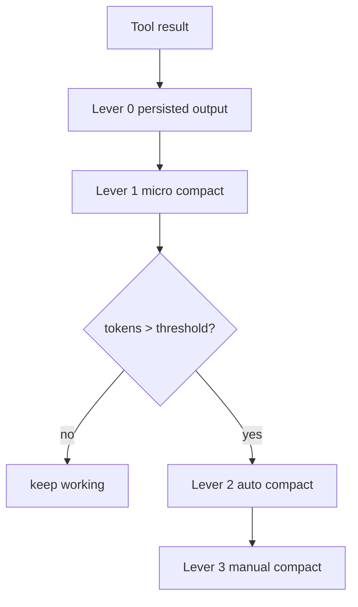

<div class="code-note small">
  教学上最重要的是把四层分开：<strong>结果落盘</strong>、<strong>静默缩旧结果</strong>、<strong>阈值自动总结</strong>、<strong>显式 compact</strong>。
</div>

---
layout: two-cols-header
---

## s06 · 核心变化代码：把压缩接进主循环

::left::

<div class="surface tight-list small">
  <h3>四个 lever 对应什么职责</h3>
  <ul class="dense-list">
    <li><strong>Lever 0</strong>：超大输出直接写磁盘，消息里只留预览</li>
    <li><strong>Lever 1</strong>：老旧 <code>tool_result</code> 变成短 placeholder</li>
    <li><strong>Lever 2</strong>：token 超阈值时让 LLM 总结整段会话</li>
    <li><strong>Lever 3</strong>：模型或用户显式调用 <code>compact</code></li>
  </ul>
  <div class="chapter-source">Run it: <span class="command-pill">python agents/s06_context_compact.py</span></div>
</div>

::right::

```python {1-3|4-5|6-7|all}
def agent_loop(messages: list):
    while True:
        micro_compact(messages)                 # Lever 1
        if estimate_tokens(messages) > THRESHOLD:
            messages[:] = auto_compact(messages)  # Lever 2
        response = client.messages.create(...)
        # ... tool execution with persisted output ... # Lever 0
        if manual_compact:
            messages[:] = auto_compact(messages)  # Lever 3
```

<div class="code-note small">
  <strong>重点不是函数名。</strong> 重点是：压缩被接成一条"持续运行的控制路径"，而不是出事后临时补救。
</div>

---
layout: default
---

## Stage 1 小结：一个可工作的单代理 kernel 已经成形

<div class="summary-grid">
  <div class="summary-card core">
    <h3><code>s01-s02</code> 先把闭环和工具路由搭出来</h3>
    <p>你已经有了最小 loop、可扩展工具调度、文件沙箱和 write-back。</p>
  </div>
  <div class="summary-card core">
    <h3><code>s03-s04</code> 再解决"任务漂移"和"上下文脏"</h3>
    <p>TodoWrite 负责当前会话计划，Subagent 负责把探索垃圾挡在父上下文之外。</p>
  </div>
  <div class="summary-card core">
    <h3><code>s05-s06</code> 最后控制 prompt 体积</h3>
    <p>Skill 把知识按需装载，Compact 把长会话从必死改成可持续运行。</p>
  </div>
  <div class="summary-card core">
    <h3>一句话</h3>
    <p><strong>会循环</strong> → <strong>会调工具</strong> → <strong>会计划</strong> → <strong>会隔离</strong> → <strong>会控制 prompt 体积</strong>。</p>
  </div>
</div>

<div class="center-note">
  下一段开始，不再只是"能跑"，而是让这个 kernel 变得 <strong>受控、可扩展、可记忆、可恢复</strong>。
</div>

---
layout: section
class: section-hardening
---

<div class="section-hero">
  <div class="layer-chip hardening">Production Hardening · s07-s11</div>
  
  # Stage 2 · 把内核加固到更像真实 harness
  
  <div class="section-subtitle">
    这一段处理的是"真实世界的麻烦事"：权限、安全、可扩展性、跨会话记忆、复杂 prompt 组装、以及运行时失败恢复。
  </div>

  <div class="badge-row">
    <span class="ghost-chip">safety pipeline</span>
    <span class="ghost-chip">external hooks</span>
    <span class="ghost-chip">durable memory</span>
    <span class="ghost-chip">prompt assembly</span>
    <span class="ghost-chip">recovery branches</span>
  </div>
</div>

---
layout: two-cols-header
---

## s07 · Permission System

::left::

<div class="surface tight-list">
  <div class="chapter-pill hardening">Intent Must Pass Safety</div>
  <h3>为什么这章很关键</h3>
  <v-clicks>

  - 到了这里，Agent 已经能写文件、跑命令、持久工作了。
  - 如果模型提什么就执行什么，那"智能"会立刻变成"风险"。
  - 需要在 <strong>model intent</strong> 和 <strong>actual execution</strong> 之间插一条权限流水线。
  - 这条 pipeline 的核心不是 yes/no，而是：**deny → mode → allow → ask**。

  </v-clicks>

  <div class="takeaway hardening">
    <strong>Key insight</strong>：Safety is a pipeline, not a boolean.
  </div>
</div>

::right::

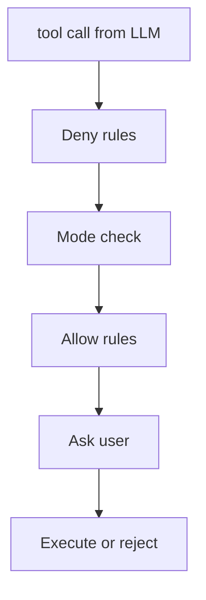

<div class="code-note small">
  `default / plan / auto` 三种模式决定 unmatched 请求默认怎么走。
</div>

---
layout: two-cols-header
---

## s07 · 核心变化代码：四段权限决策

::left::

<div class="surface tight-list small">
  <h3>看懂这段逻辑就够了</h3>
  <ul class="dense-list">
    <li><strong>deny first</strong>：危险规则永远最高优先级</li>
    <li><strong>mode second</strong>：例如 plan 模式屏蔽写操作</li>
    <li><strong>allow third</strong>：白名单放行安全操作</li>
    <li><strong>ask last</strong>：剩下的交给用户</li>
  </ul>
  <div class="chapter-source">Run it: <span class="command-pill">python agents/s07_permission_system.py</span></div>
</div>

::right::

```python {1-5|7-11|13-17|19-24|all}
def check(self, tool_name, tool_input):
    for rule in self.rules:
        if rule["behavior"] == "deny" and self._matches(rule, ...):
            return {"behavior": "deny", "reason": "..."}

    if self.mode == "plan" and tool_name in WRITE_TOOLS:
        return {"behavior": "deny", "reason": "Plan mode: writes blocked"}
    if self.mode == "auto" and tool_name in READ_ONLY_TOOLS:
        return {"behavior": "allow", "reason": "Auto: read-only approved"}

    for rule in self.rules:
        if rule["behavior"] == "allow" and self._matches(rule, ...):
            return {"behavior": "allow", "reason": "..."}

    return {"behavior": "ask", "reason": "..."}

if decision["behavior"] == "deny":
    output = f"Permission denied: {decision['reason']}"
elif decision["behavior"] == "ask":
    output = handler(**block.input) if perms.ask_user(block.name, block.input) else "Permission denied by user"
```

---
layout: two-cols-header
---

## s08 · Hook System

::left::

<div class="surface tight-list">
  <div class="chapter-pill hardening">Extend Without Rewriting the Loop</div>
  <h3>本章解决的不是权限，而是扩展性</h3>
  <v-clicks>

  - 你可能想在工具前后做审计、lint、告警、注释注入。
  - 如果全写进主循环，loop 很快会被 if/else 污染到不可维护。
  - Hook 的思路是：给 loop 暴露固定生命周期点，让外部脚本在这些点观察或干预。
  - 主循环仍然掌控控制流，hook 只做 <strong>observe / block / annotate</strong>。

  </v-clicks>
</div>

::right::

<div class="surface small">

| Event | When | Can Block? |
|---|---|---|
| `SessionStart` | 启动时一次 | No |
| `PreToolUse` | 工具执行前 | Yes |
| `PostToolUse` | 工具执行后 | No |

<div class="hr-soft"></div>

| Exit code | Meaning |
|---|---|
| `0` | continue |
| `1` | block |
| `2` | inject / annotate |

<div class="takeaway hardening">
  <strong>Key insight</strong>：The loop owns control flow; hooks only observe, block, or annotate.
</div>
</div>

---
layout: two-cols-header
---

## s08 · 核心变化代码：配置在外、协议在内

::left::

<div class="surface tight-list small">
  <h3>实现边界</h3>
  <ul class="dense-list">
    <li><code>.hooks.json</code> 是外部配置，不进核心 loop 代码</li>
    <li>上下文通过环境变量传给 hook</li>
    <li><code>PreToolUse</code> 唯一可以挡住执行</li>
  </ul>
  <div class="chapter-source">Run it: <span class="command-pill">python agents/s08_hook_system.py</span></div>
</div>

::right::

```python {1-8|10-14|16-20|all}
{
  "hooks": {
    "PreToolUse": [
      {"matcher": "bash", "command": "echo 'Checking bash command...'"}
    ],
    "PostToolUse": [
      {"command": "echo 'Tool finished'"}
    ]
  }
}

pre_result = hooks.run_hooks("PreToolUse", ctx)
if pre_result["blocked"]:
    output = f"Blocked by hook: {pre_result['block_reason']}"
    continue

output = handler(**tool_input)
post_result = hooks.run_hooks("PostToolUse", ctx)
for msg in post_result["messages"]:
    output += f"\n[Hook note]: {msg}"
```

---
layout: two-cols-header
---

## s09 · Memory System

::left::

<div class="surface tight-list">
  <div class="chapter-pill hardening">Keep Only What Survives Sessions</div>
  <h3>"记忆"最容易教错的地方</h3>
  <v-clicks>

  - memory 不是更长的 context，也不是 repo 的复制品。
  - 它只存 **跨会话仍然重要、且不能从当前代码便宜重建** 的事实。
  - 课程把 memory 划成 4 类：`user` / `feedback` / `project` / `reference`。
  - 最重要的教学边界：memory ≠ task ≠ plan ≠ `CLAUDE.md`。

  </v-clicks>

  <div class="takeaway hardening">
    <strong>Key insight</strong>：Memory gives direction; current observation gives truth.
  </div>
</div>

::right::

<div class="card-grid cols-2 small">
  <div class="mini-panel"><strong>user</strong><br>稳定偏好，例如喜欢 `pnpm`</div>
  <div class="mini-panel"><strong>feedback</strong><br>反复强调的纠正，例如别改 snapshot</div>
  <div class="mini-panel"><strong>project</strong><br>repo 外部的长期项目事实</div>
  <div class="mini-panel"><strong>reference</strong><br>外部链接、面板、规范入口</div>
</div>

<div class="code-note small">
  <strong>不要存</strong>：函数签名、目录树、当前任务进度、临时分支名、任何 secret。
</div>

---
layout: two-cols-header
---

## s09 · 核心变化代码：frontmatter memory record

::left::

<div class="surface tight-list small">
  <h3>为什么用"一条记录一个文件"</h3>
  <ul class="dense-list">
    <li>好读、好删、好审计</li>
    <li>frontmatter 让记录可索引、可分类</li>
    <li>index 只负责"知道有哪些"，不负责承载正文</li>
  </ul>
  <div class="chapter-source">Run it: <span class="command-pill">python agents/s09_memory_system.py</span></div>
</div>

::right::

```md {1-5|6|all}
---
name: prefer_pnpm
description: User prefers pnpm over npm
type: user
---
The user explicitly prefers pnpm for package management commands.
```

```python {1-4|5-7|all}
def save_memory(name, description, mem_type, content):
    path = memory_dir / f"{slugify(name)}.md"
    path.write_text(render_frontmatter(name, description, mem_type) + content)
    rebuild_index()

MEMORY_TYPES = ("user", "feedback", "project", "reference")
memories = memory_store.load_all()
```

---
layout: two-cols-header
---

## s10 · System Prompt

::left::

<div class="surface tight-list">
  <div class="chapter-pill hardening">Build Inputs as a Pipeline</div>
  <h3>这一章把 prompt 从"字符串"变成"装配线"</h3>
  <v-clicks>

  - 当系统里有 tools、skills、memory、`CLAUDE.md`、runtime context 时，prompt 不能再是一大坨字符串。
  - 需要一个 builder，把不同来源的内容按固定顺序拼起来。
  - 还要分清：哪些是 stable prefix，哪些是 per-turn dynamic context。
  - memory 存好了还不够，必须重新注入到 prompt 管线里才真正生效。

  </v-clicks>

  <div class="takeaway hardening">
    <strong>Key insight</strong>：The system prompt is an assembly pipeline, not one mysterious blob.
  </div>
</div>

::right::

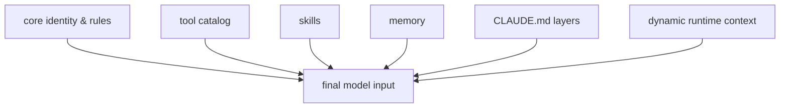

<div class="code-note small">
  这章真正讲的是 <strong>source boundary</strong>：每一段内容都应该能追溯来源。
</div>

---
layout: two-cols-header
---

## s10 · 核心变化代码：`SystemPromptBuilder`

::left::

<div class="surface tight-list small">
  <h3>只记住这个 build 顺序</h3>
  <ol class="dense-list">
    <li>core</li>
    <li>tools</li>
    <li>skills</li>
    <li>memory</li>
    <li>`CLAUDE.md`</li>
    <li>dynamic context</li>
  </ol>
  <div class="chapter-source">Run it: <span class="command-pill">python agents/s10_system_prompt.py</span></div>
</div>

::right::

```python {1-9|11-15|17-18|all}
class SystemPromptBuilder:
    def build(self) -> str:
        parts = []
        parts.append(self._build_core())
        parts.append(self._build_tools())
        parts.append(self._build_skills())
        parts.append(self._build_memory())
        parts.append(self._build_claude_md())
        parts.append(self._build_dynamic())
        return "\n\n".join(p for p in parts if p)

# stable: role, tool contract, long-lived safety, CLAUDE.md
# dynamic: date, cwd, mode, per-turn warnings

# save in s09
# re-inject in s10
```

---
layout: two-cols-header
---

## s11 · Error Recovery

::left::

<div class="surface tight-list">
  <div class="chapter-pill hardening">Recover, Then Continue</div>
  <h3>为什么"统一重试"不够</h3>
  <v-clicks>

  - 输出截断、prompt 过长、网络临时失败，本质上是三类不同问题。
  - 如果只会"再试一次"，context overflow 会无限重复，截断输出会从头再来。
  - 所以 recovery 先做分类，再选 continuation path。
  - 每一类恢复都要有 budget，不然系统会陷入永动机式重试。

  </v-clicks>

  <div class="takeaway hardening">
    <strong>Key insight</strong>：Most failures are continuation signals, not true task failure.
  </div>
</div>

::right::

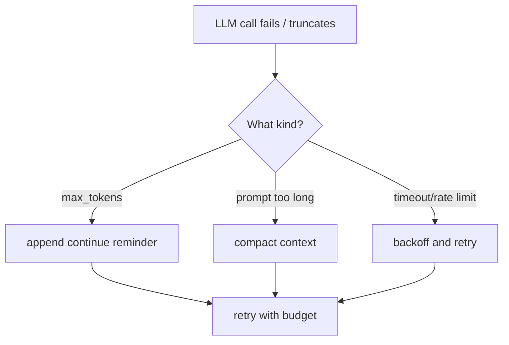

---
layout: two-cols-header
---

## s11 · 核心变化代码：分类优先，动作其次

::left::

<div class="surface tight-list small">
  <h3>最小恢复策略</h3>
  <ul class="dense-list">
    <li><strong>continue</strong>：输出被截断，但任务没失败</li>
    <li><strong>compact</strong>：任务没错，错的是 context 太大</li>
    <li><strong>backoff</strong>：环境暂时不行，等一下再来</li>
  </ul>
  <div class="chapter-source">Run it: <span class="command-pill">python agents/s11_error_recovery.py</span></div>
</div>

::right::

```python {1-8|10-15|17-24|all}
def choose_recovery(stop_reason: str | None, error_text: str | None) -> dict:
    if stop_reason == "max_tokens":
        return {"kind": "continue", "reason": "output truncated"}
    if error_text and "prompt" in error_text and "long" in error_text:
        return {"kind": "compact", "reason": "context too large"}
    if error_text and any(word in error_text for word in ["timeout", "rate", "unavailable", "connection"]):
        return {"kind": "backoff", "reason": "transient transport failure"}
    return {"kind": "fail", "reason": "unknown or non-recoverable error"}

if decision["kind"] == "continue":
    messages.append({"role": "user", "content": CONTINUE_MESSAGE})
if decision["kind"] == "compact":
    messages = auto_compact(messages)
if decision["kind"] == "backoff":
    time.sleep(backoff_delay(...))
```

---
layout: default
---

## Stage 2 小结：harness 开始具备"治理能力"

<div class="summary-grid">
  <div class="summary-card hardening">
    <h3><code>s07</code> 控制执行权</h3>
    <p>模型只是在提议动作，真正是否执行，要经过 permission pipeline。</p>
  </div>
  <div class="summary-card hardening">
    <h3><code>s08</code> 控制扩展点</h3>
    <p>loop 不再被业务方定制逻辑污染，扩展行为可以挂到固定生命周期上。</p>
  </div>
  <div class="summary-card hardening">
    <h3><code>s09-s10</code> 控制长期知识与输入装配</h3>
    <p>memory 负责保存 durable facts，prompt builder 负责把它们重新送进模型输入。</p>
  </div>
  <div class="summary-card hardening">
    <h3><code>s11</code> 控制失败后的 continuation</h3>
    <p>系统不再"遇错即死"，而是知道为什么错，以及接下来应该走哪条恢复分支。</p>
  </div>
</div>

<div class="center-note">
  到这里，Agent 已经不仅是"会工作"，而是开始"能自我治理"。
</div>

---
layout: section
class: section-runtime
---

<div class="section-hero">
  <div class="layer-chip runtime">Task Runtime · s12-s14</div>
  
  # Stage 3 · 任务运行时：让工作跨时间存在
  
  <div class="section-subtitle">
    这一段把工作从"只在当前会话活着"升级为"可以跨压缩、跨重启、跨时间触发"的持久化运行时：task graph、background threads、cron scheduler。
  </div>

  <div class="badge-row">
    <span class="ghost-chip">blockedBy / blocks</span>
    <span class="ghost-chip">daemon threads</span>
    <span class="ghost-chip">notification queue</span>
    <span class="ghost-chip">cron triggers</span>
  </div>
</div>

---
layout: two-cols-header
---

## s12 · Task System

::left::

<div class="surface tight-list">
  <div class="chapter-pill runtime">Durable Work Graph</div>
  <h3>为什么 flat todo 不够了</h3>
  <v-clicks>

  - 真实工作有依赖：A 做完了，B 和 C 才能开；D 还要等 B、C 一起完成。
  - `s03` 的 todo 只能表达"做没做"，表达不了阻塞关系和并行关系。
  - 而且 todo 在内存里，压缩或重启后就没了。
  - 所以这里把 checklist 升级成 **持久化 DAG**：知道谁 ready、谁 blocked、谁 completed。

  </v-clicks>

  <div class="takeaway runtime">
    <strong>Key insight</strong>：Todo lists help a session; task graphs coordinate work that outlives it.
  </div>
</div>

::right::

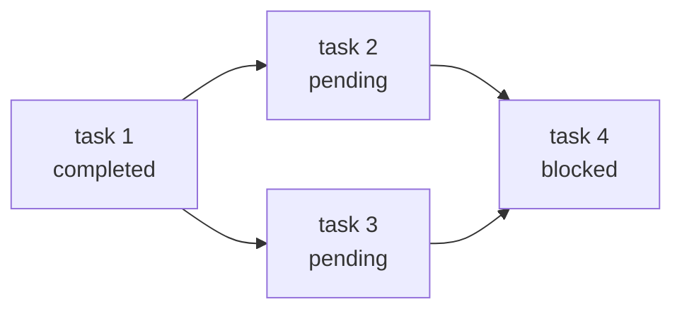

<div class="code-note small">
  关键结构不是"更多字段"，而是：<strong>依赖边 + 状态流转 + 落盘持久化</strong>。
</div>

---
layout: two-cols-header
---

## s12 · 核心变化代码：`TaskManager` 和自动解阻塞

::left::

<div class="surface tight-list small">
  <h3>本章值得记住的三个动作</h3>
  <ul class="dense-list">
    <li><strong>create</strong>：生成 JSON task record</li>
    <li><strong>update</strong>：状态变化时触发依赖清理</li>
    <li><strong>list/get</strong>：把 task graph 暴露给 agent 使用</li>
  </ul>
  <div class="chapter-source">Run it: <span class="command-pill">python agents/s12_task_system.py</span></div>
</div>

::right::

```python {1-8|10-16|18-23|all}
class TaskManager:
    def create(self, subject, description=""):
        task = {
            "id": self._next_id,
            "subject": subject,
            "status": "pending",
            "blockedBy": [],
            "blocks": [],
        }
        self._save(task)
        return json.dumps(task, indent=2)

    def _clear_dependency(self, completed_id):
        for f in self.dir.glob("task_*.json"):
            task = json.loads(f.read_text())
            if completed_id in task.get("blockedBy", []):
                task["blockedBy"].remove(completed_id)
                self._save(task)

TOOL_HANDLERS = {
    "task_create": lambda **kw: TASKS.create(kw["subject"]),
    "task_update": lambda **kw: TASKS.update(kw["task_id"], kw.get("status")),
    "task_list": lambda **kw: TASKS.list_all(),
    "task_get": lambda **kw: TASKS.get(kw["task_id"]),
}
```

---
layout: default
---

## 收束 s12：task graph 为后续运行时打底

<div class="takeaway runtime">
  <strong>s12 的核心</strong>：把 flat todo 升级为持久化 DAG，知道谁 ready、谁 blocked、谁 completed。后续的 background、cron、teams 都建在这个 task 结构上。
</div>

---
layout: two-cols-header
---

## s13 · Background Tasks

::left::

<div class="surface tight-list">
  <div class="chapter-pill runtime">Separate Goal from Running Work</div>
  <h3>为什么需要后台执行</h3>
  <v-clicks>

  - `npm install`、`pytest`、`docker build` 可能跑几分钟。
  - 如果主循环阻塞等待，用户也只能干等。
  - 解法是把慢命令放进 **daemon thread**，主循环继续接活。
  - 结果通过 **thread-safe notification queue** 在下次 LLM 调用前注入。

  </v-clicks>

  <div class="takeaway runtime">
    <strong>Key insight</strong>：Background execution is a runtime lane, not a second main loop.
  </div>
</div>

::right::

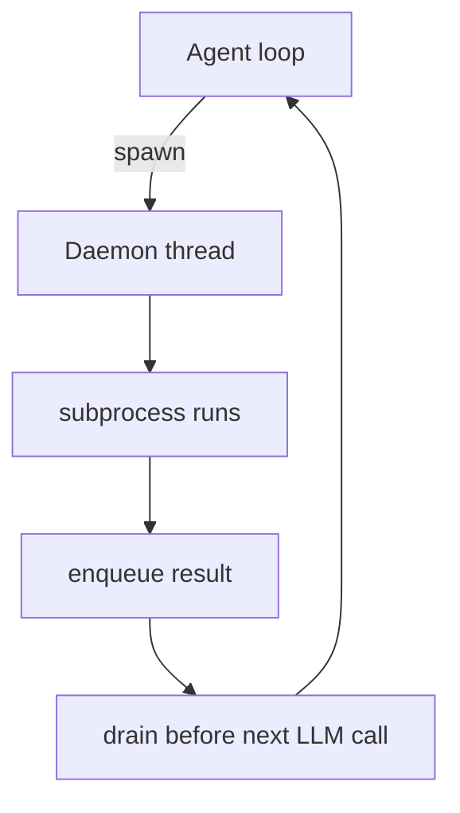

```python {1-5|7-10|all}
class BackgroundManager:
    def run(self, command: str) -> str:
        task_id = str(uuid.uuid4())[:8]
        thread = threading.Thread(
            target=self._execute, args=(task_id, command), daemon=True)
        thread.start()

    # drain-before-call pattern
    notifs = BG.drain_notifications()
    if notifs:
        messages.append({"role": "user", "content": f"<background-results>..."})
```

---
layout: two-cols-header
---

## s14 · Cron Scheduler

::left::

<div class="surface tight-list">
  <div class="chapter-pill runtime">Let Time Trigger Work</div>
  <h3>从"用户触发"到"时间触发"</h3>
  <v-clicks>

  - s13 解决了"慢任务不阻塞"，但任务仍然只能由用户发起。
  - 如果想"每晚跑一次测试"，用户每天都得重新下指令。
  - Cron scheduler 存储 **future intent**：记录时间规则 + prompt。
  - 后台 checker 每 60 秒轮询，匹配到就走同一条 notification queue。

  </v-clicks>

  <div class="takeaway runtime">
    <strong>Key insight</strong>：A scheduler stores future intent, not a second loop.
  </div>
</div>

::right::

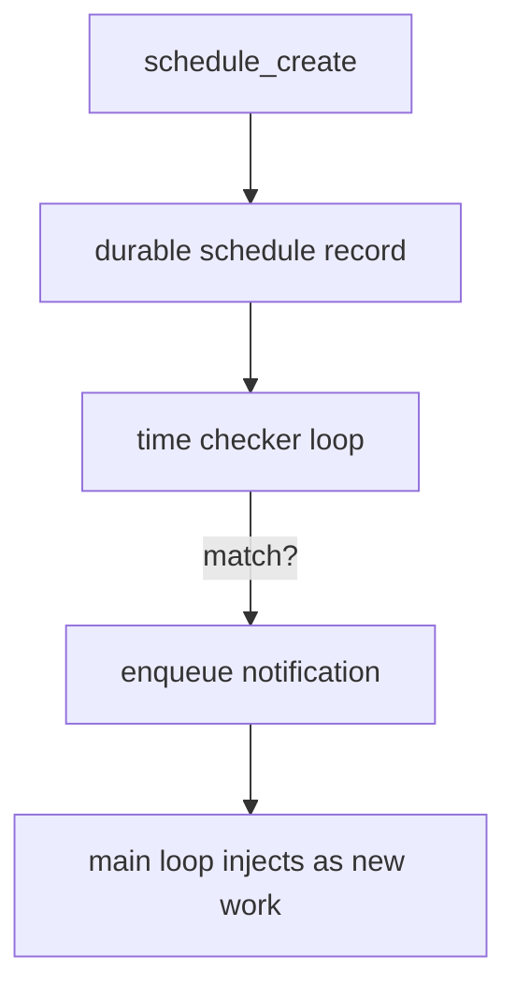

```python {1-6|8-12|all}
schedule = {
    "id": "job_001",
    "cron": "0 9 * * 1",
    "prompt": "Run weekly status report.",
    "recurring": True,
    "last_fired_at": None,
}

def check_jobs(self, now):
    for job in self.jobs:
        if cron_matches(job["cron"], now):
            self.queue.put({"type": "scheduled_prompt",
                "schedule_id": job["id"], "prompt": job["prompt"]})
```

---
layout: default
---

## Stage 3 小结：从"只能当下做"到"跨时间工作"

<div class="summary-grid">
  <div class="summary-card runtime">
    <h3><code>s12</code> Task Graph</h3>
    <p>持久化 DAG：依赖、解阻塞、落盘，是整个 runtime 层的骨架。</p>
  </div>
  <div class="summary-card runtime">
    <h3><code>s13</code> Background Tasks</h3>
    <p>daemon threads + notification queue，慢任务不再阻塞主循环。</p>
  </div>
  <div class="summary-card runtime">
    <h3><code>s14</code> Cron Scheduler</h3>
    <p>future intent 落盘 + 时间匹配触发，agent 可以自行安排将来的工作。</p>
  </div>
  <div class="summary-card runtime">
    <h3>一句话</h3>
    <p><strong>计划 → 并行 → 定时</strong>：agent 从纯反应式变成能组织跨时间工作。</p>
  </div>
</div>

---
layout: section
---

<div class="section-hero">
  <div class="layer-chip platform">Multi-Agent Platform · s15-s19</div>
  
  # Stage 4 · 从单代理走向多代理平台
  
  <div class="section-subtitle">
    最后一段把"一个 agent 做所有事"升级为"多个 agent 协同做事"：持久化队友、结构化协议、自治认领、隔离执行、外部能力接入。
  </div>

  <div class="badge-row">
    <span class="ghost-chip">JSONL inboxes</span>
    <span class="ghost-chip">request-response protocols</span>
    <span class="ghost-chip">idle polling + auto-claim</span>
    <span class="ghost-chip">git worktrees</span>
    <span class="ghost-chip">MCP stdio</span>
  </div>
</div>

---
layout: two-cols-header
---

## s15 · Agent Teams

::left::

<div class="surface tight-list">
  <div class="chapter-pill platform">Persistent Specialists</div>
  <h3>从一次性子代理到持久队友</h3>
  <v-clicks>

  - s04 的 subagent 是一次性的：做完就丢。
  - 真正的团队需要：**持久身份**、**独立 loop**、**通信通道**。
  - 每个队友有自己的 JSONL inbox，inbox 是 append-only + drain-on-read。
  - lifecycle：`spawn → working → idle → working → ... → shutdown`。

  </v-clicks>

  <div class="takeaway">
    <strong>Key insight</strong>：Teammates persist beyond one prompt, each with identity and a durable mailbox.
  </div>
</div>

::right::

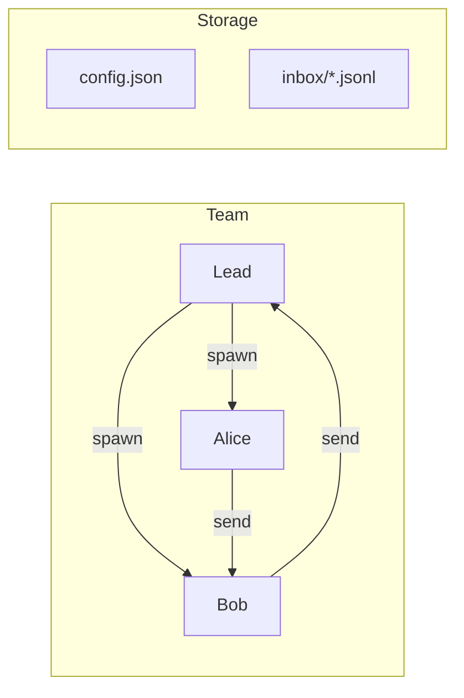

```python {1-4|6-9|all}
class MessageBus:
    def send(self, sender, to, content, msg_type="message"):
        with open(self.dir / f"{to}.jsonl", "a") as f:
            f.write(json.dumps(msg) + "\n")

    def read_inbox(self, name):
        path = self.dir / f"{name}.jsonl"
        msgs = [json.loads(l) for l in path.read_text().strip().splitlines()]
        path.write_text("")  # drain
        return json.dumps(msgs, indent=2)
```

---
layout: two-cols-header
---

## s16 · Team Protocols

::left::

<div class="surface tight-list">
  <div class="chapter-pill platform">Shared Request-Response Rules</div>
  <h3>从自由聊天到结构化握手</h3>
  <v-clicks>

  - s15 有通信了，但没有协调规则。
  - 两个典型场景：**graceful shutdown** 和 **plan approval**。
  - 核心抽象就一个：**带 `request_id` 的 request-response 信封**。
  - 一个 FSM 覆盖两种协议：`pending → approved | rejected`。

  </v-clicks>

  <div class="takeaway">
    <strong>Key insight</strong>：A protocol request is a structured message with an ID; the response must reference the same ID.
  </div>
</div>

::right::

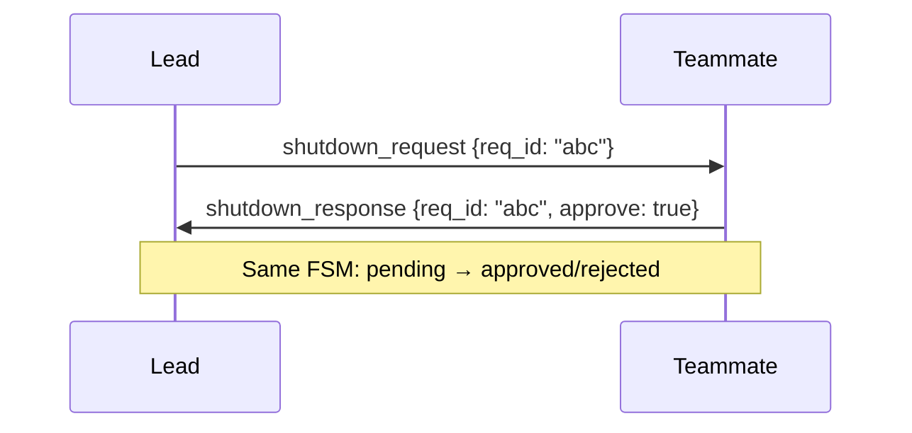

```python {1-5|7-10|all}
def handle_shutdown_request(teammate: str) -> str:
    req_id = str(uuid.uuid4())[:8]
    shutdown_requests[req_id] = {"target": teammate, "status": "pending"}
    BUS.send("lead", teammate, "Please shut down gracefully.",
             "shutdown_request", {"request_id": req_id})

def handle_plan_review(request_id, approve, feedback=""):
    req = plan_requests[request_id]
    req["status"] = "approved" if approve else "rejected"
    BUS.send("lead", req["from"], feedback,
             "plan_approval_response", {"request_id": request_id, "approve": approve})
```

---
layout: two-cols-header
---

## s17 · Autonomous Agents

::left::

<div class="surface tight-list">
  <div class="chapter-pill platform">Self-Claim and Self-Resume</div>
  <h3>从 lead 手动派活到自治</h3>
  <v-clicks>

  - s15-s16 的队友还需要 lead 一个一个派任务。
  - 自治意味着：空闲时 **自己扫 task board**，发现未认领任务就 **auto-claim**。
  - idle 阶段每 5 秒轮询 inbox + task board，60 秒无活就 auto-shutdown。
  - 压缩后可能忘记身份，所以要做 **identity re-injection**。

  </v-clicks>

  <div class="takeaway">
    <strong>Key insight</strong>：Autonomous teammates scan, claim, and shut down — removing the lead as bottleneck.
  </div>
</div>

::right::

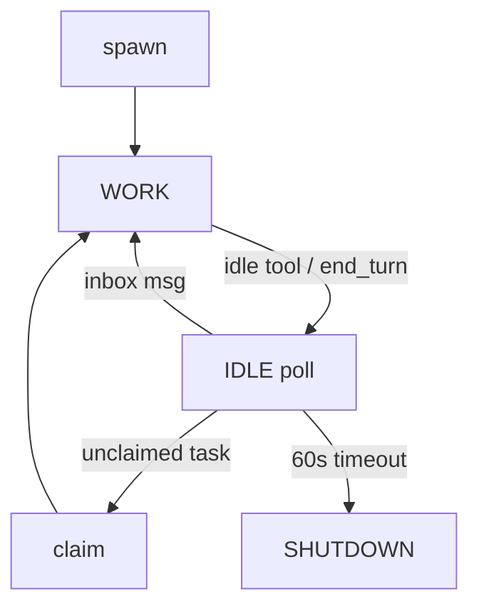

```python {1-7|9-12|all}
def _idle_poll(self, name, messages):
    for _ in range(IDLE_TIMEOUT // POLL_INTERVAL):
        time.sleep(POLL_INTERVAL)
        inbox = BUS.read_inbox(name)
        if inbox: return True
        unclaimed = scan_unclaimed_tasks()
        if unclaimed:
            claim_task(unclaimed[0]["id"], name)
            return True
    return False  # timeout -> shutdown

if len(messages) <= 3:
    messages.insert(0, {"role": "user", "content": f"<identity>You are '{name}'...</identity>"})
```

---
layout: two-cols-header
---

## s18 · Worktree + Task Isolation

::left::

<div class="surface tight-list">
  <div class="chapter-pill platform">Separate Directory, Separate Lane</div>
  <h3>多人同时改代码怎么不冲突</h3>
  <v-clicks>

  - 所有 agent 共享同一目录 → 文件冲突。
  - 解法：给每个 task 绑定独立的 **git worktree**。
  - Task 管"做什么"，Worktree 管"在哪做"，靠 `task_id` 双向关联。
  - lifecycle 有 event stream：`events.jsonl` 记录每次 create / keep / remove。

  </v-clicks>

  <div class="takeaway">
    <strong>Key insight</strong>：Tasks answer <em>what</em>; worktrees answer <em>where</em>. Keep them separate.
  </div>
</div>

::right::

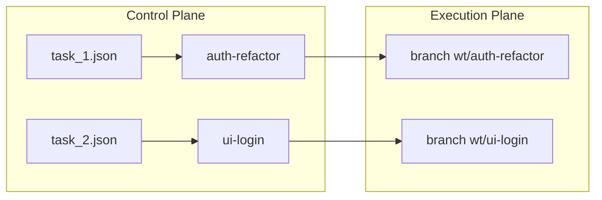

```python {1-5|7-10|all}
def bind_worktree(self, task_id, worktree):
    task = self._load(task_id)
    task["worktree"] = worktree
    if task["status"] == "pending":
        task["status"] = "in_progress"
    self._save(task)

def remove(self, name, force=False, complete_task=False):
    self._run_git(["worktree", "remove", wt["path"]])
    if complete_task and wt.get("task_id") is not None:
        self.tasks.update(wt["task_id"], status="completed")
```

---
layout: two-cols-header
---

## s19 · MCP & Plugin

::left::

<div class="surface tight-list">
  <div class="chapter-pill platform">External Capability Bus</div>
  <h3>工具不再只能写在 harness 里</h3>
  <v-clicks>

  - 到 s18 为止，每个工具都是手写 Python handler。
  - MCP 让 **外部程序** 通过 stdio 协议暴露 tools。
  - 名字用 `mcp__{server}__{tool}` 前缀，避免碰撞。
  - 统一 router：原生工具和 MCP 工具走同一条路由、同一套权限。
  - Plugin manifest 负责发现和启动 server。

  </v-clicks>

  <div class="takeaway">
    <strong>Key insight</strong>：External capabilities enter the same pipeline — same routing, same permissions.
  </div>
</div>

::right::

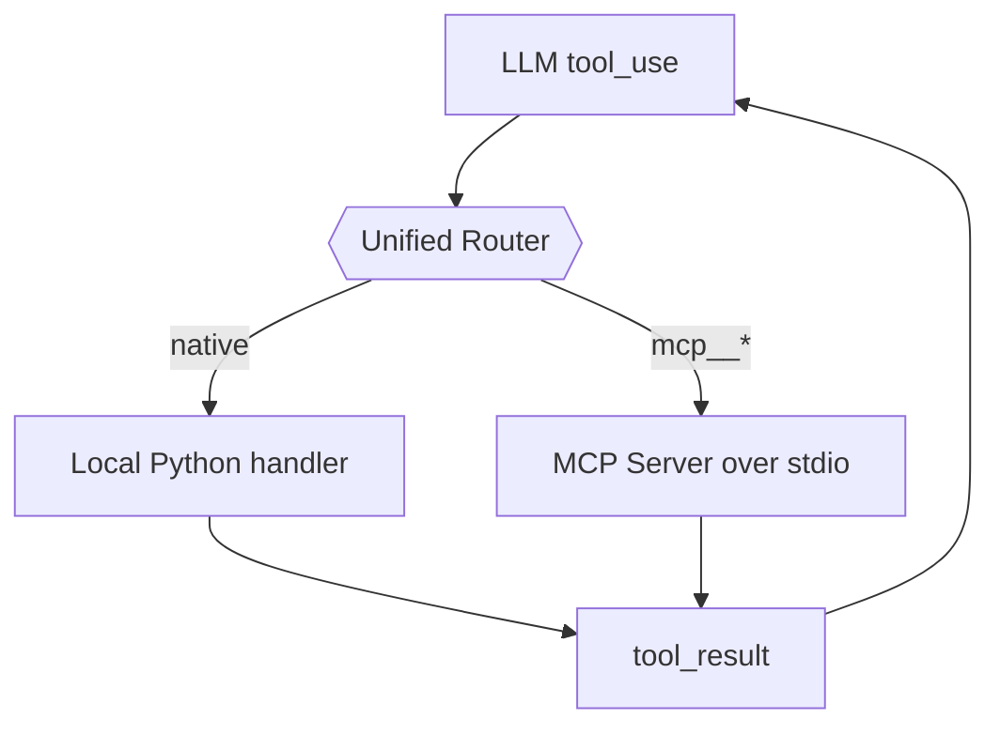

```python {1-5|7-10|12-15|all}
class MCPClient:
    def call_tool(self, tool_name, arguments):
        self._send({"method": "tools/call", "params": {
            "name": tool_name, "arguments": arguments}})
        return self._recv()

    def get_agent_tools(self):
        for tool in self._tools:
            prefixed = f"mcp__{self.server_name}__{tool['name']}"
            agent_tools.append({"name": prefixed, ...})

# Unified dispatch
if tool_name.startswith("mcp__"):
    return mcp_router.call(tool_name, arguments)
else:
    return native_handler(arguments)
```

---
layout: default
---

## Stage 4 小结：从"一个 agent"到"一个平台"

<div class="summary-grid">
  <div class="summary-card" style="border-color: #fca5a5;">
    <h3><code>s15</code> 持久化队友</h3>
    <p>有名字、有 inbox、有独立 loop，不再是用完即弃的 subagent。</p>
  </div>
  <div class="summary-card" style="border-color: #fca5a5;">
    <h3><code>s16</code> 结构化协议</h3>
    <p>request_id 让消息变成可追踪的握手，shutdown 和 plan approval 是两个基本协议。</p>
  </div>
  <div class="summary-card" style="border-color: #fca5a5;">
    <h3><code>s17-s18</code> 自治 + 隔离</h3>
    <p>agent 自己认领任务、自己关掉自己；worktree 让并行修改代码不冲突。</p>
  </div>
  <div class="summary-card" style="border-color: #fca5a5;">
    <h3><code>s19</code> 外部能力接入</h3>
    <p>MCP 统一了原生和外部工具的路由与权限，agent 的能力不再被 harness 代码冻结。</p>
  </div>
</div>

---
layout: default
---

## 全课程收束：19 章一条主线

<div class="outro-grid">
  <div class="surface">
    <h3>从 s01 到 s19 可以这样复述</h3>
    <ul class="dense-list">
      <li><strong>s01-s02</strong>：最小 loop + 工具控制面</li>
      <li><strong>s03-s04</strong>：计划防漂移 + 子代理防上下文污染</li>
      <li><strong>s05-s06</strong>：按需加载知识 + 压缩保长寿</li>
      <li><strong>s07-s11</strong>：安全、扩展、记忆、装配、恢复</li>
      <li><strong>s12-s14</strong>：持久化 task graph + 后台执行 + 定时触发</li>
      <li><strong>s15-s19</strong>：团队、协议、自治、隔离、外部能力</li>
    </ul>
    <div class="takeaway">
      每章只引入 <strong>一个新的控制层</strong>。19 章叠完，你得到一个生产级 agent 平台的完整架构蓝图。
    </div>
  </div>
  <div class="surface small">
    <h3>运行这份 deck</h3>
    <div class="badge-row">
      <span class="command-pill">cd learn-claude-code/slidev</span>
      <span class="command-pill">npm install</span>
      <span class="command-pill">npm run dev</span>
      <span class="command-pill">npm run build</span>
    </div>
    <div class="hr-soft"></div>
    <p><strong>建议演讲节奏</strong></p>
    <ul class="dense-list">
      <li>Stage 1 讲"能力如何长出来"</li>
      <li>Stage 2 讲"为什么真实系统必须治理自己"</li>
      <li>Stage 3 讲"工作如何跨时间存在"</li>
      <li>Stage 4 讲"多个 agent 如何协同"</li>
    </ul>
    <p class="slide-caption">教程源码：<code>learn-claude-code/agents/</code> · 文档：<code>learn-claude-code/docs/en/</code></p>
  </div>
</div>
