# Build Your Own Agent

## 从 0 到 1 手搓 AI Coding Agent

<div class="text-lg text-gray-500 mt-8">
<p>javayhu</p>
<p>2026/4/13</p>
</div>

<!--
基于开源项目 Learn Claude Code 的教程，分享一个简化版本的 AI Coding Agent 的构建流程
这个教程是在 Claude Code 代码泄漏之前就有，在这之后，可能基于泄漏的源码，又补充了几个章节
-->

---
layout: section
---

# 内容大纲

## 1、回顾近半年进展

## 2、Agent 框架对比

## 3、Agent 框架实现

## 4、Agent 框架使用

<!-- 大模型的核心概念，这次是介绍半年后它们的进展，以及现在火热的 Agent 开发入门。
基础知识的科普，对齐大家的认知，方便工作中遇到 Agent 开发时沟通交流，或者寻找方向。
不追热点，聚焦本质，将原来的编程思想应用到 Agent 开发中-->

---
layout: two-cols
---

<template v-slot:default>

# (1/2) 大模型基础概念

- <span class="text-orange-500 font-bold">LLM</span>
- Prompt
- Token
- Context
- Tools
- MCP

<div class="concept-slide-image">
  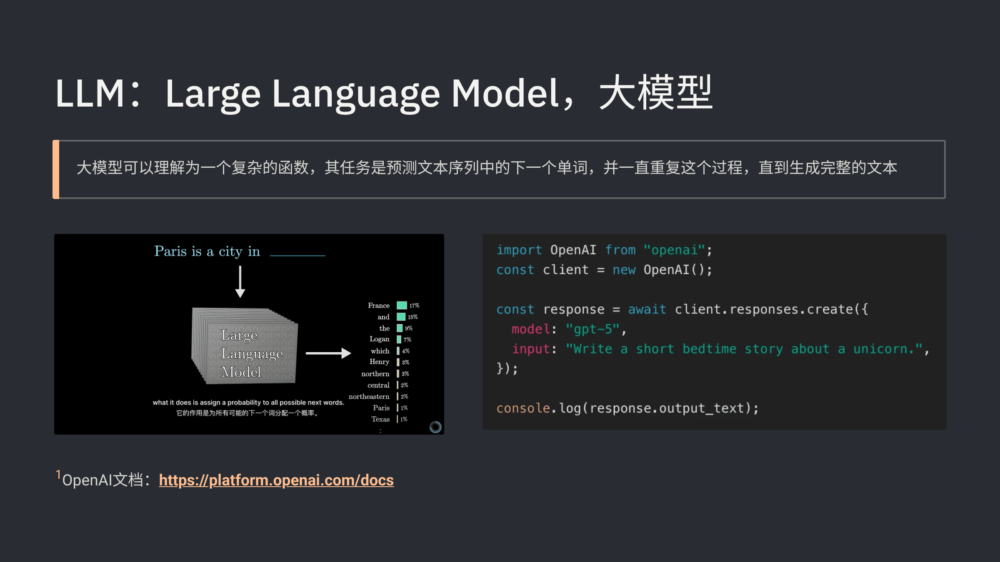
</div>

</template>

<template v-slot:right>

## 近半年进展

### 1、[models.dev](https://models.dev)

记录主流模型的发布时间、知识库时间、性能、价格和能力

- OpenAI GPT 5.4 / Google Gemini 3.1 / Anthropic Claude Opus 4.6

- GLM 5.1 / Kimi K2.5 / MiniMax M2.7

### 2、[openrouter.ai](https://openrouter.ai/rankings)

调用量前十中除了国外三家模型，国产开源模型也表现亮眼

<div class="concept-slide-image">
  
</div>

</template>

<!-- LLM -->

---
layout: two-cols
---

<template v-slot:default>

# (1/2) 大模型基础概念

- LLM
- <span class="text-orange-500 font-bold">Prompt</span>
- Token
- Context
- Tools
- MCP

<div class="concept-slide-image">
  
</div>

</template>

<template v-slot:right>

## 近半年进展

### 1、提示词缓存（Prompt Caching）

如果当前请求的输入前缀和之前的请求完全一致，模型商就可以直接从缓存中读取结果，效率更高，成本更低

<!-- <div class="slide-image">
  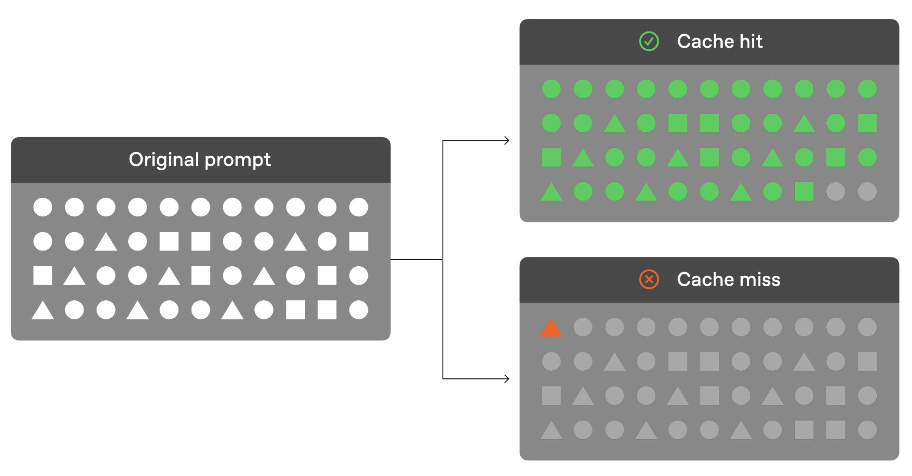
</div> -->

<div class="slide-image">
  
</div>

### 2、设计提示词的核心原则

<span class="text-orange-500">常驻内容要短且稳定</span>：把不变的放前面，把变化的放后面

- 前面：系统提示、工具定义等在多轮请求中基本不会变的内容

- 后面：当前时间、用户输入、工具调用结果等动态变化的内容

- 启发：JSON序列化的结果要按照key进行排序，保证缓存复用

</template>

<!-- Prompt -->

---
layout: two-cols
---

<template v-slot:default>

# (1/2) 大模型基础概念

- LLM
- Prompt
- <span class="text-orange-500 font-bold">Token</span>
- Context
- Tools
- MCP

<div class="concept-slide-image">
  
</div>

</template>

<template v-slot:right>

## 近半年进展

### 1、中文名：<span class="text-orange-500">词元</span>

Token是大模型处理信息的最小信息单元，也是 AI 时代的结算单位

<!-- ### 2、Token 不同价

Prompt Caching 普及后，重复前缀可复用缓存，cached input tokens 比普通 input token 便宜很多

<div class="slide-image">
  
</div> -->

### 2、Token Plan

模型服务商从提供 Coding Plan 到提供 Token Plan，满足用户使用 AI 应用时多模态输入输出的需求

- Tencent Token Plan
- MiniMax Token Plan

</template>

<!-- Token -->

---
layout: two-cols
---

<template v-slot:default>

# (1/2) 大模型基础概念

- LLM
- Prompt
- Token
- <span class="text-orange-500 font-bold">Context</span>
- Tools
- MCP

<div class="concept-slide-image">
  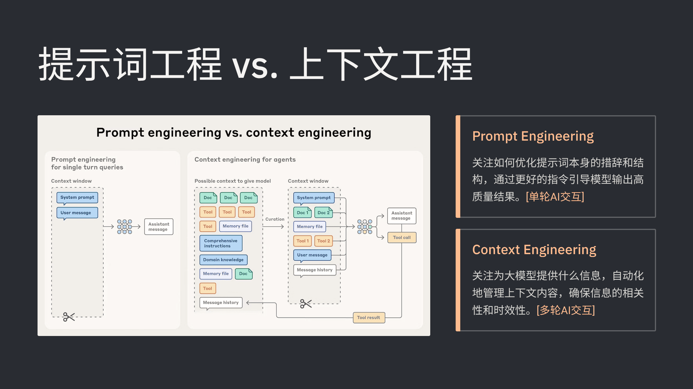
</div>

</template>

<template v-slot:right>

## 近半年进展

### 1、工程化的演进

<div class="mt-4 mb-8">
  <table class="w-full">
    <thead>
      <tr class="">
        <th class="w-28 text-left pb-2"></th>
        <th class="w-28 text-left pb-2">时间</th>
        <th class="text-left pb-2">解决的问题</th>
      </tr>
    </thead>
    <tbody>
      <tr>
        <td class="pr-2 pb-2 align-center">提示词工程</td>
        <td class="pr-2 pb-2 align-center">2023-2024</td>
        <td class="pb-2 align-top">怎么跟模型说，能让它输出高质量的结果，<span class="text-orange-500">侧重于措辞和结构化</span></td>
      </tr>
      <tr>
        <td class="pr-2 pb-2 align-center">上下文工程</td>
        <td class="pr-2 pb-2 align-center">2025</td>
        <td class="pb-2 align-top">给模型看什么，能让它输出高质量的结果，<span class="text-orange-500">侧重于上下文信息编排</span></td>
      </tr>
      <tr>
        <td class="pr-2 align-center">驾驭工程</td>
        <td class="pr-2 align-center">2026+</td>
        <td class="align-top">如何约束模型，能让它输出高质量的结果，<span class="text-orange-500">侧重于 Agent 运行环境的设计</span></td>
      </tr>
    </tbody>
  </table>
</div>

<!-- ### 2、<span class="text-orange-500 font-bold">Harness Engineering</span>

Model 决定做什么，Harness 决定如何做，两者结合就是 Agent 系统

<div class="slide-image">
  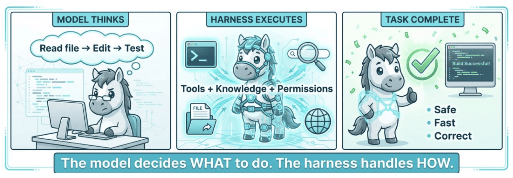
</div> -->

</template>

<!-- Context -->

---
layout: two-cols
---

<template v-slot:default>

# (1/2) 大模型基础概念

- LLM
- Prompt
- Token
- Context
- <span class="text-orange-500 font-bold">Tools</span>
- MCP

<div class="concept-slide-image">
  
</div>

</template>

<template v-slot:right>

## 近半年进展

### 1、<a href="https://youtu.be/TqC1qOfiVcQ" target="_blank"><span class="text-orange-500">Bash is all you need</span></a>

- HCI (Human Computer Interface) 向 ACI (Agent Computer Interface) 转化

- GUI 是给人看的 (Chrome)，Agent 只需要 bash 工具就行 (Headless Chrome)

### 2、为什么选择 bash？

- bash 能读写文件、管理文件系统、编写脚本并执行

- bash 可以利用其他三方工具，比如 ffmpeg/git/grep

- 增加工具不会解锁新能力，只会增加模型需要理解的接口

### 3、CLI 工具的兴起

- 飞书推出 CLI，钉钉推出 CLI，企微推出 CLI

- Google Workspace 推出 CLI，Obsidian 推出 CLI

```bash
# Send an email
gws gmail +send --to alice@example.com --subject "Hello" --body "Hi there"

# Create a spreadsheet
gws sheets spreadsheets create --json '{"properties": {"title": "Q1 Budget"}}'

# Create a new note
obsidian create name="Trip to Paris"

# Search your vault
obsidian search query="meeting notes"
```

</template>

<!-- Tools -->

---
layout: two-cols
---

<template v-slot:default>

# (1/2) 大模型基础概念

- LLM
- Prompt
- Token
- Context
- Tools
- <span class="text-orange-500 font-bold">MCP + Skill</span>

<div class="concept-slide-image">
  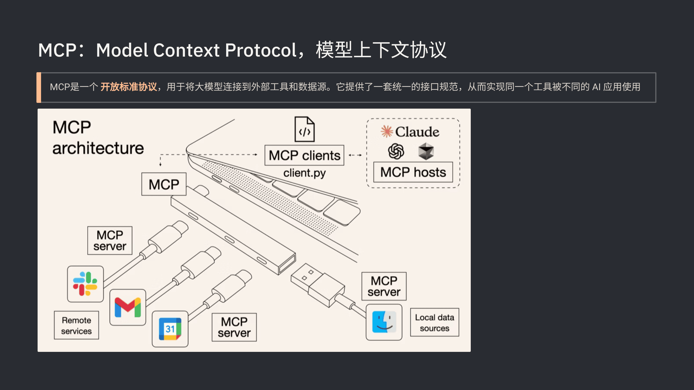
</div>

</template>

<template v-slot:right>

## 近半年进展

<!-- ### 1、MCP 的问题

- MCP Tools 的定义和返回结果内容太多，占用大量上下文

- 很多 MCP Server 只是把旧接口重新包装，使用体验不佳 -->

### 1、MCP 和 Skill

- 对于 Agent 而言，MCP 和 Skill 都在工具层，都是为了扩展 Agent 的能力

- MCP 和 Skill 不是竞争关系，而是互补关系，Skills + MCP = 专业知识 + 外部连接

<div class="mt-3">
  <table class="w-full">
    <thead>
      <tr class="text-orange-500">
        <th class="w-32 text-left"></th>
        <th class="text-left">MCP</th>
        <th class="text-left">Skill</th>
      </tr>
    </thead>
    <tbody>
      <tr>
        <td class="pr-2 pb-2 align-top">解决的问题</td>
        <td class="pr-2 pb-2 align-top">把外部能力接进来给 Agent 用</td>
        <td class="pb-2 align-top">把做事的方法和步骤教给 Agent</td>
      </tr>
      <tr>
        <td class="pr-2 pb-2 align-top">内容形态</td>
        <td class="pr-2 pb-2 align-top">tools / resources / prompts</td>
        <td class="pb-2 align-top">Skill.md / scripts / references</td>
      </tr>
      <tr>
        <td class="pr-2 pb-2 align-top">加载方式</td>
        <td class="pr-2 pb-2 align-top">连接 server 后暴露能力</td>
        <td class="pb-2 align-top">按需加载正文和脚本</td>
      </tr>
      <tr>
        <td class="pr-2 align-top">上下文成本</td>
        <td class="pr-2 align-top">工具定义和结果可能太大</td>
        <td class="align-top">分层设计，按需加载</td>
      </tr>
    </tbody>
  </table>
</div>

### 2、理解 Skill

- <span class="text-orange-500">Agent = 系统，Tools = 系统接口，Skills = 安装在系统上的应用</span>

- Claude Code/Cowork = iOS 系统，OpenClaw = Android 系统

- ClawHub = 国外应用商店，SkillsHub = 国内应用商店，有毒的 Skill = 恶意应用

### 3、<a href="https://youtu.be/CEvIs9y1uog" target="_blank"><span class="text-orange-500">Don't build agents, build skills instead</span></a>

- Claude Code 证明：不同领域的 Agent 底层可以完全一样（bash + 文件系统）

- 构建 Skills 生态，让通用 Agent 通过可积累、可复用的 Skills 变成各领域的专业工具

</template>

<!-- MCP -->

---
layout: two-cols
---

<template v-slot:default>

# (2/2) AI 编程工具的演进和经验

- Chat：ChatGPT
- VS Code 插件：Copilot
- AI IDE：Cursor、Windsurf
- AI Coding Agent：Claude Code、Codex

<div class="concept-slide-image">
  
</div>

</template>

<template v-slot:right>

## 近半年进展

### 1、CodeBuddy 逐渐完善

- AI IDE：CodeBuddy IDE
- VS Code 插件：CodeBuddy 插件
- AI Coding Agent：CodeBuddy Code
- 底层共享通用的 CodeBuddy Agent SDK

### 2、Claude Code 源码泄漏

国内外各种源码分析，带动全网开发和设计更加高效的 Agent 框架

[Claude Code Upacked](https://ccunpacked.dev/)

[Claude Code From Source](https://claude-code-from-source.com/)

<!-- [驾驭工程 — 从 Claude Code 源码到 AI 编码最佳实践](https://zhanghandong.github.io/harness-engineering-from-cc-to-ai-coding/preface.html) -->

### 3、<a href="https://learn.shareai.run/" target="_blank"><span class="text-orange-500">Learn Claude Code</span></a>

通过学习这个教程，了解 AI Coding Agent 的架构设计和开发流程

- 教程在 Claude Code 源码泄漏之前就存在，所以不是源码分析教程

- 教程在 Claude Code 源码泄漏之后，新增了 7 个章节，可能是受泄漏的源码启发

</template>

<!-- AI Coding-->

---
layout: section
---

# Agent 框架对比

<div class="text-gray-500 mt-4">
常见的 Coding Agent 框架的架构和对比
</div>

---
layout: default
---

# <span class="text-orange-500">Agent = Model + Harness</span>

- Agent 是大脑和身体的结合

- Model 是大脑，负责思考+推理

- Harness 是身体，负责感知+执行

- 如何设计和实现一个 Agent 框架？需要解决哪些问题？需要包含哪些功能？为什么要这样设计和实现？

<div class="section-image">
  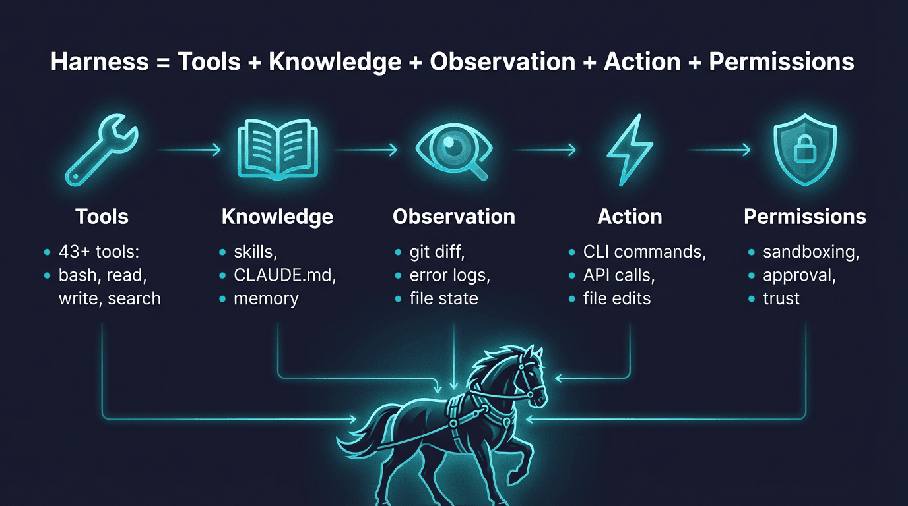
</div>


---
layout: section
---

# Agent 框架实现

<div class="text-gray-500 mt-4">
跟着 Learn Claude Code 教程实现简易的 AI Coding Agent
</div>

---
layout: default
---

# <a href="https://learn.shareai.run/" target="_blank"><span class="text-orange-500">Learn Claude Code</span></a>

<div class="mt-18">

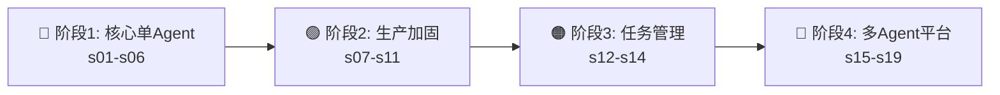

</div>

<v-clicks class="mt-16 text-xl flex flex-col justify-left">

- **阶段 1** — 先做出一个真能工作的 agent
- **阶段 2** — 再补安全、扩展、记忆和恢复
- **阶段 3** — 临时清单升级成持久化任务系统
- **阶段 4** — 从单 agent 升级成多 agent 平台

</v-clicks>

<div v-click class="mt-16 text-xl text-orange-500">

核心原则：每一章节都是上一章节自然迭代出来的，从最小的单 Agent 开始，到复杂的多 Agent 平台

</div>

---
layout: section
---

# 阶段 1：核心单 Agent

## s01 — s06

<div class="text-gray-500 mt-4">
先让 agent 能跑起来
</div>

---
layout: center
---

# 阶段 1 要解决什么？

<v-clicks>

想象你有一个天才助手——能推理、能写代码、能设计方案

**但它什么都不能"做"。**

每次它建议你跑一个命令，你得手动复制、执行、再把结果粘回去。

你就是那个循环。**这个阶段的目标就是把你从循环里解放出来。**

</v-clicks>

<div v-click class="mt-6 grid grid-cols-3 gap-3 text-sm">
<div class="p-2 bg-blue-50 dark:bg-blue-900/20 rounded text-center">

**s01** 最小循环

</div>
<div class="p-2 bg-blue-50 dark:bg-blue-900/20 rounded text-center">

**s02** 工具 · **s03** 规划

</div>
<div class="p-2 bg-blue-50 dark:bg-blue-900/20 rounded text-center">

**s04** 隔离 · **s05** 知识 · **s06** 压缩

</div>
</div>

<!-- s01 agent loop -->

---
layout: default
---

# s01: 智能体循环 (The Agent Loop)

> 没有循环，就没有 agent，真正的 agent 起点是把真实工具结果重新喂回模型

<div class="grid grid-cols-[1fr_600px] gap-8">
<div>

问题：模型能思考，但不会打开文件、运行命令，是个“只会说话，不会干活”的程序，需要人来做中转

方案：把“模型 + 工具”连接成一个能持续推进任务的主循环，最小的心智循环，不要让人来做 AI 的测试员

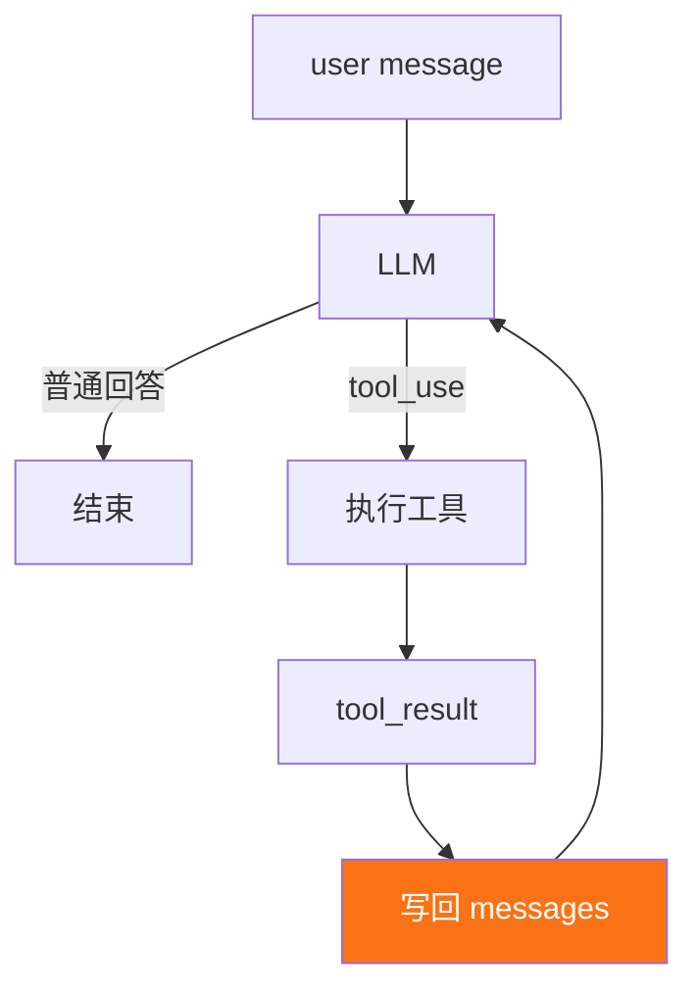

</div>

<div class="embed-viz">
<iframe src="https://build-your-own-agent.vercel.app/en/embed/s01/" />
</div>

</div>

---
layout: default
---

# s01: 最小 Agent Loop 实现

<div class="grid grid-cols-[1.3fr_1fr] gap-4">
<div>

```python {1|3-4|5-18|20-23|25-34|36-39|all}
messages = [{"role": "user", "content": query}]

def agent_loop(state):
    while True:
        # 1. 调用模型
        response = client.messages.create(
            model=MODEL, 
            system=SYSTEM,
            tools=TOOLS, 
            messages=state["messages"],
            max_tokens=8000,
        )

        # 2. 追加 assistant 回复
        state["messages"].append({
            "role": "assistant", 
            "content": response.content,
        })

        # 3. 如果不是 tool_use，结束
        if response.stop_reason != "tool_use":
          state["transition_reason"] = None
          return

        # 4. 执行工具，回写结果
        results = []
        for block in response.content:
            if block.type == "tool_use":
                output = run_tool(block)
                results.append({
                    "type": "tool_result",
                    "tool_use_id": block.id,
                    "content": output,
                })

        # 5. 工具结果作为新消息写回
        state["messages"].append({"role": "user", "content": results})
        state["turn_count"] += 1
        state["transition_reason"] = "tool_result"
```

</div>
<div>

```python
SYSTEM = (
    f"You are a coding agent at {os.getcwd()}. "
    "Use bash to inspect and change the workspace. Act first, then report clearly."
)
TOOLS = [{
    "name": "bash",
    "description": "Run a shell command in the current workspace.",
    "input_schema": {
        "type": "object",
        "properties": {"command": {"type": "string"}},
        "required": ["command"],
    },
}]
```

**Message**：消息历史不是聊天记录展示层，而是模型下一轮要读的上下文

```python
{"role": "user", "content": "..."}
{"role": "assistant", "content": [...]}
{"role": "tool_result", "content": [...]}
```

**Tool Result**：模型返回的工具结果

```python
{
    "type": "tool_result",
    "tool_use_id": "...",
    "content": "...",
}
```

**LoopState**：显式收拢循环状态

```python
state = {
    "messages": [...],
    "turn_count": 1,
    "transition_reason": None,
}
```

</div>
</div>

---
layout: default
---

# s02: 工具使用 (Tool Use)

> 只有 bash 工具，`rm -rf /` 谁来拦？路径逃逸谁来管？高危高频的文件操作需要专用工具

<div class="grid grid-cols-[1fr_600px] gap-8">
<div>

问题：只有 bash 工具，所有操作都走 shell，每次 bash 调用都是不受约束的，存在严重的安全隐患

方案：专用工具 (read_file, write_file) 可以在工具层面做路径沙箱，新增工具只是新增处理方法，核心循环保持不变

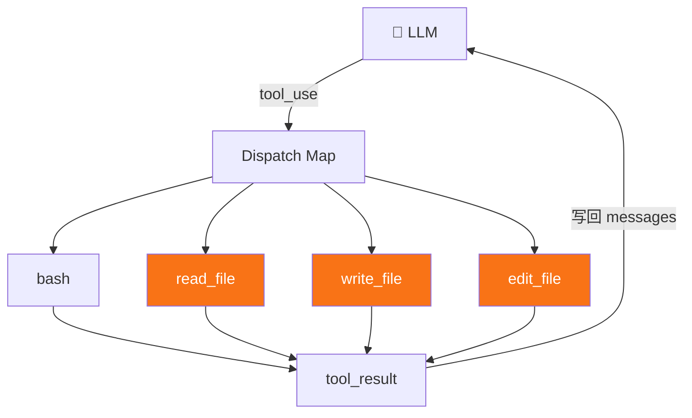

</div>

<div class="embed-viz">
<iframe src="https://build-your-own-agent.vercel.app/en/embed/s02/" style="--viz-h: 1000px; --viz-scale: 0.45" />
</div>

</div>

---
layout: default
---

# s02: 核心代码

<div class="grid grid-cols-2 gap-4">
<div>

## 工具分发 + 路径沙箱

注册新的工具，并补充安全路径检查，防止逃逸出工作目录

```python {1-8,12-15|22-27,29-30}
# s02 新增：工具注册表
TOOL_HANDLERS = {
    "bash":       lambda **kw: run_bash(kw["command"]),
    "read_file":  lambda **kw: run_read(kw["path"], kw.get("limit")),
    "write_file": lambda **kw: run_write(kw["path"], kw["content"]),
    "edit_file":  lambda **kw: run_edit(kw["path"], kw["old_text"],
                                        kw["new_text"]),
}

# s02 循环中按名称查找
for block in response.content:
    if block.type == "tool_use":
        handler = TOOL_HANDLERS.get(block.name)
        output = handler(**block.input) if handler \
            else f"Unknown tool: {block.name}"
        results.append({
            "type": "tool_result",
            "tool_use_id": block.id,
            "content": output,
        })

# s02 路径沙箱，防止逃逸出工作目录
def safe_path(p: str) -> Path:
    path = (WORKDIR / p).resolve()
    if not path.is_relative_to(WORKDIR):
        raise ValueError(f"Path escapes workspace: {p}")
    return path

def run_read(path: str, limit: int = None) -> str:
    text = safe_path(path).read_text()
    lines = text.splitlines()
    if limit and limit < len(lines):
        lines = lines[:limit]
    return "\n".join(lines)[:50000]
```

</div>
<div>

## 对比

新增工具 = 新增 handler + 新增 schema，核心的循环永远不变

<div class="mt-4 p-2 rounded text-sm">

| 组件 | s01 | s02 |
|------|-----|-----|
| Tools | 1 (仅 bash) | <span class="text-orange-500">4 (bash, read, write, edit)</span> |
| Dispatch | 硬编码 | 工具注册表 |
| 路径安全 | 无 | 安全路径校验 |
| Agent loop | 不变 | <span class="text-orange-500">不变</span> |

</div>

</div>
</div>

---
layout: default
---

# s03: 会话内规划 (TodoWrite)

> 你对模型说"重构这个模块：加类型、文档、测试、保证编译通过"，结果 Agent 做完前两步之后，就开始即兴发挥

<div class="grid grid-cols-[1fr_600px] gap-8">
<div>

原因：模型的注意力始终受上下文影响，如果没有一块显式、可反复更新的计划状态，大任务就很容易漂

方案：在会话内做规划，先把要做的任务写出来，在过程中不断更新任务状态，并在合适时机注入提醒

<v-clicks>

- 不是任务系统，只是当前会话的计划外显
- **约束**：同一时间最多一个任务正在执行
- **提醒**：连续 3 轮不更新 → 注入 reminder

</v-clicks>

</div>

<div class="embed-viz">
<iframe src="https://build-your-own-agent.vercel.app/en/embed/s03/" />
</div>

</div>

---
layout: default
---

# s03: 核心代码

<div class="grid grid-cols-[1.3fr_1fr] gap-4">
<div>

## agent_loop 变更

```python {9-19|21-28}{at:1}
def agent_loop(messages: list) -> None:
    while True:
        response = client.messages.create(...)
        messages.append({"role": "assistant", "content": response.content})
        if response.stop_reason != "tool_use":
            return

        results = []
        # s03 新增：跟踪本轮是否调用了 todo
        used_todo = False
        for block in response.content:
            if block.type != "tool_use":
                continue
            handler = TOOL_HANDLERS.get(block.name)
            output = handler(**block.input) if handler else ...
            results.append({"type": "tool_result",
                "tool_use_id": block.id, "content": str(output)})
            if block.name == "todo":
                used_todo = True

        # s03 新增：注入更新执行计划的提醒
        if used_todo:
            TODO.state.rounds_since_update = 0
        else:
            TODO.note_round_without_update()
            reminder = TODO.reminder()
            if reminder:
                results.insert(0, {"type": "text", "text": reminder})

        messages.append({"role": "user", "content": results})
```

</div>
<div>

## 新增数据结构

```python {18-24}
@dataclass
class PlanItem:
    content: str
    status: str = "pending"       # pending | in_progress | completed
    active_form: str = ""

@dataclass
class PlanningState:
    items: list[PlanItem] = field(default_factory=list)
    rounds_since_update: int = 0  # 连续多少轮过去了，模型还没有更新这份计划

class TodoManager:
    def __init__(self):
        self.state = PlanningState()
    def update(self, items) -> str: ...   # 校验 + 重写整份计划
    def render(self) -> str: ...          # [ ] [>] [x] 渲染

    # s03 新增：注入更新执行计划的提醒
    def reminder(self) -> str | None:
        if not self.state.items:
            return None
        if self.state.rounds_since_update < PLAN_REMINDER_INTERVAL:
            return None
        return "<reminder>Refresh your current plan.</reminder>"
```

## 注册新工具

```python
TOOL_HANDLERS = {
    "bash":       ...,
    # s03 新增工具 todo
    "todo": lambda **kw: TODO.update(kw["items"]),
}
```

</div>
</div>

---

# s04: 子智能体 (Subagent)

> 问"项目用什么测试框架？"，Agent 读了 5 个文件，但答案只有一个词："pytest"，那 5 个文件为什么还留在上下文里？

<div class="grid grid-cols-[1fr_600px] gap-8">
<div>

**问题**：如果中间过程的结果都永久留在对话里，后面的问题会越来越难回答，因为上下文被大量局部任务的噪声填满了

**方案**：引入 subagent，把局部任务放进 subagent 的独立上下文里做，做完只把必要结果带回来，保持主 agent 上下文干净

<v-clicks>

- Subagent 有自己的消息列表
- Subagent 有自己的工具列表
- Subagent 完成后只返回摘要
- Subagent 没有 task 工具，防止递归创建 Subagent

</v-clicks>

</div>

<div class="embed-viz">
<iframe src="https://build-your-own-agent.vercel.app/en/embed/s04/" />
</div>

</div>

---
layout: default
---

# s04: 核心代码

<div class="grid grid-cols-[1.3fr_1fr] gap-4">
<div>

## agent_loop 变更

```python {7-8|16-22}
def agent_loop(messages: list):
    while True:
        response = client.messages.create(
            model=MODEL, 
            system=SYSTEM, 
            messages=messages,
            # s04 变更：使用 PARENT_TOOLS
            tools=PARENT_TOOLS, 
            max_tokens=8000,
        )
        messages.append({"role": "assistant", "content": response.content})
        if response.stop_reason != "tool_use":
            return
        results = []
        for block in response.content:
            if block.type == "tool_use":
                # s04 新增：处理 task 工具调用，创建 Subagent
                if block.name == "task":
                    desc = block.input.get("description", "subtask")
                    prompt = block.input.get("prompt", "")
                    print(f"> task ({desc}): {prompt[:80]}")
                    output = run_subagent(prompt)
                else:
                    handler = TOOL_HANDLERS.get(block.name)
                    output = handler(**block.input) if handler 
                    else f"Unknown tool: {block.name}"
                print(f"  {str(output)[:200]}")
                results.append({"type": "tool_result", 
                "tool_use_id": block.id, "content": str(output)})
        messages.append({"role": "user", "content": results})
```

</div>
<div>

## Subagent 实现

```python
def run_subagent(prompt: str) -> str:
    # Subagent 独立的消息列表
    sub_messages = [{"role": "user", "content": prompt}]
    for _ in range(30):  # 安全上限
        response = client.messages.create(
            model=MODEL, 
            system=SUBAGENT_SYSTEM,
            messages=sub_messages,
            # Subagent 独立的工具列表
            tools=CHILD_TOOLS, 
            max_tokens=8000,
        )
        sub_messages.append({"role": "assistant", "content": response.content})
        if response.stop_reason != "tool_use":
            break
        ...  # 执行工具，写回 sub_messages
    # 最终只把结果带回主 agent 上下文
    return "".join(b.text for b in response.content
                   if hasattr(b, "text")) or "(no summary)"
```

## 新增工具

```python
# 子智能体：基础工具，没有 task 工具
CHILD_TOOLS = [bash, read_file, write_file, edit_file]

# 父智能体：基础工具 + task 工具分派任务给 Subagent
PARENT_TOOLS = CHILD_TOOLS + [
    {
      "name": "task", 
      "description": "Spawn a subagent with fresh context.",
      "input_schema": {"type": "object", "properties": {...}}, 
      "required": ["prompt"]}
    },
]
```

</div>
</div>

---

# s05: 技能系统  (Skills)

> 你不会每次做饭前把所有菜谱从头到尾看一遍，agent 的领域知识也一样

<div class="grid grid-cols-[1fr_600px] gap-4">
<div>

**问题**：代码审查需要一套审查清单，代码提交需要一套提交约定，如果把这些知识包全部塞进系统提示词，会占用大量 tokens

**方案**：把技能说明从系统提示词中拆出来，改成 2 层架构，系统提示词只告诉模型有哪些技能，模型按需加载完整技能说明

<v-clicks>

- **Layer 1 目录**：始终在 system prompt，~120 tokens
- **Layer 2 正文**：模型调用 `load_skill` 工具按需加载
- 新增工具 `load_skill`，Agent 核心循环保持不变

</v-clicks>

</div>

<div class="embed-viz">
<iframe src="https://build-your-own-agent.vercel.app/en/embed/s05/" />
</div>

</div>

---
layout: default
---

# s05: 核心代码 — 按需加载

<div class="grid grid-cols-[1.3fr_1fr] gap-4">
<div>

## agent_loop 不变，system prompt 变更

```python {1-10,16,18}
# s05 新增：技能注册表，从 skills 目录发现所有技能
SKILL_REGISTRY = SkillRegistry(WORKDIR / "skills")

# s05 新增：system prompt 注入 skill 列表
SYSTEM = f"""You are a coding agent at {WORKDIR}.
Use load_skill when a task needs specialized instructions.

Skills available:
{SKILL_REGISTRY.describe_available()}
"""

def agent_loop(messages: list) -> None:
    while True:
        response = client.messages.create(
            model=MODEL, 
            system=SYSTEM,
            messages=messages, 
            tools=TOOLS, 
            max_tokens=8000,
        )
        
        # 标准循环：append → stop_reason → dispatch → results
        ...  
```

</div>
<div>

## 新增数据结构

```python
@dataclass
class SkillManifest:
    name: str
    description: str
    path: Path

@dataclass
class SkillDocument:
    manifest: SkillManifest
    body: str
```

## SkillRegistry

```python
class SkillRegistry:
    def __init__(self, skills_dir: Path):
        self.skills_dir = skills_dir
        self.documents: dict[str, SkillDocument] = {}
        self._load_all()

    # Layer 1 目录：返回技能列表
    def describe_available(self) -> str: ...   

    # Layer 2 正文：返回技能正文
    def load_full_text(self, name) -> str: ... 
```

## 新增工具

```python
TOOL_HANDLERS = {
    "bash":       ...,
    # s05 新增工具 load_skill
    "load_skill": lambda **kw: SKILL_REGISTRY.load_full_text(kw["name"]),
}
```

</div>
</div>

---

# s06: 上下文压缩 (Context Compact)

> 读了 30 个文件，跑了 20 条命令后，10 万 tokens 烧完了，但活儿才干了一半

<div class="grid grid-cols-[1fr_600px] gap-4">
<div>

**问题**：读个大文件，塞进大量文本，跑个长命令，得到大段输出，上下文不断膨胀，如何在保证主线任务连续性的前提下，给上下文腾出空间

**方案**：上下文压缩，三层压缩策略

<v-clicks>

- Level 1：大结果写磁盘，只留预览（`persist_large_output`）
- Level 2：旧工具调用结果替换为占位符（`micro_compact`）
- Level 3：消息历史太长，整体摘要压缩（`compact_history`）
- 新增工具 `compact`，上下文超阈值自动触发，也可以手动触发

</v-clicks>

</div>

<div class="embed-viz">
<iframe src="https://build-your-own-agent.vercel.app/en/embed/s06/" />
</div>

</div>

---
layout: default
---

# s06: 核心代码 — 主循环的变更

<div class="grid grid-cols-[1.3fr_1fr] gap-4">
<div>

## agent_loop 变更

```python {2-4|6-9|17-27,30-33}
def agent_loop(messages: list, state: CompactState) -> None:
    while True:
        # s06 新增：每轮开始前微压缩，将旧结果替换为占位符
        messages[:] = micro_compact(messages)

        # s06 新增：超阈值自动压缩，总结消息列表为摘要
        if estimate_context_size(messages) > CONTEXT_LIMIT:
            print("[auto compact]")
            messages[:] = compact_history(messages, state)

        response = client.messages.create(...)
        messages.append({"role": "assistant", "content": response.content})
        if response.stop_reason != "tool_use":
            return

        results = []
        # s06 新增：标记本轮中模型是否触发了压缩
        manual_compact = False
        for block in response.content:
            if block.type != "tool_use":
                continue

            output = execute_tool(block, state)
            results.append(...)
            # s06 新增：模型主动触发压缩
            if block.name == "compact":
                manual_compact = True

        messages.append({"role": "user", "content": results})

        # s06 新增：本轮结束前，执行模型触发的压缩
        if manual_compact:
            print("[manual compact]")
            messages[:] = compact_history(messages, state)
```

</div>
<div>

## 新增数据结构

```python
@dataclass
class CompactState:
    has_compacted: bool = False
    last_summary: str = ""
    recent_files: list[str] = field(default_factory=list)

# 常量
CONTEXT_LIMIT = 50000         # 上下文空间占用阈值，50 万 tokens
PERSIST_THRESHOLD = 30000     # 工具调用输出结果阈值，3 万 tokens
KEEP_RECENT_TOOL_RESULTS = 3  # 保留最近 3 个工具调用结果
```

## 三级压缩函数

```python
# Level 1: 大输出结果写磁盘
# 替换内容："<persisted-output>Full output saved to:... Preview:... </persisted-output>"
def persist_large_output(tool_use_id, output): ...

# Level 2: 旧结果替换占位符
# 替换内容："[Earlier tool result compacted...]"
def micro_compact(messages): ...

# Level 3: 消息历史摘要压缩
# 替换内容："This conversation was compacted so the agent can continue working, summary:..."
def compact_history(messages, state): ...
```

## 注册新工具

```python
TOOL_HANDLERS = {
    ...,
    # s06 新增工具 compact
    "compact": lambda **kw: "Summarize earlier conversation ...",
}
```

</div>
</div>

<!-- ---

# 阶段 1 完成：你有了一个能工作的单 Agent

<div class="grid grid-cols-2 gap-6">
<div>

## 六章带来了什么

| 章节 | 新增能力 |
|------|----------|
| **s01** | 最小可运行循环 |
| **s02** | 工具分发 + 路径沙箱 |
| **s03** | 结构化计划 + 漂移提醒 |
| **s04** | 上下文隔离委派 |
| **s05** | 按需知识加载 |
| **s06** | 四级上下文压缩 |

</div>
<div>

## 现在你的 agent 能

<v-clicks>

- 读写文件、执行命令
- 按计划完成多步任务
- 遇到子问题时隔离探索
- 需要领域知识时按需加载
- 长时间工作而不撑爆上下文

</v-clicks>

<div v-click class="mt-4 p-3 bg-blue-50 dark:bg-blue-900/20 rounded text-sm">

**但它还没有安全管控、没有记忆、出错就崩。**

这就是阶段 2 要解决的。

</div>

</div>
</div> -->

<!-- ---

# 回顾：一条请求的完整流动

<v-clicks>

1. 用户发来任务
2. 组装 system prompt + messages + tools
3. 模型返回文本或 `tool_use`
4. **tool_use** → 执行工具 → tool_result 写回 messages
5. 主循环继续
6. 如果太大 → todo / subagent / compact
7. 直到模型结束

</v-clicks>

<div v-click class="mt-4 p-3 bg-blue-50 dark:bg-blue-900/30 rounded-lg text-sm">

**一句话记住**：先做出能工作的最小循环，再一层一层给它补上规划、隔离、安全、记忆、任务、协作和外部能力。

</div> -->

---
layout: section
---

# 阶段 2：生产加固

## s07 — s11

<div class="text-gray-500 mt-4">
能跑 ≠ 能上线，让 agent 更安全、更稳定、更可扩展
</div>

---
layout: center
---

# 阶段 2 要解决什么？

<v-clicks>

你的 agent 很能干——但它**没有刹车**。

模型 hallucinate 了一个路径，`rm -rf` 就直接执行了。

每次新会话，用户偏好全忘了。输出被截断就直接崩溃。

**这个阶段给循环套上安全带、装上记忆、教它自愈。**

</v-clicks>

<div v-click class="mt-6 grid grid-cols-5 gap-2 text-sm">
<div class="p-2 bg-green-50 dark:bg-green-900/20 rounded text-center">

**s07** 权限

</div>
<div class="p-2 bg-green-50 dark:bg-green-900/20 rounded text-center">

**s08** Hook

</div>
<div class="p-2 bg-green-50 dark:bg-green-900/20 rounded text-center">

**s09** 记忆

</div>
<div class="p-2 bg-green-50 dark:bg-green-900/20 rounded text-center">

**s10** Prompt

</div>
<div class="p-2 bg-green-50 dark:bg-green-900/20 rounded text-center">

**s11** 恢复

</div>
</div>

---

# s07: 权限系统 (Permission System)

> 模型说"删掉这个目录"，但它 hallucinate 了路径，没有权限管控，意图直接变成执行

问题：模型可能出现幻觉，导致写错文件、删错文件、执行危险命令

方案：任何工具调用，都不应该直接执行，中间必须先过四级权限管控

<div class="grid grid-cols-4 gap-4 mt-8 mb-16">
<div v-click class="p-2 bg-red-50 dark:bg-red-900/20 rounded text-center">

**deny rules**

sudo、rm -rf → 绝对禁止

</div>
<div v-click class="p-2 bg-blue-50 dark:bg-blue-900/20 rounded text-center">

**mode check**

plan / auto / default

</div>
<div v-click class="p-2 bg-green-50 dark:bg-green-900/20 rounded text-center">

**allow rules**

规则匹配 → 放行

</div>
<div v-click class="p-2 bg-orange-50 dark:bg-orange-900/20 rounded text-center">

**ask user**

都没命中 → 问用户

</div>
</div>

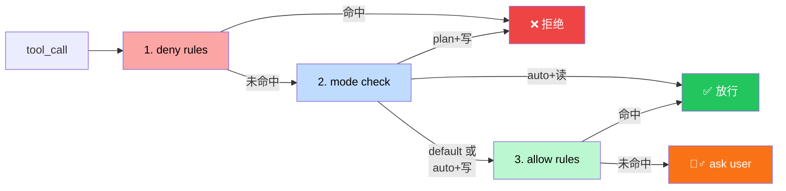

---
layout: default
---

# s07: 核心代码

<div class="grid grid-cols-[1.3fr_1fr] gap-4">
<div>

## agent_loop 变更

```python {1,15-32}
perms = PermissionManager(mode)

def agent_loop(messages: list, perms: PermissionManager):
    while True:
        response = client.messages.create(...)
        messages.append({"role": "assistant", "content": response.content})
        if response.stop_reason != "tool_use":
            return

        results = []
        for block in response.content:
            if block.type != "tool_use":
                continue

            # s07 新增：权限管道
            decision = perms.check(block.name, block.input or {})

            if decision["behavior"] == "deny": # 拒绝执行
                output = f"Permission denied: {decision['reason']}"
                print(f"  [DENIED] {block.name}: {decision['reason']}")
            elif decision["behavior"] == "ask": # 询问用户
                if perms.ask_user(block.name, block.input or {}):
                    handler = TOOL_HANDLERS.get(block.name)
                    output = handler(**(block.input or {})) if handler else f"Unknown: {block.name}"
                    print(f"> {block.name}: {str(output)[:200]}")
                else:
                    output = f"Permission denied by user for {block.name}"
                    print(f"  [USER DENIED] {block.name}")
            else:  # 允许执行
                handler = TOOL_HANDLERS.get(block.name)
                output = handler(**(block.input or {})) if handler else f"Unknown: {block.name}"
                print(f"> {block.name}: {str(output)[:200]}")

            results.append({...})

        messages.append({"role": "user", "content": results})
```

</div>
<div>

## PermissionManager

```python
# plan：最严格，所有写操作直接禁止，只允许读
# default：最保守，没有命中规则的操作，一律问用户
# auto：半自动，读文件、搜索这类安全操作自动过，写文件、执行命令要走规则或问用户
MODES = ("default", "plan", "auto")

class PermissionManager:
    def __init__(self, mode="default", rules=None):
        self.mode = mode
        self.rules = rules or DEFAULT_RULES

    def check(self, tool_name, tool_input) -> dict:
        # 1. deny rules
        # 2. mode check (plan/auto)
        # 3. allow rules
        # 4. ask user
        return {"behavior": "allow|deny|ask", "reason": "..."}
```

## BashSecurityValidator（Step 0）

bash 命令是自由文本，四级管道之前先过一遍正则检查：

```python
class BashSecurityValidator:
    VALIDATORS = [
        ("shell_metachar", r"[;&|`$]"),
        ("sudo", r"\bsudo\b"),
        ("rm_rf", r"\brm\s+(-[a-zA-Z]*)?r"),
        ("cmd_substitution", r"\$\("),
    ]
    def validate(self, command) -> list: ...
    def is_safe(self, command) -> bool: ...
```

</div>
</div>

---

# s08: Hook 系统

> 安全团队要审计 bash、QA 要自动跑 lint、运维要运行日志，难道每个需求都改主循环？

**问题**：安全审计、自动 lint、操作日志……每加一个横切需求都要改主循环，循环越来越重，改动就可能影响全局

**方案**：主循环只在关键节点暴露"时机"，附加行为写成独立的 hook 脚本，通过配置文件注册，用退出码约定结果

<div class="grid grid-cols-3 gap-4 mt-8 mb-16">
<div v-click class="p-2 bg-blue-50 dark:bg-blue-900/20 rounded text-center">

**3 个生命周期事件**

SessionStart · PreToolUse · PostToolUse

</div>
<div v-click class="p-2 bg-amber-50 dark:bg-amber-900/20 rounded text-center">

**统一退出码协议**

`0` 继续 · `1` 阻止 · `2` 追加信息

</div>
<div v-click class="p-2 bg-green-50 dark:bg-green-900/20 rounded text-center">

**核心原则**

hook 不替代主循环，只在固定时机旁路扩展

</div>
</div>

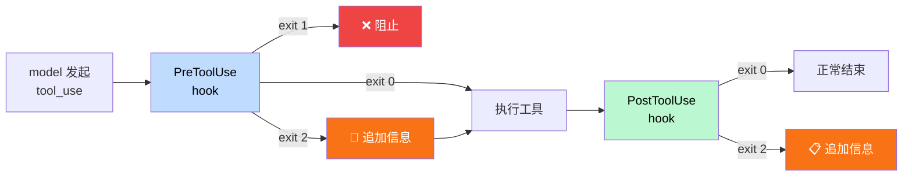


---
layout: default
---

# s08: 核心代码

<div class="grid grid-cols-[1.3fr_1fr] gap-4">
<div>

## agent_loop 变更

```python {4-7|9-20|25-27|29-31}
    while True:
        response = client.messages.create(...)
        ...
        for block in response.content:
            ...
            # s08 新增：执行 PreToolUse hooks
            pre_result = hooks.run_hooks("PreToolUse", ctx)

            # s08 新增：注入 hook 的信息
            for msg in pre_result.get("messages", []):
                results.append({
                    "type": "tool_result", "tool_use_id": block.id,
                    "content": f"[Hook message]: {msg}",
                })

            if pre_result.get("blocked"):
                reason = pre_result.get("block_reason", "Blocked by hook")
                output = f"Tool blocked by PreToolUse hook: {reason}"
                results.append(...)
                continue

            # 正常执行工具
            ...

            # s08 新增：执行 PostToolUse hooks
            ctx["tool_output"] = output
            post_result = hooks.run_hooks("PostToolUse", ctx)

            # s08 新增：注入 hook 的信息
            for msg in post_result.get("messages", []):
                output += f"\n[Hook note]: {msg}"

            results.append(...)

        messages.append({"role": "user", "content": results})
```

</div>
<div>

## 新增常量

```python
HOOK_EVENTS = ("PreToolUse", "PostToolUse", "SessionStart")
```

## HookEvent

```python
event = {
    "name": "PreToolUse",
    "payload": {
        "tool_name": "bash",
        "input": {"command": "pytest"},
    },
}
```

## HookResult

```python
result = {
    "exit_code": 0, # 0 继续 · 1 阻止 · 2 追加信息
    "message": "",
}
```

## 配置文件 `.hooks.json`

```json
{
  "hooks": {
    "PreToolUse": [
      {"matcher": "bash", "command": "audit.sh"}
    ],
    "PostToolUse": [
      {"matcher": "*", "command": "log.sh"}
    ]
  }
}
```

</div>
</div>

---

# s09: 记忆系统 (Memory)

> 你告诉它三次"别改 test snapshots"，下次开会话，它又改了——因为它每次都是新的

<div class="grid grid-cols-[1fr_600px] gap-4">
<div>

**问题**：每次新会话，用户偏好、纠正、项目约定全部丢失

**方案**：4 类跨会话记忆

<v-clicks>

- **user** — 偏好（"我用 tabs"、"始终用 pytest"）
- **feedback** — 纠正（"不要改 snapshots"）
- **project** — 不易从代码推出的约定
- **reference** — 外部资源指针
- 新增工具 `save_memory`，记忆注入 system prompt

</v-clicks>

<div v-click class="mt-2 p-2 bg-yellow-50 dark:bg-yellow-900/20 rounded text-sm">

**不要存**：文件结构、临时任务进度、密钥

</div>

</div>

<div class="embed-viz">
<iframe src="https://build-your-own-agent.vercel.app/en/embed/s09/" />
</div>

</div>

---
layout: default
---

# s09: 核心代码 — 主循环的变更

<div class="grid grid-cols-[1.3fr_1fr] gap-4">
<div>

## agent_loop 变更

```python {3-4}
def agent_loop(messages: list):
    while True:
        # s09 新增：每轮重建 system prompt，含最新记忆
        system = build_system_prompt()
        response = client.messages.create(
            model=MODEL, system=system,
            messages=messages, tools=TOOLS, max_tokens=8000,
        )
        ...  # 标准循环
```

## 注册新工具

```python
TOOL_HANDLERS = {
    ...,
    # s09 新增
    "save_memory": lambda **kw: memory_mgr.save_memory(
        kw["name"], kw["description"], kw["type"], kw["content"]),
}
```

</div>
<div>

## MemoryManager

```python
MEMORY_TYPES = ("user", "feedback", "project", "reference")

class MemoryManager:
    def __init__(self, memory_dir: Path):
        self.memories = {}  # name -> {desc, type, content}

    def load_all(self): ...         # 启动时加载 .memory/*.md
    def load_memory_prompt(self) -> str: ...  # 注入 system prompt
    def save_memory(self, name, desc, type, content) -> str:
        # 写 .memory/{name}.md + frontmatter
        # 更新 MEMORY.md 索引
        ...
```

## 存储布局

```text
.memory/
  MEMORY.md          ← 索引（≤200行）
  prefer_tabs.md     ← 单条记忆
  review_style.md
```

</div>
</div>

---

# s10: 系统提示词构建 (System Prompt)

> 角色说明、工具文档、技能目录、记忆、CLAUDE.md——全塞一个字符串里，半年后谁敢改？

<div class="grid grid-cols-[1fr_600px] gap-4">
<div>

**问题**：system prompt 是一整块硬编码字符串，无法维护

**方案**：组装流水线 + 动态边界

<v-clicks>

- 6 段独立组装：core → tools → skills → memory → CLAUDE.md → dynamic
- `DYNAMIC_BOUNDARY` 分隔静态和动态部分
- 静态前缀可缓存，动态后缀每轮变
- 每轮重建，新记忆立即可见

</v-clicks>

</div>

<div class="embed-viz">
<iframe src="https://build-your-own-agent.vercel.app/en/embed/s10/" />
</div>

</div>

---
layout: default
---

# s10: 核心代码 — SystemPromptBuilder

<div class="grid grid-cols-[1.3fr_1fr] gap-4">
<div>

## agent_loop 变更

```python {3-4}
def agent_loop(messages: list):
    while True:
        # s10 新增：用 builder 组装 system prompt
        system = prompt_builder.build()
        response = client.messages.create(
            model=MODEL, system=system,
            messages=messages, tools=TOOLS, max_tokens=8000,
        )
        ...  # 标准循环
```

## build() 方法

```python
def build(self) -> str:
    sections = []
    core = self._build_core()                # 身份 + 规则
    if core: sections.append(core)
    tools = self._build_tool_listing()       # 工具列表
    if tools: sections.append(tools)
    skills = self._build_skill_listing()     # 技能目录
    if skills: sections.append(skills)
    memory = self._build_memory_section()    # 记忆内容
    if memory: sections.append(memory)
    claude_md = self._build_claude_md()      # CLAUDE.md
    if claude_md: sections.append(claude_md)
    sections.append(DYNAMIC_BOUNDARY)        # 分隔线
    dynamic = self._build_dynamic_context()  # 日期/目录
    if dynamic: sections.append(dynamic)
    return "\n\n".join(sections)
```

</div>
<div>

## SystemPromptBuilder

```python
DYNAMIC_BOUNDARY = "=== DYNAMIC_BOUNDARY ==="

class SystemPromptBuilder:
    def __init__(self, workdir, tools):
        self.workdir = workdir
        self.tools = tools
        self.skills_dir = workdir / "skills"
        self.memory_dir = workdir / ".memory"
```

## 6 段来源

| 段 | 来源 | 变化频率 |
|----|------|----------|
| 1. core | 硬编码 | 几乎不变 |
| 2. tools | TOOLS 列表 | 版本更新 |
| 3. skills | skills/ 目录 | 安装时 |
| 4. memory | .memory/ | 会话内 |
| 5. CLAUDE.md | 文件链 | 人工编辑 |
| 6. dynamic | 运行时 | 每轮变 |

<div class="mt-2 p-2 bg-blue-50 dark:bg-blue-900/20 rounded text-sm">

**CLAUDE.md 链**：`~/.claude/CLAUDE.md` → 项目根 → 子目录

</div>

</div>
</div>

---

# s11: 错误恢复 (Error Recovery)

> 大文件写到一半 max_tokens 截断、上下文爆了、API 超时——如果每次都崩溃，用户就不敢用了

<div class="grid grid-cols-[1fr_600px] gap-4">
<div>

**问题**：max_tokens 截断、prompt_too_long、API 超时——三种常见错误

**方案**：三条恢复路径

<v-clicks>

- **max_tokens** → 注入续写提示，继续生成
- **prompt_too_long** → 自动压缩后重试
- **timeout/rate_limit** → 指数退避重试
- 每种最多重试 3 次，全部耗尽才真正失败

</v-clicks>

</div>

<div class="embed-viz">
<iframe src="https://build-your-own-agent.vercel.app/en/embed/s11/" />
</div>

</div>

---
layout: default
---

# s11: 核心代码 — 主循环的变更

<div class="grid grid-cols-[1.3fr_1fr] gap-4">
<div>

## agent_loop 变更

```python {2|4-5|7-15|17-23|25-29}
def agent_loop(messages: list):
    max_output_recovery_count = 0
    while True:
        # s11 新增：API 调用 + 重试包装
        response = None
        for attempt in range(MAX_RECOVERY_ATTEMPTS + 1):
            try:
                response = client.messages.create(...)
                break
            except APIError as e:
                # 恢复路径 2: prompt_too_long → 压缩重试
                if "prompt" in str(e) and "long" in str(e):
                    messages[:] = auto_compact(messages)
                    continue
                # 恢复路径 3: 退避重试
                delay = backoff_delay(attempt)
                time.sleep(delay)
                continue
        ...
        # 恢复路径 1: max_tokens → 注入续写提示
        if response.stop_reason == "max_tokens":
            max_output_recovery_count += 1
            if max_output_recovery_count <= MAX_RECOVERY_ATTEMPTS:
                messages.append({"role": "user",
                    "content": CONTINUATION_MESSAGE})
                continue
        max_output_recovery_count = 0
        ...  # 正常工具执行
```

</div>
<div>

## 恢复常量

```python
MAX_RECOVERY_ATTEMPTS = 3
BACKOFF_BASE_DELAY = 1.0   # seconds
BACKOFF_MAX_DELAY = 30.0   # seconds
TOKEN_THRESHOLD = 50000

CONTINUATION_MESSAGE = (
    "Output limit hit. Continue directly "
    "from where you stopped -- no recap, "
    "no repetition."
)
```

## 退避函数

```python
def backoff_delay(attempt: int) -> float:
    delay = min(BACKOFF_BASE_DELAY * (2 ** attempt),
                BACKOFF_MAX_DELAY)
    jitter = random.uniform(0, 1)
    return delay + jitter
```

## 自动压缩

```python
def auto_compact(messages: list) -> list:
    summary = client.messages.create(
        model=MODEL,
        messages=[{"role": "user",
                   "content": "Summarize..."}],
    ).content[0].text
    return [{"role": "user", "content": summary}]
```

</div>
</div>

---

# 阶段 2 完成：你的 Agent 现在能自我治理了

<div class="grid grid-cols-5 gap-3 text-sm">

<div v-click class="p-3 bg-green-50 dark:bg-green-900/20 rounded-lg text-center">

**s07 权限**

deny → mode → allow → ask

</div>

<div v-click class="p-3 bg-green-50 dark:bg-green-900/20 rounded-lg text-center">

**s08 Hook**

不改循环也能扩展

</div>

<div v-click class="p-3 bg-green-50 dark:bg-green-900/20 rounded-lg text-center">

**s09 记忆**

跨会话持久知识

</div>

<div v-click class="p-3 bg-green-50 dark:bg-green-900/20 rounded-lg text-center">

**s10 Prompt**

组装流水线

</div>

<div v-click class="p-3 bg-green-50 dark:bg-green-900/20 rounded-lg text-center">

**s11 恢复**

出错不崩溃

</div>

</div>

<div v-click class="mt-6 p-3 bg-green-50 dark:bg-green-900/30 rounded-lg text-sm text-center">

**如果你在这里停下来做产品，已经是一个真正有用的 agent harness 了。**

但真实工作有结构：任务之间有依赖、有些事要后台跑、有些事要定时做。这是阶段 3。

</div>

---
layout: section
---

# 阶段 3：任务管理

## s12 — s14

<div class="text-gray-500 mt-4">
把"聊天中的清单"升级成"磁盘上的任务图"
</div>

---
layout: center
---

# 阶段 3 要解决什么？

<v-clicks>

s03 的 TodoWrite 是"会话内清单"——压缩一次就丢了。

真实工作有**结构**：任务 B 等任务 A，C 和 D 能并行，E 等 C+D 都完成。

有些命令要跑 90 秒（`pytest`），难道 agent 傻等？

有些事要"每周一早 9 点跑"——难道用户每次手动提？

</v-clicks>

<div v-click class="mt-6 grid grid-cols-3 gap-3 text-sm">
<div class="p-2 bg-amber-50 dark:bg-amber-900/20 rounded text-center">

**s12** 持久任务图

</div>
<div class="p-2 bg-amber-50 dark:bg-amber-900/20 rounded text-center">

**s13** 后台执行

</div>
<div class="p-2 bg-amber-50 dark:bg-amber-900/20 rounded text-center">

**s14** 定时调度

</div>
</div>

---

# s12: 任务系统 (Task System)

> s03 的 Todo 只知道"有事要做"；Task 能告诉你"先做什么、谁在等谁、完成后自动解锁下游"

<div class="grid grid-cols-[1fr_600px] gap-4">
<div>

**问题**：Todo 是会话内清单，压缩一次就丢了；没有依赖关系

**方案**：持久化任务图（JSON 文件 on disk）

<v-clicks>

- 每个 task 有 `blockedBy` / `blocks` 依赖关系
- 完成一个 task → 自动从下游的 `blockedBy` 移除
- `is_ready(task)` = pending + 没有前置阻塞
- 新增工具：`task_create` / `task_update` / `task_list` / `task_get`

</v-clicks>

</div>

<div class="embed-viz">
<iframe src="https://build-your-own-agent.vercel.app/en/embed/s07/" />
</div>

</div>

---
layout: default
---

# s12: 核心代码

<div class="grid grid-cols-[1.3fr_1fr] gap-4">
<div>

## 主循环无本质变化（只新增工具）

```python
TOOL_HANDLERS = {
    "bash":        ...,
    "read_file":   ...,
    "write_file":  ...,
    "edit_file":   ...,
    # s12 新增
    "task_create": lambda **kw: TASKS.create(kw["subject"], ...),
    "task_update": lambda **kw: TASKS.update(kw["task_id"], ...),
    "task_list":   lambda **kw: TASKS.list_all(),
    "task_get":    lambda **kw: TASKS.get(kw["task_id"]),
}
```

## 自动解锁

```python
def _clear_dependency(self, completed_id: int):
    for f in self.dir.glob("task_*.json"):
        task = json.loads(f.read_text())
        if completed_id in task.get("blockedBy", []):
            task["blockedBy"].remove(completed_id)
            self._save(task)
```

</div>
<div>

## TaskRecord

```python
task = {
    "id": 1,
    "subject": "Write parser",
    "description": "",
    "status": "pending",    # pending | in_progress | completed
    "blockedBy": [],        # 还在等谁
    "blocks": [],           # 它完成后解锁谁
    "owner": "",
}
```

## TaskManager

```python
class TaskManager:
    def __init__(self, tasks_dir: Path):
        self.dir = tasks_dir
    def create(self, subject, desc) -> str: ...
    def get(self, task_id) -> str: ...
    def update(self, task_id, status=None, ...) -> str:
        ...
        if status == "completed":
            self._clear_dependency(task_id)
    def list_all(self) -> str: ...
```

## 存储布局

```text
.tasks/
  task_1.json  {"id":1, "status":"completed", ...}
  task_2.json  {"id":2, "blockedBy":[1], ...}
```

</div>
</div>

---

# s13: 后台任务 (Background Tasks)

> 用户说"跑测试，同时帮我建配置文件"——但你的 agent 只会傻等 90 秒测试跑完

<div class="grid grid-cols-[1fr_600px] gap-4">
<div>

**问题**：慢命令（pytest、npm build）阻塞主循环

**方案**：daemon 线程 + 通知队列

<v-clicks>

- `background_run` 启动后台线程，立即返回 task_id
- 主循环继续其他工作
- 后台完成 → 推入通知队列
- 每轮 LLM 调用前 `drain_notifications()` → 注入结果
- 新增工具：`background_run` / `check_background`

</v-clicks>

</div>

<div class="embed-viz">
<iframe src="https://build-your-own-agent.vercel.app/en/embed/s08/" />
</div>

</div>

---
layout: default
---

# s13: 核心代码 — 主循环的变更

<div class="grid grid-cols-[1.3fr_1fr] gap-4">
<div>

## agent_loop 变更

```python {3-10}
def agent_loop(messages: list):
    while True:
        # s13 新增：每轮开始前 drain 后台通知
        notifs = BG.drain_notifications()
        if notifs and messages:
            notif_text = "\n".join(
                f"[bg:{n['task_id']}] {n['status']}: {n['preview']}"
                for n in notifs
            )
            messages.append({"role": "user",
                "content": f"<background-results>\n{notif_text}\n</background-results>"})

        response = client.messages.create(...)
        ...  # 标准循环
```

## 注册新工具

```python
TOOL_HANDLERS = {
    ...,
    # s13 新增
    "background_run":   lambda **kw: BG.run(kw["command"]),
    "check_background": lambda **kw: BG.check(kw.get("task_id")),
}
```

</div>
<div>

## BackgroundManager

```python
class BackgroundManager:
    def __init__(self):
        self.tasks = {}       # task_id -> status/result
        self._notification_queue = []
        self._lock = threading.Lock()

    def run(self, command) -> str:
        # 启动 daemon 线程，立即返回 task_id
        task_id = str(uuid.uuid4())[:8]
        thread = threading.Thread(
            target=self._execute,
            args=(task_id, command), daemon=True)
        thread.start()
        return f"Background task {task_id} started"

    def drain_notifications(self) -> list:
        # 返回并清空通知队列
        ...
```

## RuntimeTaskRecord

```python
task = {
    "id": "a1b2c3d4",
    "command": "pytest",
    "status": "running",      # running | completed | error
    "result_preview": "",
    "output_file": ".runtime-tasks/a1b2c3d4.log",
}
```

</div>
</div>

---

# s14: 定时调度 (Cron Scheduler)

> 后台任务解决"现在开始的慢任务"，但"每周一 9 点跑报告"怎么办？——agent 需要学会"记住未来"

<div class="grid grid-cols-[1fr_600px] gap-4">
<div>

**问题**：agent 只能响应当前请求，不能"记住未来要做的事"

**方案**：cron 表达式 + 后台检查线程 + 通知注入

<v-clicks>

- `cron_create("0 9 * * 1", "Run weekly report")` 注册定时任务
- 后台线程每秒检查一次是否到期
- 到期 → 推入通知队列 → 注入主循环
- 支持 recurring / one-shot、session-only / durable
- 新增工具：`cron_create` / `cron_delete` / `cron_list`

</v-clicks>

</div>

<div class="embed-viz" style="--viz-h: 1000px; --viz-scale: 0.45">
<iframe src="https://build-your-own-agent.vercel.app/en/embed/s09/" />
</div>

</div>

---
layout: default
---

# s14: 核心代码 — 主循环的变更

<div class="grid grid-cols-[1.3fr_1fr] gap-4">
<div>

## agent_loop 变更

```python {3-6}
def agent_loop(messages: list):
    while True:
        # s14 新增：drain 定时任务通知
        notifications = scheduler.drain_notifications()
        for note in notifications:
            messages.append({"role": "user", "content": note})

        response = client.messages.create(...)
        ...  # 标准循环
```

## 注册新工具

```python
TOOL_HANDLERS = {
    ...,
    # s14 新增
    "cron_create": lambda **kw: scheduler.create(
        kw["cron"], kw["prompt"],
        kw.get("recurring", True), kw.get("durable", False)),
    "cron_delete": lambda **kw: scheduler.delete(kw["id"]),
    "cron_list":   lambda **kw: scheduler.list_tasks(),
}
```

</div>
<div>

## ScheduleRecord

```python
schedule = {
    "id": "job_001",
    "cron": "0 9 * * 1",       # 每周一 9 点
    "prompt": "Run weekly status report.",
    "recurring": True,
    "durable": True,
    "last_fired": None,
}
```

## CronScheduler

```python
class CronScheduler:
    def __init__(self):
        self.tasks = []
        self.queue = Queue()
    def start(self): ...          # 启动后台检查线程
    def create(self, cron, prompt, ...) -> str: ...
    def drain_notifications(self) -> list: ...
```

## cron_matches

```python
def cron_matches(expr: str, dt: datetime) -> bool:
    # 5 字段匹配: min hour dom month dow
    # 支持 * / */N / N-M / N,M
    ...
```

<div class="mt-2 p-2 bg-orange-50 dark:bg-orange-900/20 rounded text-sm">

**调度器做的是"记住未来"，触发后仍然回到同一条主循环。**

</div>

</div>
</div>

---

# 阶段 3 完成：从纯反应式到可持续运行

<div class="grid grid-cols-3 gap-4 text-sm">

<div v-click class="p-3 bg-amber-50 dark:bg-amber-900/20 rounded-lg text-center">

**s12 任务图**

依赖关系 + 自动解锁

持久化到磁盘

</div>

<div v-click class="p-3 bg-amber-50 dark:bg-amber-900/20 rounded-lg text-center">

**s13 后台执行**

daemon 线程 + 通知队列

drain-before-call 模式

</div>

<div v-click class="p-3 bg-amber-50 dark:bg-amber-900/20 rounded-lg text-center">

**s14 定时调度**

cron 表达式 + 触发注入

"记住未来"

</div>

</div>

<div v-click class="mt-6 p-3 bg-amber-50 dark:bg-amber-900/30 rounded-lg text-sm">

| 概念 | 区别 |
|------|------|
| **Todo** vs **Task** | 临时会话步骤 vs 持久化工作节点（有依赖、有 owner） |
| **Task** vs **Runtime Task** | "要做什么"（目标）vs"正在跑的执行槽位"（运行时） |

</div>

---
layout: section
---

# 阶段 4：多 Agent 与外部系统

## s15 — s19

<div class="text-gray-500 mt-4">
从单 agent 升级成真正的平台
</div>

---
layout: center
---

# 阶段 4 要解决什么？

<v-clicks>

一个 agent 忙不过来了。

前端、后端、测试——需要**多个 agent 并行工作**。

但它们不能共享一个对话、不能都改同一个文件、也不能自说自话。

**这个阶段解决：谁在做、怎么协调、在哪做、外部能力怎么接入。**

</v-clicks>

<div v-click class="mt-6 grid grid-cols-5 gap-2 text-sm">
<div class="p-2 bg-red-50 dark:bg-red-900/20 rounded text-center">

**s15** 团队

</div>
<div class="p-2 bg-red-50 dark:bg-red-900/20 rounded text-center">

**s16** 协议

</div>
<div class="p-2 bg-red-50 dark:bg-red-900/20 rounded text-center">

**s17** 自治

</div>
<div class="p-2 bg-red-50 dark:bg-red-900/20 rounded text-center">

**s18** 隔离

</div>
<div class="p-2 bg-red-50 dark:bg-red-900/20 rounded text-center">

**s19** MCP

</div>
</div>

---

# s15: 智能体团队 (Agent Teams)

> s04 的 Subagent 是"用完即弃"；团队成员**长期在线、有身份、有邮箱、能反复接活**

<div class="grid grid-cols-[1fr_600px] gap-4">
<div>

**问题**：Subagent 是一次性的，没有身份、没有邮箱、不能长期在线

**方案**：持久化名册 + JSONL 邮箱 + 独立循环

<v-clicks>

- **名册** `.team/config.json`：成员列表、角色、状态
- **邮箱** `.team/inbox/alice.jsonl`：append-only 收件箱
- 每个队友独立线程运行自己的 agent loop
- 新增工具：`spawn_teammate` / `send_message` / `read_inbox` / `broadcast`

</v-clicks>

</div>

<div class="embed-viz">
<iframe src="https://build-your-own-agent.vercel.app/en/embed/s09/" />
</div>

</div>

---
layout: default
---

# s15: 核心代码

<div class="grid grid-cols-[1.3fr_1fr] gap-4">
<div>

## agent_loop 变更（Lead 循环）

```python {3-7}
def agent_loop(messages: list):
    while True:
        # s15 新增：每轮 drain lead 的邮箱
        inbox = BUS.read_inbox("lead")
        if inbox:
            messages.append({"role": "user",
                "content": f"<inbox>{json.dumps(inbox)}</inbox>"})

        response = client.messages.create(...)
        ...  # 标准循环
```

## Lead 工具（9 个）

```python
TOOL_HANDLERS = {
    "bash": ..., "read_file": ..., "write_file": ..., "edit_file": ...,
    # s15 新增
    "spawn_teammate":  lambda **kw: TEAM.spawn(kw["name"], kw["role"], kw["prompt"]),
    "list_teammates":  lambda **kw: TEAM.list_all(),
    "send_message":    lambda **kw: BUS.send("lead", kw["to"], kw["content"]),
    "read_inbox":      lambda **kw: json.dumps(BUS.read_inbox("lead")),
    "broadcast":       lambda **kw: BUS.broadcast("lead", kw["content"], ...),
}
```

</div>
<div>

## MessageBus（JSONL 邮箱）

```python
class MessageBus:
    def send(self, sender, to, content, msg_type="message"):
        msg = {"type": msg_type, "from": sender,
               "content": content, "timestamp": time.time()}
        # append 到 .team/inbox/{to}.jsonl

    def read_inbox(self, name) -> list:
        # 读取并清空 .team/inbox/{name}.jsonl
```

## TeammateManager

```python
class TeammateManager:
    def spawn(self, name, role, prompt) -> str:
        # 写入 config.json
        # 启动独立线程 → _teammate_loop
        ...

    def _teammate_loop(self, name, role, prompt):
        messages = [{"role": "user", "content": prompt}]
        for _ in range(50):
            inbox = BUS.read_inbox(name)
            ...  # 标准 agent loop
```

</div>
</div>

---

# s16: 团队协议 (Team Protocols)

> Lead 说"请停下"，Alice 无视了；Bob 直接开始数据库迁移没人审批——自由聊天不够，需要结构化握手

<div class="grid grid-cols-[1fr_600px] gap-4">
<div>

**问题**：自由消息无法保证"请求必须被回应"

**方案**：request_id 关联的结构化握手

<v-clicks>

- **shutdown 协议**：Lead 发 request → 队友 approve/reject
- **plan_approval 协议**：队友提交计划 → Lead 审批
- 每个 request 有持久化状态：`pending → approved | rejected`
- `.team/requests/{request_id}.json` 存储请求记录

</v-clicks>

</div>

<div class="embed-viz">
<iframe src="https://build-your-own-agent.vercel.app/en/embed/s10/" />
</div>

</div>

---
layout: default
---

# s16: 核心代码

<div class="grid grid-cols-[1.3fr_1fr] gap-4">
<div>

## Lead 新增工具（+3 个）

```python
TOOL_HANDLERS = {
    ...  # s15 的 9 个
    # s16 新增
    "shutdown_request": lambda **kw:
        handle_shutdown_request(kw["teammate"]),
    "shutdown_response": lambda **kw:
        _check_shutdown_status(kw["request_id"]),
    "plan_approval": lambda **kw:
        handle_plan_review(kw["request_id"],
            kw["approve"], kw.get("feedback", "")),
}
```

## shutdown 流程

```python
def handle_shutdown_request(teammate: str) -> str:
    req_id = str(uuid.uuid4())[:8]
    REQUEST_STORE.create({
        "request_id": req_id, "kind": "shutdown",
        "from": "lead", "to": teammate,
        "status": "pending", ...
    })
    BUS.send("lead", teammate, "Please shut down.",
             "shutdown_request", {"request_id": req_id})
    return f"Shutdown request {req_id} sent"
```

</div>
<div>

## RequestStore

```python
class RequestStore:
    def __init__(self, base_dir: Path):
        self.dir = base_dir   # .team/requests/

    def create(self, record: dict) -> dict:
        # 写 {request_id}.json
    def get(self, request_id) -> dict | None: ...
    def update(self, request_id, **changes): ...
```

## 协议信封

```python
# shutdown_request
message = {
    "type": "shutdown_request",
    "from": "lead", "to": "alice",
    "request_id": "req_001",
    "timestamp": 1710000000.0,
}

# shutdown_response
response = {
    "request_id": "req_001",
    "approve": True,
    "reason": "Work complete",
}
```

## 队友新增工具

```python
# 队友可以：
"shutdown_response"  # 回应关机请求
"plan_approval"      # 提交计划审批
```

</div>
</div>

---

# s17: 自治智能体 (Autonomous Agents)

> 任务板上 10 个待办，Lead 一个一个分配——Lead 成了瓶颈。让队友自己去任务板找活干

<div class="grid grid-cols-[1fr_600px] gap-4">
<div>

**问题**：所有任务都由 Lead 分配，Lead 成了瓶颈

**方案**：WORK/IDLE 状态机 + 自动认领

<v-clicks>

- **WORK 阶段**：正常 agent loop
- **IDLE 阶段**：每 5 秒轮询邮箱和任务板
- 有消息 → 恢复 WORK；有 unclaimed task → 认领后恢复
- 60 秒无事 → shutdown
- 压缩后自动重注入身份（`<identity>` block）

</v-clicks>

</div>

<div class="embed-viz">
<iframe src="https://build-your-own-agent.vercel.app/en/embed/s11/" />
</div>

</div>

---
layout: default
---

# s17: 核心代码

<div class="grid grid-cols-[1.3fr_1fr] gap-4">
<div>

## 队友循环变更（WORK → IDLE → WORK）

```python {3-8|10-19}
def _loop(self, name, role, prompt):
    messages = [{"role": "user", "content": prompt}]
    while True:
        # WORK 阶段：标准 agent loop
        for _ in range(50):
            ...  # 正常执行，直到 stop_reason != tool_use
            if idle_requested:
                break

        # IDLE 阶段：轮询
        self._set_status(name, "idle")
        for _ in range(IDLE_TIMEOUT // POLL_INTERVAL):
            time.sleep(POLL_INTERVAL)
            inbox = BUS.read_inbox(name)
            if inbox:
                ensure_identity_context(messages, ...)
                resume = True; break
            unclaimed = scan_unclaimed_tasks(role)
            if unclaimed:
                claim_task(unclaimed[0]["id"], name, ...)
                resume = True; break

        if not resume:
            self._set_status(name, "shutdown"); return
        self._set_status(name, "working")
```

</div>
<div>

## 认领条件

```python
def is_claimable_task(task: dict, role=None) -> bool:
    return (
        task.get("status") == "pending"
        and not task.get("owner")
        and not task.get("blockedBy")
        and _task_allows_role(task, role)
    )
```

## 身份重注入

```python
def ensure_identity_context(messages, name, role, team):
    if "<identity>" in str(messages[0].get("content", "")):
        return  # 已有身份
    messages.insert(0, {
        "role": "user",
        "content": f"<identity>You are '{name}', "
                   f"role: {role}, team: {team}."
                   f"</identity>"
    })
```

## 新增工具

```python
# 队友新增
"idle":       # 信号：进入 IDLE 阶段
"claim_task": # 手动认领任务
```

</div>
</div>

---

# s18: Worktree 任务隔离

> Alice 在重构 auth，Bob 在做登录页——两人同时改 `config.py`，文件冲突了。每个任务需要自己的"车道"

<div class="grid grid-cols-[1fr_600px] gap-4">
<div>

**问题**：多个队友在同一个目录工作，文件冲突

**方案**：git worktree = 每个任务一个隔离目录

<v-clicks>

- **Task** 是控制面（做什么），**Worktree** 是执行面（在哪做）
- `worktree_create` → `git worktree add -b wt/{name}`
- `worktree_run` → `subprocess.run(cmd, cwd=wt_path)`
- `worktree_closeout` → keep（保留）或 remove（删除）
- 任务状态和车道状态**分开管理**

</v-clicks>

</div>

<div class="embed-viz">
<iframe src="https://build-your-own-agent.vercel.app/en/embed/s12/" />
</div>

</div>

---
layout: default
---

# s18: 核心代码

<div class="grid grid-cols-[1.3fr_1fr] gap-4">
<div>

## 主循环无本质变化（新增工具）

```python
TOOL_HANDLERS = {
    ...,  # 基础 4 个 + task 4 个
    # s18 新增：worktree 系列
    "worktree_create":   lambda **kw: WORKTREES.create(kw["name"], ...),
    "worktree_list":     lambda **kw: WORKTREES.list_all(),
    "worktree_enter":    lambda **kw: WORKTREES.enter(kw["name"]),
    "worktree_run":      lambda **kw: WORKTREES.run(kw["name"], kw["command"]),
    "worktree_closeout": lambda **kw: WORKTREES.closeout(
        kw["name"], kw["action"], ...),
    "worktree_status":   lambda **kw: WORKTREES.status(kw["name"]),
    "worktree_events":   lambda **kw: EVENTS.list_recent(...),
    "task_bind_worktree": ...,
}
```

## 生命周期

```text
1. task_create("Refactor auth")
2. worktree_create("auth-refactor", task_id=12)
3. worktree_enter("auth-refactor")
4. worktree_run("auth-refactor", "pytest")
5. worktree_closeout("auth-refactor", "keep"|"remove")
```

</div>
<div>

## 两张注册表

```python
# .tasks/task_12.json
task = {
    "id": 12,
    "subject": "Refactor auth",
    "worktree": "auth-refactor",
    "worktree_state": "active",  # 独立于 status
}

# .worktrees/index.json
worktree = {
    "name": "auth-refactor",
    "path": ".worktrees/auth-refactor",
    "branch": "wt/auth-refactor",
    "task_id": 12,
    "status": "active",  # active | kept | removed
}
```

## WorktreeManager

```python
class WorktreeManager:
    def create(self, name, task_id=None, base_ref="HEAD"):
        # git worktree add -b wt/{name} ...
        # 写入 index.json
        # 绑定 task
    def run(self, name, command) -> str:
        # subprocess.run(cmd, cwd=wt_path)
    def closeout(self, name, action, ...):
        # action="keep" | "remove"
```

## EventBus

```python
class EventBus:
    def emit(self, event, task_id=None, wt_name=None): ...
    # worktree.create / worktree.run / worktree.remove
```

</div>
</div>

---

# s19: MCP 与插件系统

> 想查数据库？写个 handler。想控浏览器？再写一个。每次加能力都改代码？——让外部进程自己报到

<div class="grid grid-cols-[1fr_600px] gap-4">
<div>

**问题**：每加一个外部能力都要改代码

**方案**：MCP 协议 — 外部进程自己报到，统一路由

<v-clicks>

- **MCPClient**：连接外部 stdio 进程，发现它的工具
- **mcp__ 前缀**：`mcp__postgres__query` 路由到 postgres server
- **PluginLoader**：从 `.claude-plugin/plugin.json` 发现配置
- **统一权限**：MCP 工具走同一条 `CapabilityPermissionGate`
- native + MCP 合并成一个 tool pool

</v-clicks>

</div>

<div class="embed-viz" style="--viz-h: 1000px; --viz-scale: 0.45">
<iframe src="https://build-your-own-agent.vercel.app/en/embed/s12/" />
</div>

</div>

---
layout: default
---

# s19: 核心代码 — 统一路由

<div class="grid grid-cols-[1.3fr_1fr] gap-4">
<div>

## agent_loop 变更

```python {2|8-9|11-15}
def agent_loop(messages: list):
    # s19 新增：合并 native + MCP 工具
    tools = build_tool_pool()
    while True:
        response = client.messages.create(
            model=MODEL, system=system,
            messages=messages, tools=tools, max_tokens=8000)
        ...
        for block in response.content:
            # s19 新增：统一权限检查
            decision = permission_gate.check(block.name, block.input)
            if decision["behavior"] == "deny":
                output = f"Permission denied"
            elif decision["behavior"] == "ask" and not ...:
                output = f"Permission denied by user"
            else:
                # s19 新增：统一路由
                output = handle_tool_call(block.name, block.input)
            results.append({...})
```

## 统一路由

```python
def handle_tool_call(tool_name, tool_input) -> str:
    if mcp_router.is_mcp_tool(tool_name):   # mcp__ 前缀
        return mcp_router.call(tool_name, tool_input)
    handler = NATIVE_HANDLERS.get(tool_name)
    return handler(**tool_input) if handler else "Unknown"
```

</div>
<div>

## MCPClient

```python
class MCPClient:
    def __init__(self, server_name, command, args):
        ...
    def connect(self): ...         # 启动进程 + initialize
    def list_tools(self) -> list:  # tools/list
    def call_tool(self, name, args) -> str:  # tools/call
    def get_agent_tools(self) -> list:
        # 给每个 tool 加 mcp__{server}__{tool} 前缀
```

## MCPToolRouter

```python
class MCPToolRouter:
    def __init__(self):
        self.clients = {}  # server_name -> MCPClient
    def is_mcp_tool(self, name) -> bool:
        return name.startswith("mcp__")
    def call(self, tool_name, args) -> str:
        _, server, tool = tool_name.split("__", 2)
        return self.clients[server].call_tool(tool, args)
```

## CapabilityPermissionGate

```python
class CapabilityPermissionGate:
    def check(self, tool_name, tool_input) -> dict:
        intent = self.normalize(tool_name, tool_input)
        # read → allow; write → ask; high → ask
        # MCP 和 native 走同一条管道
```

</div>
</div>

---

# 阶段 4 完成：从单 Agent 到完整平台

<div class="grid grid-cols-5 gap-2 text-sm">

<div v-click class="p-3 bg-red-50 dark:bg-red-900/20 rounded-lg text-center">

**s15 团队**

名册 + 邮箱 + 独立循环

</div>

<div v-click class="p-3 bg-red-50 dark:bg-red-900/20 rounded-lg text-center">

**s16 协议**

request_id 握手

shutdown + plan

</div>

<div v-click class="p-3 bg-red-50 dark:bg-red-900/20 rounded-lg text-center">

**s17 自治**

IDLE 轮询 + 自动认领

身份重注入

</div>

<div v-click class="p-3 bg-red-50 dark:bg-red-900/20 rounded-lg text-center">

**s18 Worktree**

控制面 vs 执行面

git worktree 隔离

</div>

<div v-click class="p-3 bg-red-50 dark:bg-red-900/20 rounded-lg text-center">

**s19 MCP**

统一路由 + 权限一致

mcp__前缀

</div>

</div>

<div v-click class="mt-6 p-3 bg-red-50 dark:bg-red-900/30 rounded-lg text-sm">

| 概念 | 区别 |
|------|------|
| **Subagent** vs **Teammate** | 用完即弃 vs 长期存在、有身份、有邮箱 |
| **Worktree** vs **Task** | "在哪做"（执行车道）vs"做什么"（工作目标） |

</div>

---

# 全景回顾：系统三层架构

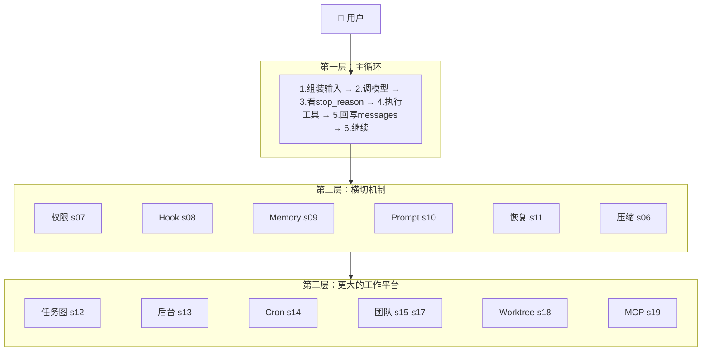

<div class="mt-2 text-sm text-center text-gray-500">

现在再看这张图，每一个方块你都知道它是什么、为什么存在、最小实现长什么样。

</div>

---

# 核心数据结构总览

<div class="text-sm">

| 层次 | 关键结构 | 职责 |
|------|----------|------|
| **对话控制** | `Message` / `QueryState` / `TransitionReason` | 管本轮输入和继续理由 |
| **工具执行** | `ToolSpec` / `DispatchMap` / `ToolUseContext` | 管动作怎么安全执行 |
| **权限 Hook** | `PermissionRule` / `PermissionDecision` / `HookEvent` | 管安全和扩展 |
| **持久工作** | `TaskRecord` / `MemoryEntry` / `ScheduleRecord` | 管跨会话的持久工作 |
| **运行时** | `RuntimeTaskState` / `TeamMember` / `WorktreeRecord` | 管当前执行车道 |
| **外部能力** | `MCPServerConfig` / `MCPToolSpec` | 管系统怎样向外接能力 |

</div>

---

# 最容易混淆的概念对照

<div class="grid grid-cols-2 gap-4 text-sm">

<div>

| 概念对 | 区分方法 |
|--------|----------|
| **Todo** vs **Task** | 临时步骤 vs 持久化工作节点 |
| **Task** vs **Runtime Task** | 目标 vs 执行槽位 |
| **Subagent** vs **Teammate** | 一次性 vs 长期存在 |
| **Memory** vs **Context** | 跨会话 vs 当前轮 |

</div>

<div>

| 概念对 | 区分方法 |
|--------|----------|
| **Prompt** vs **Reminder** | 稳定说明 vs 临时提醒 |
| **Worktree** vs **Task** | 在哪做 vs 做什么 |
| **Tool** vs **Resource** | 动作 vs 可读内容 |
| **Permission** vs **Hook** | 能不能做 vs 额外插入行为 |

</div>

</div>

---

# 四个里程碑

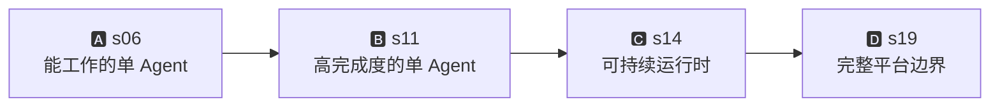

<div class="grid grid-cols-4 gap-3 mt-6 text-sm">

<div class="p-3 bg-blue-50 dark:bg-blue-900/20 rounded-lg text-center">

**A: s06 完成**

主循环 + 工具 + 计划 + 子任务 + 技能 + 压缩

</div>

<div class="p-3 bg-green-50 dark:bg-green-900/20 rounded-lg text-center">

**B: s11 完成**

权限 + Hook + Memory + Prompt + 恢复

</div>

<div class="p-3 bg-amber-50 dark:bg-amber-900/20 rounded-lg text-center">

**C: s14 完成**

持久任务 + 后台执行 + 定时触发

</div>

<div class="p-3 bg-red-50 dark:bg-red-900/20 rounded-lg text-center">

**D: s19 完成**

队友 + 协议 + 自治 + Worktree + MCP

</div>

</div>

---
layout: center
class: text-center
---

# 一句话记住

<div class="text-2xl mt-8 font-bold">

先做出能工作的最小循环

再一层一层给它补上

**规划 → 隔离 → 安全 → 记忆 → 任务 → 协作 → 外部能力**

</div>

<div class="mt-8 text-gray-500">

好的章节顺序，不是把所有机制排成一列，

而是让每一章都像前一章**自然长出来的下一层**。

</div>

<div class="mt-6 text-sm text-gray-400">

如果你能从 s01 开始，不看代码重建到 s19，你就真正理解了这套设计。

</div>

---
layout: end
---

# Thank You!

Learn Claude Code · 从零手搓 AI Coding Agent

<div class="text-sm text-gray-500 mt-4">

GitHub: [shareAI-lab/learn-claude-code](https://github.com/shareAI-lab/learn-claude-code)

</div>
