# Build Your Own Agent

## 从 0 到 1 手搓 AI Coding Agent

<div class="text-lg text-gray-500 mt-8">
<p>javayhu</p>
<p>2026/4/13</p>
</div>

<!--
基于开源项目 Learn Claude Code 的教程，分享一个简化版本的 AI Coding Agent 的构建流程
这个教程是在 Claude Code 代码泄漏之前就有，在这之后，可能基于泄漏的源码，又补充了几个章节
-->

---
layout: section
---

# 内容大纲

## 1、回顾近半年进展

## 2、Agent 框架对比

## 3、Agent 框架实现

## 4、Agent 框架使用

<!-- 大模型的核心概念，这次是介绍半年后它们的进展，以及现在火热的 Agent 开发入门。
基础知识的科普，对齐大家的认知，方便工作中遇到 Agent 开发时沟通交流，或者寻找方向。
不追热点，聚焦本质，将原来的编程思想应用到 Agent 开发中-->

---
layout: two-cols
---

<template v-slot:default>

# (1/2) 大模型基础概念

- <span class="text-orange-500 font-bold">LLM</span>
- Prompt
- Token
- Context
- Tools
- MCP

<div class="concept-slide-image">
  
</div>

</template>

<template v-slot:right>

## 近半年进展

### 1、[models.dev](https://models.dev)

记录主流模型的发布时间、知识库时间、性能、价格和能力

- OpenAI GPT 5.4 / Google Gemini 3.1 / Anthropic Claude Opus 4.6

- GLM 5.1 / Kimi K2.5 / MiniMax M2.7

### 2、[openrouter.ai](https://openrouter.ai/rankings)

调用量前十中除了国外三家模型，国产开源模型也表现亮眼

<div class="concept-slide-image">
  
</div>

<!-- ### 3、<span class="text-orange-500">AI 应用生态</span>

现在拼的不只是模型能力，还有 AI 应用生态

- 1 月份，Claude Cowork 推出，AI 应用开始转向 个人 Agent 应用

- 2 月份，OpenClaw 爆火，全民开始养虾，各种 *Claw 产品层出不穷

- 随后，browser use、computer use 等功能逐渐成为 AI 应用的标配 -->

</template>

<!-- LLM -->

---
layout: two-cols
---

<template v-slot:default>

# (1/2) 大模型基础概念

- LLM
- <span class="text-orange-500 font-bold">Prompt</span>
- Token
- Context
- Tools
- MCP

<div class="concept-slide-image">
  
</div>

</template>

<template v-slot:right>

## 近半年进展

### 1、提示词缓存（Prompt Caching）

如果当前请求的输入前缀和之前的请求完全一致，模型商就可以直接从缓存中读取结果，效率更高，成本更低

<div class="slide-image">
  
</div>

### 2、设计提示词的核心原则

<span class="text-orange-500">常驻内容要短且稳定</span>：把不变的放前面，把变化的放后面

- 前面：系统提示、工具定义等在多轮请求中基本不会变的内容

- 后面：当前时间、用户输入、工具调用结果等动态变化的内容

- 启发：JSON序列化的结果要按照key进行排序，保证缓存复用

</template>

<!-- Prompt -->

---
layout: two-cols
---

<template v-slot:default>

# (1/2) 大模型基础概念

- LLM
- Prompt
- <span class="text-orange-500 font-bold">Token</span>
- Context
- Tools
- MCP

<div class="concept-slide-image">
  
</div>

</template>

<template v-slot:right>

## 近半年进展

### 1、中文名：<span class="text-orange-500">词元</span>

Token是大模型处理信息的最小信息单元，也是 AI 时代的结算单位

### 2、Token 不同价

Prompt Caching 普及后，重复前缀可复用缓存，cached input tokens 比普通 input token 便宜很多

<div class="slide-image">
  
</div>

### 3、Token Plan

模型服务商从提供 Coding Plan 到提供 Token Plan，满足用户使用 AI 应用时多模态输入输出的需求

- Tencent Token Plan
- MiniMax Token Plan

</template>

<!-- Token -->

---
layout: two-cols
---

<template v-slot:default>

# (1/2) 大模型基础概念

- LLM
- Prompt
- Token
- <span class="text-orange-500 font-bold">Context</span>
- Tools
- MCP

<div class="concept-slide-image">
  
</div>

</template>

<template v-slot:right>

## 近半年进展

### 1、工程化的演进

<div class="mt-4 mb-8">
  <table class="w-full">
    <thead>
      <tr class="">
        <th class="w-28 text-left pb-2"></th>
        <th class="w-28 text-left pb-2">时间</th>
        <th class="text-left pb-2">解决的问题</th>
      </tr>
    </thead>
    <tbody>
      <tr>
        <td class="pr-2 pb-2 align-center">提示词工程</td>
        <td class="pr-2 pb-2 align-center">2023-2024</td>
        <td class="pb-2 align-top">怎么跟模型说，能让它输出高质量的结果，<span class="text-orange-500">侧重于措辞和结构化</span></td>
      </tr>
      <tr>
        <td class="pr-2 pb-2 align-center">上下文工程</td>
        <td class="pr-2 pb-2 align-center">2025</td>
        <td class="pb-2 align-top">给模型看什么，能让它输出高质量的结果，<span class="text-orange-500">侧重于上下文信息编排</span></td>
      </tr>
      <tr>
        <td class="pr-2 align-center">驾驭工程</td>
        <td class="pr-2 align-center">2026+</td>
        <td class="align-top">如何约束模型，能让它输出高质量的结果，<span class="text-orange-500">侧重于 Agent 运行环境的设计</span></td>
      </tr>
    </tbody>
  </table>
</div>

### 2、<span class="text-orange-500 font-bold">Harness Engineering</span>

Model 决定做什么，Harness 决定如何做，两者结合就是 Agent 系统

<div class="slide-image">
  
</div>

</template>

<!-- Context -->

---
layout: two-cols
---

<template v-slot:default>

# (1/2) 大模型基础概念

- LLM
- Prompt
- Token
- Context
- <span class="text-orange-500 font-bold">Tools</span>
- MCP

<div class="concept-slide-image">
  
</div>

</template>

<template v-slot:right>

## 近半年进展

### 1、<a href="https://youtu.be/TqC1qOfiVcQ" target="_blank"><span class="text-orange-500">Bash is all you need</span></a>

- HCI (Human Computer Interface) 向 ACI (Agent Computer Interface) 转化

- GUI 是给人看的 (Chrome)，Agent 只需要 bash 工具就行 (Headless Chrome)

### 2、为什么选择 bash？

- bash 能读写文件、管理文件系统、编写脚本并执行

- bash 可以利用其他三方工具，比如 ffmpeg/git/grep

- 增加工具不会解锁新能力，只会增加模型需要理解的接口

### 3、CLI 工具的兴起

- 飞书推出 CLI，钉钉推出 CLI，企微推出 CLI

- Google Workspace 推出 CLI，Obsidian 推出 CLI

```bash
# Send an email
gws gmail +send --to alice@example.com --subject "Hello" --body "Hi there"

# Create a spreadsheet
gws sheets spreadsheets create --json '{"properties": {"title": "Q1 Budget"}}'

# Create a new note
obsidian create name="Trip to Paris"

# Search your vault
obsidian search query="meeting notes"
```

</template>

<!-- Tools -->

---
layout: two-cols
---

<template v-slot:default>

# (1/2) 大模型基础概念

- LLM
- Prompt
- Token
- Context
- Tools
- <span class="text-orange-500 font-bold">MCP + Skill</span>

<div class="concept-slide-image">
  
</div>

</template>

<template v-slot:right>

## 近半年进展

<!-- ### 1、MCP 的问题

- MCP Tools 的定义和返回结果内容太多，占用大量上下文

- 很多 MCP Server 只是把旧接口重新包装，使用体验不佳 -->

### 1、MCP 和 Skill

- 对于 Agent 而言，MCP 和 Skill 都在工具层，都是为了扩展 Agent 的能力

- MCP 和 Skill 不是竞争关系，而是互补关系，Skills + MCP = 专业知识 + 外部连接

<div class="mt-3">
  <table class="w-full">
    <thead>
      <tr class="text-orange-500">
        <th class="w-32 text-left"></th>
        <th class="text-left">MCP</th>
        <th class="text-left">Skill</th>
      </tr>
    </thead>
    <tbody>
      <tr>
        <td class="pr-2 pb-2 align-top">解决的问题</td>
        <td class="pr-2 pb-2 align-top">把外部能力接进来给 Agent 用</td>
        <td class="pb-2 align-top">把做事的方法和步骤教给 Agent</td>
      </tr>
      <tr>
        <td class="pr-2 pb-2 align-top">内容形态</td>
        <td class="pr-2 pb-2 align-top">tools / resources / prompts</td>
        <td class="pb-2 align-top">Skill.md / scripts / references</td>
      </tr>
      <tr>
        <td class="pr-2 pb-2 align-top">加载方式</td>
        <td class="pr-2 pb-2 align-top">连接 server 后暴露能力</td>
        <td class="pb-2 align-top">按需加载正文和脚本</td>
      </tr>
      <tr>
        <td class="pr-2 align-top">上下文成本</td>
        <td class="pr-2 align-top">工具定义和结果可能太大</td>
        <td class="align-top">分层设计，按需加载</td>
      </tr>
    </tbody>
  </table>
</div>

### 2、理解 Skill

- <span class="text-orange-500">Agent = 系统，Tools = 系统接口，Skills = 安装在系统上的应用</span>

- Claude Code/Cowork = iOS 系统，OpenClaw = Android 系统

- ClawHub = 国外应用商店，SkillsHub = 国内应用商店，有毒的 Skill = 恶意应用

### 3、<a href="https://youtu.be/CEvIs9y1uog" target="_blank"><span class="text-orange-500">Don't build agents, build skills instead</span></a>

- Claude Code 证明：不同领域的 Agent 底层可以完全一样（bash + 文件系统）

- 构建 Skills 生态，让通用 Agent 通过可积累、可复用的 Skills 变成各领域的专业工具

</template>

<!-- MCP -->

---
layout: two-cols
---

<template v-slot:default>

# (2/2) AI 编程工具的演进和经验

- Chat：ChatGPT
- VS Code 插件：Copilot
- AI IDE：Cursor、Windsurf
- AI Coding Agent：Claude Code、Codex

<div class="concept-slide-image">
  
</div>

</template>

<template v-slot:right>

## 近半年进展

### 1、CodeBuddy 逐渐完善

- AI IDE：CodeBuddy IDE
- VS Code 插件：CodeBuddy 插件
- AI Coding Agent：CodeBuddy Code
- 底层共享通用的 CodeBuddy Agent SDK

### 2、Claude Code 源码泄漏

网上各种源码分析，带动全网开发和设计更加高效的 Agent 框架

[Claude Code Upacked](https://ccunpacked.dev/)

[驾驭工程 — 从 Claude Code 源码到 AI 编码最佳实践](https://zhanghandong.github.io/harness-engineering-from-cc-to-ai-coding/preface.html)

<!-- ### 3、<a href="https://youtu.be/CEvIs9y1uog" target="_blank"><span class="text-orange-500">Don't build agents, build skills instead</span></a>

Claude Code 不仅是一个 Coding Agent，通过技能扩展可以泛化到其他领域，变成其他领域的 Agent

<div class="slide-image">
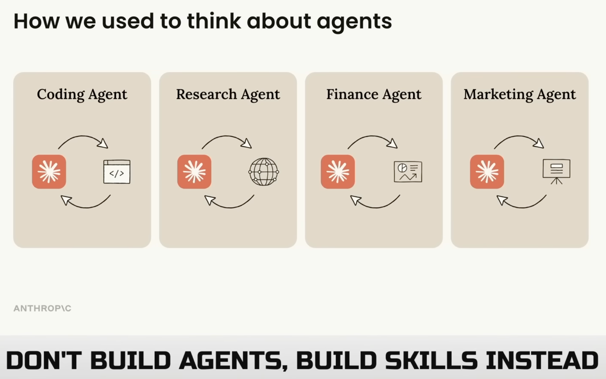
</div> -->

</template>

<!-- AI Coding-->

---
layout: section
---

# Agent 框架对比

<div class="text-gray-500 mt-4">
常见的 Coding Agent 框架的架构和对比
</div>

---
layout: default
---

# <span class="text-orange-500">Agent = Model + Harness</span>

- Agent 是大脑和身体的结合

- Model 是大脑，负责思考+推理

- Harness 是身体，负责感知+执行

- 如何设计和实现一个 Agent 框架？需要解决哪些问题？需要包含哪些功能？为什么要这样设计和实现？

<div class="section-image">
  
</div>


---
layout: section
---

# Agent 框架实现

<div class="text-gray-500 mt-4">
跟着 Learn Claude Code 教程实现简易的 Coding Agent
</div>

---
layout: default
---

# <a href="https://learn.shareai.run/" target="_blank"><span class="text-orange-500">Learn Claude Code</span></a>

<div class="mt-18">

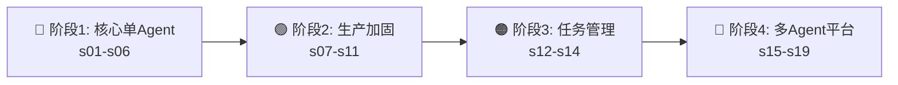

</div>

<v-clicks class="mt-16 text-xl flex flex-col justify-left">

- **阶段 1** — 先做出一个真能工作的 agent
- **阶段 2** — 再补安全、扩展、记忆和恢复
- **阶段 3** — 临时清单升级成持久化任务系统
- **阶段 4** — 从单 agent 升级成多 agent 平台

</v-clicks>

<div v-click class="mt-16 text-xl text-orange-500">

核心原则：每一章节都是上一章节自然迭代出来的，从最小的单 Agent 开始，到复杂的多 Agent 平台

</div>

---
layout: section
---

# 阶段 1：核心单 Agent

## s01 — s06

<div class="text-gray-500 mt-4">
先让 agent 能跑起来
</div>

---
layout: center
---

# 阶段 1 要解决什么？

<v-clicks>

想象你有一个天才助手——能推理、能写代码、能设计方案

**但它什么都不能"做"。**

每次它建议你跑一个命令，你得手动复制、执行、再把结果粘回去。

你就是那个循环。**这个阶段的目标就是把你从循环里解放出来。**

</v-clicks>

<div v-click class="mt-6 grid grid-cols-3 gap-3 text-sm">
<div class="p-2 bg-blue-50 dark:bg-blue-900/20 rounded text-center">

**s01** 最小循环

</div>
<div class="p-2 bg-blue-50 dark:bg-blue-900/20 rounded text-center">

**s02** 工具 · **s03** 规划

</div>
<div class="p-2 bg-blue-50 dark:bg-blue-900/20 rounded text-center">

**s04** 隔离 · **s05** 知识 · **s06** 压缩

</div>
</div>

<!-- s01 agent loop -->

---
layout: default
---

# s01: 智能体循环 (The Agent Loop)

> 没有循环，就没有 agent，真正的 agent 起点是把真实工具结果重新喂回模型

<div class="grid grid-cols-[1fr_600px] gap-8">
<div>

问题：模型能思考，但不会打开文件、运行命令，是个“只会说话，不会干活”的程序，需要人来做中转

方案：把“模型 + 工具”连接成一个能持续推进任务的主循环，最小的心智循环，不要让人来做 AI 的测试员

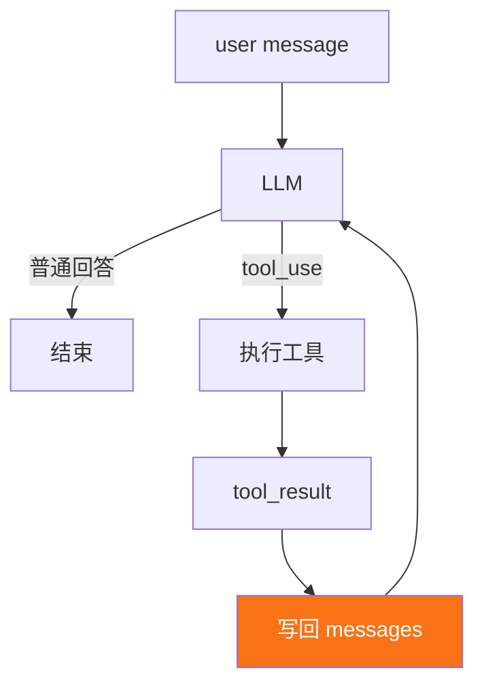

</div>

<div class="embed-viz">
<iframe src="https://build-your-own-agent.vercel.app/en/embed/s01/" />
</div>

</div>

---
layout: default
---

# s01: 最小 Agent Loop 实现

<div class="grid grid-cols-[1.3fr_1fr] gap-4">
<div>

```python {1|3-4|5-18|20-23|25-34|36-39|all}
messages = [{"role": "user", "content": query}]

def agent_loop(state):
    while True:
        # 1. 调用模型
        response = client.messages.create(
            model=MODEL, 
            system=SYSTEM,
            tools=TOOLS, 
            messages=state["messages"],
            max_tokens=8000,
        )

        # 2. 追加 assistant 回复
        state["messages"].append({
            "role": "assistant", 
            "content": response.content,
        })

        # 3. 如果不是 tool_use，结束
        if response.stop_reason != "tool_use":
          state["transition_reason"] = None
          return

        # 4. 执行工具，回写结果
        results = []
        for block in response.content:
            if block.type == "tool_use":
                output = run_tool(block)
                results.append({
                    "type": "tool_result",
                    "tool_use_id": block.id,
                    "content": output,
                })

        # 5. 工具结果作为新消息写回
        state["messages"].append({"role": "user", "content": results})
        state["turn_count"] += 1
        state["transition_reason"] = "tool_result"
```

</div>
<div>

```python
SYSTEM = (
    f"You are a coding agent at {os.getcwd()}. "
    "Use bash to inspect and change the workspace. Act first, then report clearly."
)
TOOLS = [{
    "name": "bash",
    "description": "Run a shell command in the current workspace.",
    "input_schema": {
        "type": "object",
        "properties": {"command": {"type": "string"}},
        "required": ["command"],
    },
}]
```

**Message**：消息历史不是聊天记录展示层，而是模型下一轮要读的上下文

```python
{"role": "user", "content": "..."}
{"role": "assistant", "content": [...]}
{"role": "tool_result", "content": [...]}
```

**Tool Result**：模型返回的工具结果

```python
{
    "type": "tool_result",
    "tool_use_id": "...",
    "content": "...",
}
```

**LoopState**：显式收拢循环状态

```python
state = {
    "messages": [...],
    "turn_count": 1,
    "transition_reason": None,
}
```

</div>
</div>

---
layout: default
---

# s02: 工具使用 (Tool Use)

> 只有 bash 工具，`rm -rf /` 谁来拦？路径逃逸谁来管？高危高频的文件操作需要专用工具

<div class="grid grid-cols-[1fr_600px] gap-8">
<div>

问题：只有 bash 工具，所有操作都走 shell，每次 bash 调用都是不受约束的，存在严重的安全隐患

方案：专用工具 (read_file, write_file) 可以在工具层面做路径沙箱，新增工具只是新增处理方法，核心循环保持不变

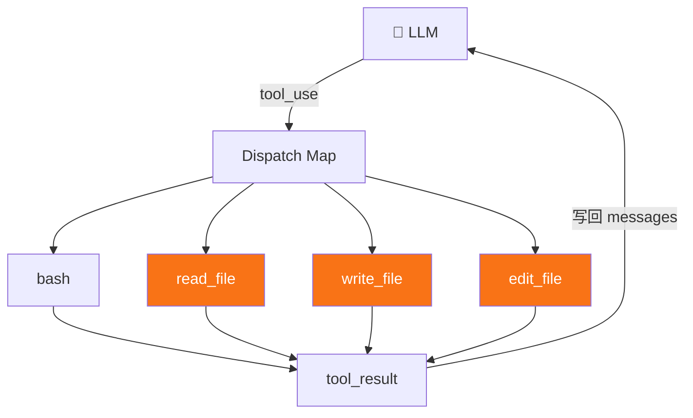

</div>
<div>

<div class="embed-viz">
<iframe src="https://build-your-own-agent.vercel.app/en/embed/s02/" style="--viz-h: 1000px; --viz-scale: 0.45" />
</div>

</div>
</div>

---
layout: default
---

# s02: 核心代码

<div class="grid grid-cols-2 gap-4">
<div>

## 工具分发 + 路径沙箱

注册新的工具，并补充安全路径检查，防止逃逸出工作目录

```python {1-8,12-15|22-27,29-30}
# 工具注册表
TOOL_HANDLERS = {
    "bash":       lambda **kw: run_bash(kw["command"]),
    "read_file":  lambda **kw: run_read(kw["path"], kw.get("limit")),
    "write_file": lambda **kw: run_write(kw["path"], kw["content"]),
    "edit_file":  lambda **kw: run_edit(kw["path"], kw["old_text"],
                                        kw["new_text"]),
}

# 循环中按名称查找
for block in response.content:
    if block.type == "tool_use":
        handler = TOOL_HANDLERS.get(block.name)
        output = handler(**block.input) if handler \
            else f"Unknown tool: {block.name}"
        results.append({
            "type": "tool_result",
            "tool_use_id": block.id,
            "content": output,
        })

# 路径沙箱，防止逃逸出工作目录
def safe_path(p: str) -> Path:
    path = (WORKDIR / p).resolve()
    if not path.is_relative_to(WORKDIR):
        raise ValueError(f"Path escapes workspace: {p}")
    return path

def run_read(path: str, limit: int = None) -> str:
    text = safe_path(path).read_text()
    lines = text.splitlines()
    if limit and limit < len(lines):
        lines = lines[:limit]
    return "\n".join(lines)[:50000]
```

</div>
<div>

## 对比

新增工具 = 新增 handler + 新增 schema，核心的循环永远不变

<div class="mt-4 p-2 rounded text-sm">

| 组件 | s01 | s02 |
|------|-----|-----|
| Tools | 1 (仅 bash) | <span class="text-orange-500">4 (bash, read, write, edit)</span> |
| Dispatch | 硬编码 | 工具注册表 |
| 路径安全 | 无 | 安全路径校验 |
| Agent loop | 不变 | <span class="text-orange-500">不变</span> |

</div>

</div>
</div>

---
layout: default
---

# s03: 会话内规划 (TodoWrite)

> 你对模型说"重构这个模块：加类型、文档、测试、保证编译通过"，结果 Agent 做完前两步之后，就开始即兴发挥

<div class="grid grid-cols-[1fr_600px] gap-8">
<div>

原因：模型的注意力始终受上下文影响，如果没有一块显式、可反复更新的计划状态，大任务就很容易漂

方案：在会话内做规划，先把要做的任务写出来，在过程中不断更新任务状态，并在合适时机注入提醒

<v-clicks>

- 不是任务系统，只是当前会话的计划外显
- **约束**：同一时间最多一个任务正在执行
- **提醒**：连续 3 轮不更新 → 注入 reminder

</v-clicks>

</div>
<div>

<div class="embed-viz">
<iframe src="https://build-your-own-agent.vercel.app/en/embed/s03/" />
</div>

</div>
</div>

---
layout: default
---

# s03: 核心代码

<div class="grid grid-cols-[1.3fr_1fr] gap-4">
<div>

## agent_loop 变更

```python {9-19|21-28}{at:1}
def agent_loop(messages: list) -> None:
    while True:
        response = client.messages.create(...)
        messages.append({"role": "assistant", "content": response.content})
        if response.stop_reason != "tool_use":
            return

        results = []
        # 新增：跟踪本轮是否调用了 todo
        used_todo = False
        for block in response.content:
            if block.type != "tool_use":
                continue
            handler = TOOL_HANDLERS.get(block.name)
            output = handler(**block.input) if handler else ...
            results.append({"type": "tool_result",
                "tool_use_id": block.id, "content": str(output)})
            if block.name == "todo":
                used_todo = True

        # 新增：注入更新执行计划的提醒
        if used_todo:
            TODO.state.rounds_since_update = 0
        else:
            TODO.note_round_without_update()
            reminder = TODO.reminder()
            if reminder:
                results.insert(0, {"type": "text", "text": reminder})

        messages.append({"role": "user", "content": results})
```

</div>
<div>

## 新增数据结构

```python
@dataclass
class PlanItem:
    content: str
    status: str = "pending"       # pending | in_progress | completed
    active_form: str = ""

@dataclass
class PlanningState:
    items: list[PlanItem] = field(default_factory=list)
    rounds_since_update: int = 0  # 连续多少轮过去了，模型还没有更新这份计划

class TodoManager:
    def __init__(self):
        self.state = PlanningState()
    def update(self, items) -> str: ...   # 校验 + 重写整份计划
    def render(self) -> str: ...          # [ ] [>] [x] 渲染

    def reminder(self) -> str | None:
        if not self.state.items:
            return None
        if self.state.rounds_since_update < PLAN_REMINDER_INTERVAL:
            return None
        return "<reminder>Refresh your current plan.</reminder>"
```

## 注册新工具

```python
TOOL_HANDLERS = {
    "bash":       ...,
    "read_file":  ...,
    "write_file": ...,
    "edit_file":  ...,
    "todo": lambda **kw: TODO.update(kw["items"]), # 新增工具 todo
}
```

</div>
</div>

---

# s04: 子智能体 (Subagent)

> 问"项目用什么测试框架？"，Agent 读了 5 个文件，但答案只有一个词："pytest"，那 5 个文件为什么还留在上下文里？

<div class="grid grid-cols-[1fr_600px] gap-8">
<div>

**问题**：Agent 为回答一个小问题读了 5 个文件，这些中间过程全堆在父上下文里，后续推理越来越差

**方案**：上下文隔离

<v-clicks>

- 派生子 agent，用 **fresh `messages=[]`**
- 子 agent 独立工作，完成后**只返回摘要**
- 子上下文丢弃，父上下文保持干净
- 子 agent **没有 `task` 工具**，防止递归

</v-clicks>

</div>
<div>

<div class="embed-viz">
<iframe src="https://build-your-own-agent.vercel.app/en/embed/s04/" />
</div>

</div>
</div>

---
layout: default
---

# s04: 核心代码 — 主循环的变更

<div class="grid grid-cols-[1.3fr_1fr] gap-4">
<div>

## agent_loop 变更

```python {5-8|10-11}{at:1}
def agent_loop(messages: list):
    while True:
        response = client.messages.create(
            model=MODEL, system=SYSTEM,
            # s04 变更：使用 PARENT_TOOLS 而非 TOOLS
            tools=PARENT_TOOLS, max_tokens=8000,
            messages=messages,
        )
        messages.append({"role": "assistant", "content": response.content})
        if response.stop_reason != "tool_use":
            return
        results = []
        for block in response.content:
            if block.type == "tool_use":
                # s04 新增：task 工具走子智能体
                if block.name == "task":
                    output = run_subagent(block.input["prompt"])
                else:
                    handler = TOOL_HANDLERS.get(block.name)
                    output = handler(**block.input) if handler else ...
                results.append({"type": "tool_result",
                    "tool_use_id": block.id, "content": str(output)})
        messages.append({"role": "user", "content": results})
```

</div>
<div>

## run_subagent — 独立循环

```python {1-2|3-12|13-14}
def run_subagent(prompt: str) -> str:
    sub_messages = [{"role": "user", "content": prompt}]
    for _ in range(30):  # 安全上限
        response = client.messages.create(
            model=MODEL, system=SUBAGENT_SYSTEM,
            messages=sub_messages,
            tools=CHILD_TOOLS, max_tokens=8000,
        )
        sub_messages.append({"role": "assistant", "content": response.content})
        if response.stop_reason != "tool_use":
            break
        ...  # 执行工具，写回 sub_messages
    # 只把最终文本带回父上下文
    return "".join(b.text for b in response.content
                   if hasattr(b, "text")) or "(no summary)"
```

## 工具过滤

```python
# 子智能体：基础工具，没有 task
CHILD_TOOLS = [bash, read_file, write_file, edit_file]

# 父智能体：基础工具 + task
PARENT_TOOLS = CHILD_TOOLS + [task]
```

</div>
</div>

---

# s05: 按需知识加载 (Skills)

> 你不会每次做饭前把所有菜谱从头看到尾——agent 的领域知识也一样

<div class="grid grid-cols-2 gap-6">
<div>

## 两层架构

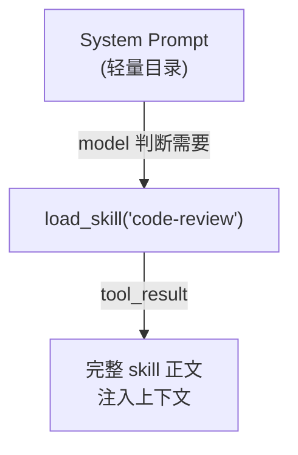

<v-click>

**Layer 1**：目录 — 始终存在，~120 tokens

**Layer 2**：正文 — 按需加载，300-500 tokens

</v-click>

</div>
<div>

## 最小注册表

```python {1-6|8-14}
class SkillRegistry:
    def __init__(self, skills_dir: Path):
        self.skills_dir = skills_dir
        self.documents: dict[str, SkillDocument] = {}
        self._load_all()

    def _load_all(self) -> None:
        if not self.skills_dir.exists():
            return
        for path in sorted(self.skills_dir.rglob("SKILL.md")):
            meta, body = self._parse_frontmatter(path.read_text())
            name = meta.get("name", path.parent.name)
            description = meta.get("description", "No description")
            manifest = SkillManifest(name=name, description=description, path=path)
            self.documents[name] = SkillDocument(manifest=manifest, body=body.strip())
```

</div>
</div>

---
layout: none
---

<EmbedVizFrame url="https://build-your-own-agent.vercel.app/en/embed/s05/" />

---

# s06: 上下文压缩 (Context Compact)

> 读了 30 个文件、跑了 20 条命令后，10 万 tokens 烧完了——但活儿才干了一半

<div class="grid grid-cols-3 gap-4 mt-4">

<div v-click class="p-3 bg-amber-50 dark:bg-amber-900/20 rounded-lg text-sm">

### 🔶 第 1 层：大结果写磁盘

```python
def persist_large_output(id, output):
    if len(output) <= THRESHOLD:
        return output
    path = save_to_disk(id, output)
    preview = output[:2000]
    return f"<persisted-output>\n"
           f"Saved to: {path}\n"
           f"Preview:\n{preview}\n"
           f"</persisted-output>"
```

</div>

<div v-click class="p-3 bg-blue-50 dark:bg-blue-900/20 rounded-lg text-sm">

### 🔷 第 2 层：旧结果微压缩

```python
def micro_compact(messages):
    tool_results = collect_results(messages)
    for result in tool_results[:-3]:
        result["content"] = \
          "[Earlier result omitted]"
    return messages
```

</div>

<div v-click class="p-3 bg-green-50 dark:bg-green-900/20 rounded-lg text-sm">

### 🟢 第 3 层：整体摘要压缩

```python
def compact_history(messages):
    summary = summarize(messages)
    return [{
      "role": "user",
      "content": "Compacted.\n" + summary
    }]
```

</div>

</div>

<div v-click class="mt-3 text-sm text-center text-gray-500">

压缩后必须保住：当前目标、已完成动作、已修改文件、关键决定、下一步

</div>

---
layout: none
---

<EmbedVizFrame url="https://build-your-own-agent.vercel.app/en/embed/s06/" />

---

# 阶段 1 完成：你有了一个能工作的单 Agent

<div class="grid grid-cols-2 gap-6">
<div>

## 六章带来了什么

| 章节 | 新增能力 |
|------|----------|
| **s01** | 最小可运行循环 |
| **s02** | 工具分发 + 路径沙箱 |
| **s03** | 结构化计划 + 漂移提醒 |
| **s04** | 上下文隔离委派 |
| **s05** | 按需知识加载 |
| **s06** | 四级上下文压缩 |

</div>
<div>

## 现在你的 agent 能

<v-clicks>

- 读写文件、执行命令
- 按计划完成多步任务
- 遇到子问题时隔离探索
- 需要领域知识时按需加载
- 长时间工作而不撑爆上下文

</v-clicks>

<div v-click class="mt-4 p-3 bg-blue-50 dark:bg-blue-900/20 rounded text-sm">

**但它还没有安全管控、没有记忆、出错就崩。**

这就是阶段 2 要解决的。

</div>

</div>
</div>

---

# 回顾：一条请求的完整流动

<v-clicks>

1. 用户发来任务
2. 组装 system prompt + messages + tools
3. 模型返回文本或 `tool_use`
4. **tool_use** → 执行工具 → tool_result 写回 messages
5. 主循环继续
6. 如果太大 → todo / subagent / compact
7. 直到模型结束

</v-clicks>

<div v-click class="mt-4 p-3 bg-blue-50 dark:bg-blue-900/30 rounded-lg text-sm">

**一句话记住**：先做出能工作的最小循环，再一层一层给它补上规划、隔离、安全、记忆、任务、协作和外部能力。

</div>

---
layout: section
---

# 阶段 2：生产加固

## s07 — s11

<div class="text-gray-500 mt-4">
能跑 ≠ 能上线。让 agent 更安全、更稳、更可扩展
</div>

---
layout: center
---

# 阶段 2 要解决什么？

<v-clicks>

你的 agent 很能干——但它**没有刹车**。

模型 hallucinate 了一个路径，`rm -rf` 就直接执行了。

每次新会话，用户偏好全忘了。输出被截断就直接崩溃。

**这个阶段给循环套上安全带、装上记忆、教它自愈。**

</v-clicks>

<div v-click class="mt-6 grid grid-cols-5 gap-2 text-sm">
<div class="p-2 bg-green-50 dark:bg-green-900/20 rounded text-center">

**s07** 权限

</div>
<div class="p-2 bg-green-50 dark:bg-green-900/20 rounded text-center">

**s08** Hook

</div>
<div class="p-2 bg-green-50 dark:bg-green-900/20 rounded text-center">

**s09** 记忆

</div>
<div class="p-2 bg-green-50 dark:bg-green-900/20 rounded text-center">

**s10** Prompt

</div>
<div class="p-2 bg-green-50 dark:bg-green-900/20 rounded text-center">

**s11** 恢复

</div>
</div>

---

# s07: 权限系统 (Permission System)

> 模型说"删掉这个目录"——但它 hallucinate 了路径。没有权限管道，意图直接变成执行

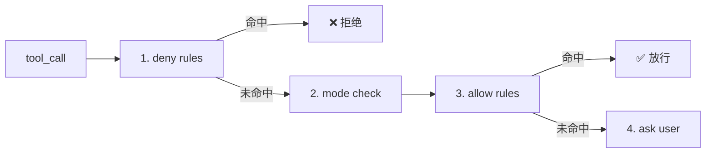

<div class="grid grid-cols-3 gap-3 mt-4">

<div v-click class="p-2 rounded bg-gray-50 dark:bg-gray-800 text-sm">

**default** — 未命中规则时问用户

</div>
<div v-click class="p-2 rounded bg-gray-50 dark:bg-gray-800 text-sm">

**plan** — 只允许读，不允许写

</div>
<div v-click class="p-2 rounded bg-gray-50 dark:bg-gray-800 text-sm">

**auto** — 安全操作自动过，危险再问

</div>

</div>

---

# s07: 权限实现 & Bash 安全

<div class="grid grid-cols-2 gap-4">
<div>

```python {1|2-4|6-9|11-14|16}
def check_permission(tool_name, tool_input):
    # 1. deny rules 优先
    for rule in deny_rules:
        if matches(rule, tool_name, tool_input):
            return {"behavior": "deny"}

    # 2. mode 检查
    if mode == "plan" and tool_name in WRITES:
        return {"behavior": "deny"}
    if mode == "auto" and tool_name in READS:
        return {"behavior": "allow"}

    # 3. allow rules
    for rule in allow_rules:
        if matches(rule, tool_name, tool_input):
            return {"behavior": "allow"}

    # 4. fallback
    return {"behavior": "ask"}
```

</div>
<div>

## Bash 特殊处理

<v-clicks>

- `sudo` — 直接拒绝
- `rm -rf` — 直接拒绝
- 命令替换 — 高风险
- 可疑重定向 — 检查
- shell 元字符拼接 — 检查

</v-clicks>

<div v-click class="mt-3 p-2 bg-red-50 dark:bg-red-900/20 rounded text-sm">

**bash 不是普通文本，而是可执行动作描述。**

</div>

</div>
</div>

---

# s08: Hook 系统

> 安全团队要审计 bash、QA 要自动跑 lint、运维要日志——难道每个需求都改主循环？

<div class="grid grid-cols-2 gap-6">
<div>

## 3 个核心事件

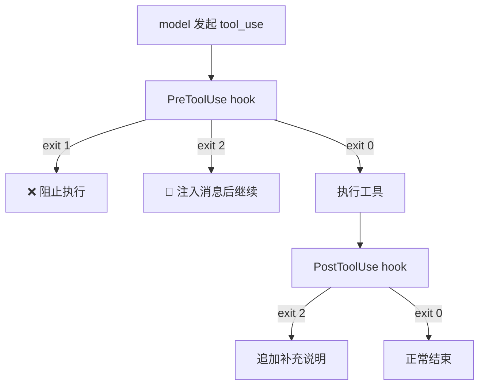

</div>
<div>

## 统一返回约定

| 退出码 | 含义 |
|--------|------|
| `0` | 正常继续 |
| `1` | 阻止当前动作 |
| `2` | 注入补充消息再继续 |

```python
HOOKS = {
    "SessionStart": [on_session_start],
    "PreToolUse":  [pre_tool_guard],
    "PostToolUse": [post_tool_log],
}
```

</div>
</div>

---

# s09: 记忆系统 (Memory)

> 你告诉它三次"别改 test snapshots"，下次开会话，它又改了——因为它每次都是新的

<div class="grid grid-cols-2 gap-6">
<div>

## 4 类 Memory

<v-clicks>

- **user** — 用户偏好（代码风格、回答偏好）
- **feedback** — 明确纠正（"不要这样改"）
- **project** — 不易从代码看出的约定
- **reference** — 外部资源指针

</v-clicks>

</div>
<div>

## ❌ 不要存的

<v-clicks>

- 文件结构/函数签名 → 可重新读
- 当前任务进度 → 属于 task/plan
- 临时分支名/PR 号 → 会过时
- 修 bug 的具体代码 → 看提交记录
- 密钥/密码 → 安全风险

</v-clicks>

</div>
</div>

<div v-click class="mt-4 p-2 bg-yellow-50 dark:bg-yellow-900/20 rounded text-sm text-center">

**memory 用来提供方向，不用来替代当前观察。** 如果 memory 和当前代码冲突，优先相信你看到的真实状态。

</div>

---

# s10: 系统提示词构建 (System Prompt)

> 角色说明、工具文档、技能目录、记忆、CLAUDE.md——全塞一个字符串里，半年后谁敢改？

```python {1-10|12-14}
class SystemPromptBuilder:
    def build(self) -> str:
        sections = []
        core = self._build_core()
        if core: sections.append(core)
        tools = self._build_tool_listing()
        if tools: sections.append(tools)
        skills = self._build_skill_listing()
        if skills: sections.append(skills)
        memory = self._build_memory_section()
        if memory: sections.append(memory)
        claude_md = self._build_claude_md()
        if claude_md: sections.append(claude_md)
        sections.append(DYNAMIC_BOUNDARY)
        dynamic = self._build_dynamic_context()
        if dynamic: sections.append(dynamic)
        return "\n\n".join(sections)

# 真正送给模型的完整输入管道:
# prompt blocks + normalized messages + attachments + reminders
```

<div v-click class="mt-2 grid grid-cols-2 gap-3 text-sm">
<div class="p-2 bg-gray-50 dark:bg-gray-800 rounded">

**稳定说明** — 身份、规则、工具

</div>
<div class="p-2 bg-blue-50 dark:bg-blue-800/30 rounded">

**动态提醒** — 当前日期、目录、模式

</div>
</div>

---

# s11: 错误恢复 (Error Recovery)

> 大文件写到一半 max_tokens 截断、上下文爆了、API 超时——如果每次都崩溃，用户就不敢用了

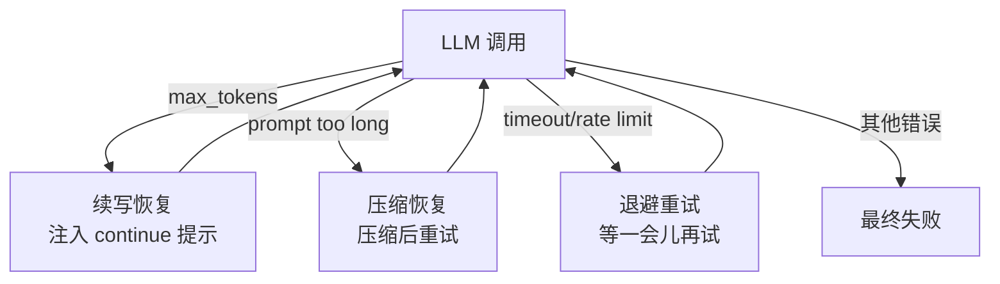

<div class="grid grid-cols-3 gap-3 mt-3 text-sm">
<div v-click class="p-2 bg-amber-50 dark:bg-amber-900/20 rounded">

**续写提示**

```python
"Output limit hit. Continue "
"directly from where you "
"stopped. Do not restart."
```

</div>
<div v-click class="p-2 bg-blue-50 dark:bg-blue-900/20 rounded">

**恢复状态**

```python
recovery_state = {
  "continuation_attempts": 0,
  "compact_attempts": 0,
  "transport_attempts": 0,
}
```

</div>
<div v-click class="p-2 bg-green-50 dark:bg-green-900/20 rounded">

**退避延迟**

```python
def backoff_delay(attempt: int) -> float:
    delay = min(BACKOFF_BASE_DELAY * (2 ** attempt),
                BACKOFF_MAX_DELAY)
    jitter = random.uniform(0, 1)
    return delay + jitter
```

</div>
</div>

---

# 阶段 2 完成：你的 Agent 现在能自我治理了

<div class="grid grid-cols-5 gap-3 text-sm">

<div v-click class="p-3 bg-green-50 dark:bg-green-900/20 rounded-lg text-center">

**s07 权限**

deny → mode → allow → ask

</div>

<div v-click class="p-3 bg-green-50 dark:bg-green-900/20 rounded-lg text-center">

**s08 Hook**

不改循环也能扩展

</div>

<div v-click class="p-3 bg-green-50 dark:bg-green-900/20 rounded-lg text-center">

**s09 记忆**

跨会话持久知识

</div>

<div v-click class="p-3 bg-green-50 dark:bg-green-900/20 rounded-lg text-center">

**s10 Prompt**

组装流水线

</div>

<div v-click class="p-3 bg-green-50 dark:bg-green-900/20 rounded-lg text-center">

**s11 恢复**

出错不崩溃

</div>

</div>

<div v-click class="mt-6 p-3 bg-green-50 dark:bg-green-900/30 rounded-lg text-sm text-center">

**如果你在这里停下来做产品，已经是一个真正有用的 agent harness 了。**

但真实工作有结构：任务之间有依赖、有些事要后台跑、有些事要定时做。这是阶段 3。

</div>

---
layout: section
---

# 阶段 3：任务管理

## s12 — s14

<div class="text-gray-500 mt-4">
把"聊天中的清单"升级成"磁盘上的任务图"
</div>

---
layout: center
---

# 阶段 3 要解决什么？

<v-clicks>

s03 的 TodoWrite 是"会话内清单"——压缩一次就丢了。

真实工作有**结构**：任务 B 等任务 A，C 和 D 能并行，E 等 C+D 都完成。

有些命令要跑 90 秒（`pytest`），难道 agent 傻等？

有些事要"每周一早 9 点跑"——难道用户每次手动提？

</v-clicks>

<div v-click class="mt-6 grid grid-cols-3 gap-3 text-sm">
<div class="p-2 bg-amber-50 dark:bg-amber-900/20 rounded text-center">

**s12** 持久任务图

</div>
<div class="p-2 bg-amber-50 dark:bg-amber-900/20 rounded text-center">

**s13** 后台执行

</div>
<div class="p-2 bg-amber-50 dark:bg-amber-900/20 rounded text-center">

**s14** 定时调度

</div>
</div>

---

# s12: 任务系统 (Task System)

> s03 的 Todo 只知道"有事要做"；Task 能告诉你"先做什么、谁在等谁、完成后自动解锁下游"

<div class="grid grid-cols-2 gap-6">
<div>

## TaskRecord

```python {1-8|10-12}
task = {
    "id": 1,
    "subject": "Write parser",
    "description": "",
    "status": "pending",
    "blockedBy": [],   # 还在等谁
    "blocks": [],      # 它完成后解锁谁
    "owner": "",
}

# 最关键的判断规则
def is_ready(task):
    return (task["status"] == "pending"
            and not task["blockedBy"])
```

</div>
<div>

## 自动解锁

```python {1-7}
def complete(self, task_id):
    task = self._load(task_id)
    task["status"] = "completed"
    self._save(task)
    # 解锁后续任务
    for other in self._all_tasks():
        if task_id in other["blockedBy"]:
            other["blockedBy"].remove(task_id)
            self._save(other)
```

<v-click>

**任务系统不是静态记录表，而是随着完成事件自动推进的工作图。**

</v-click>

</div>
</div>

---
layout: none
---

<EmbedVizFrame url="https://build-your-own-agent.vercel.app/en/embed/s07/" />

---

# s13: 后台任务 (Background Tasks)

> 用户说"跑测试，同时帮我建配置文件"——但你的 agent 只会傻等 90 秒测试跑完

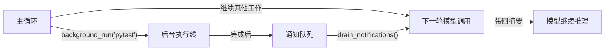

<div class="grid grid-cols-2 gap-4 mt-3">
<div v-click>

```python
# RuntimeTaskRecord
task = {
    "id": "a1b2c3d4",
    "command": "pytest",
    "status": "running",
    "result_preview": "",
    "output_file": "",
}
```

</div>
<div v-click>

```python
# Notification
notification = {
    "type": "background_completed",
    "task_id": "a1b2c3d4",
    "status": "completed",
    "preview": "tests passed",
}
```

<div class="mt-2 text-sm text-gray-500">

通知只放摘要，完整输出放文件

</div>

</div>
</div>

---
layout: none
---

<EmbedVizFrame url="https://build-your-own-agent.vercel.app/en/embed/s08/" />

---

# s14: 定时调度 (Cron Scheduler)

> 后台任务解决"现在开始的慢任务"，但"每周一 9 点跑报告"怎么办？——agent 需要学会"记住未来"

```python {1-8|10-15}
# ScheduleRecord
schedule = {
    "id": "job_001",
    "cron": "0 9 * * 1",              # 每周一9点
    "prompt": "Run weekly status report.",
    "recurring": True,
    "durable": True,
    "last_fired_at": None,
}

# 检查循环
def check_jobs(self, now):
    for job in self.jobs:
        if cron_matches(job["cron"], now):
            self.queue.put({
                "type": "scheduled_prompt",
                "schedule_id": job["id"],
                "prompt": job["prompt"],
            })
```

<div v-click class="mt-3 p-2 bg-orange-50 dark:bg-orange-900/20 rounded text-sm text-center">

**调度器做的是"记住未来"，不是"取代主循环"。** 触发后仍然回到同一条主循环。

</div>

---

# 阶段 3 完成：从纯反应式到可持续运行

<div class="grid grid-cols-3 gap-4 text-sm">

<div v-click class="p-3 bg-amber-50 dark:bg-amber-900/20 rounded-lg text-center">

**s12 任务图**

依赖关系 + 自动解锁

持久化到磁盘

</div>

<div v-click class="p-3 bg-amber-50 dark:bg-amber-900/20 rounded-lg text-center">

**s13 后台执行**

daemon 线程 + 通知队列

drain-before-call 模式

</div>

<div v-click class="p-3 bg-amber-50 dark:bg-amber-900/20 rounded-lg text-center">

**s14 定时调度**

cron 表达式 + 触发注入

"记住未来"

</div>

</div>

<div v-click class="mt-6 p-3 bg-amber-50 dark:bg-amber-900/30 rounded-lg text-sm">

| 概念 | 区别 |
|------|------|
| **Todo** vs **Task** | 临时会话步骤 vs 持久化工作节点（有依赖、有 owner） |
| **Task** vs **Runtime Task** | "要做什么"（目标）vs"正在跑的执行槽位"（运行时） |

</div>

---
layout: section
---

# 阶段 4：多 Agent 与外部系统

## s15 — s19

<div class="text-gray-500 mt-4">
从单 agent 升级成真正的平台
</div>

---
layout: center
---

# 阶段 4 要解决什么？

<v-clicks>

一个 agent 忙不过来了。

前端、后端、测试——需要**多个 agent 并行工作**。

但它们不能共享一个对话、不能都改同一个文件、也不能自说自话。

**这个阶段解决：谁在做、怎么协调、在哪做、外部能力怎么接入。**

</v-clicks>

<div v-click class="mt-6 grid grid-cols-5 gap-2 text-sm">
<div class="p-2 bg-red-50 dark:bg-red-900/20 rounded text-center">

**s15** 团队

</div>
<div class="p-2 bg-red-50 dark:bg-red-900/20 rounded text-center">

**s16** 协议

</div>
<div class="p-2 bg-red-50 dark:bg-red-900/20 rounded text-center">

**s17** 自治

</div>
<div class="p-2 bg-red-50 dark:bg-red-900/20 rounded text-center">

**s18** 隔离

</div>
<div class="p-2 bg-red-50 dark:bg-red-900/20 rounded text-center">

**s19** MCP

</div>
</div>

---

# s15: 智能体团队 (Agent Teams)

> s04 的 Subagent 是"用完即弃"；团队成员**长期在线、有身份、有邮箱、能反复接活**

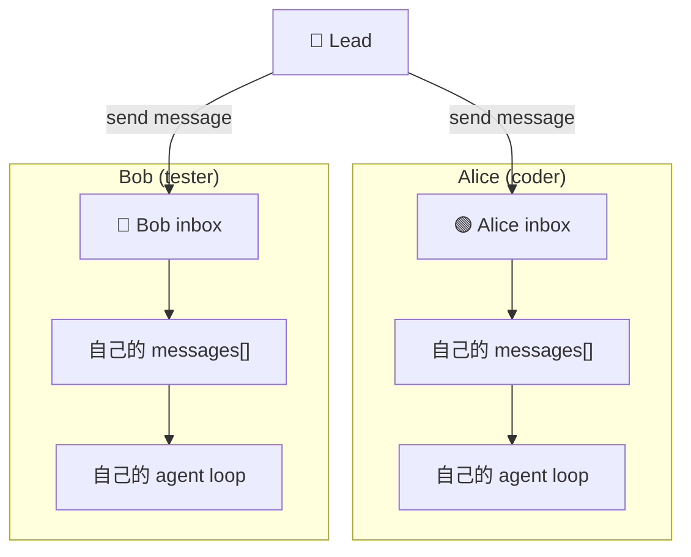

<div class="grid grid-cols-3 gap-3 mt-3 text-sm">
<div v-click class="p-2 bg-gray-50 dark:bg-gray-800 rounded text-center">

**名册** — 成员列表 `.team/config.json`

</div>
<div v-click class="p-2 bg-gray-50 dark:bg-gray-800 rounded text-center">

**邮箱** — JSONL 收件箱 `.team/inbox/alice.jsonl`

</div>
<div v-click class="p-2 bg-gray-50 dark:bg-gray-800 rounded text-center">

**独立循环** — 每个队友自己的 agent loop

</div>
</div>

---
layout: none
---

<EmbedVizFrame url="https://build-your-own-agent.vercel.app/en/embed/s09/" />

---

# s16: 团队协议 (Team Protocols)

> Lead 说"请停下"，Alice 无视了；Bob 直接开始数据库迁移没人审批——自由聊天不够，需要结构化握手

<div class="grid grid-cols-2 gap-6">
<div>

## 协议信封

```python {1-7}
message = {
    "type": "shutdown_request",
    "from": "lead",
    "to": "alice",
    "request_id": "req_001",
    "payload": {},
    "timestamp": 1710000000.0,
}
```

</div>
<div>

## 请求状态机

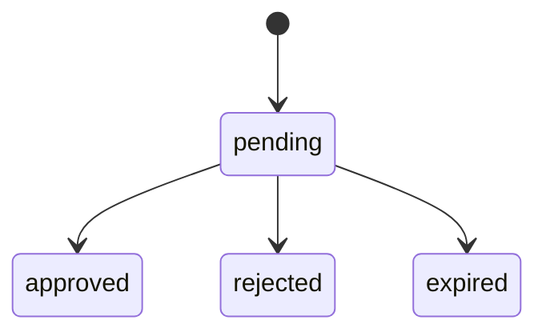

```python
request = {
    "request_id": "req_001",
    "kind": "shutdown",
    "status": "pending",
}
```

</div>
</div>

<div v-click class="mt-2 text-sm text-center text-gray-500">

教学版先做 2 类协议：**shutdown**（优雅关机）和 **plan_approval**（计划审批）

</div>

---
layout: none
---

<EmbedVizFrame url="https://build-your-own-agent.vercel.app/en/embed/s10/" />

---

# s17: 自治智能体 (Autonomous Agents)

> 任务板上 10 个待办，Lead 一个一个分配——Lead 成了瓶颈。让队友自己去任务板找活干

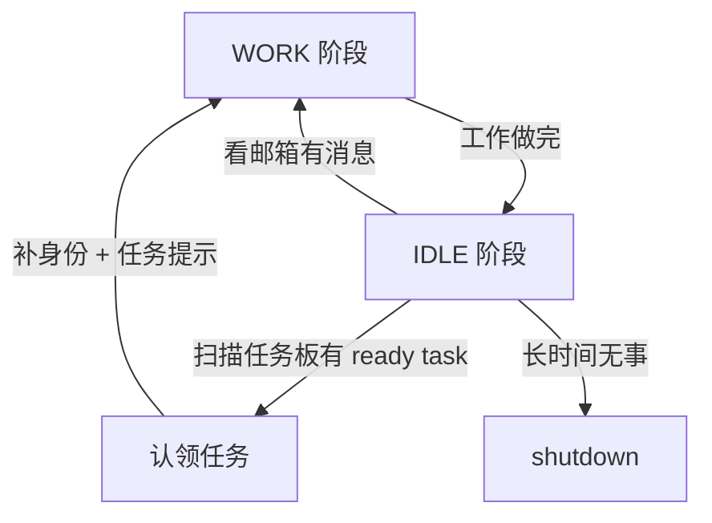

<div v-click>

## 认领条件（缺一不可）

```python {1-6}
def is_claimable_task(task: dict, role: str | None = None) -> bool:
    return (
        task.get("status") == "pending"
        and not task.get("owner")
        and not task.get("blockedBy")
        and _task_allows_role(task, role)
    )
```

</div>

---
layout: none
---

<EmbedVizFrame url="https://build-your-own-agent.vercel.app/en/embed/s11/" />

---

# s18: Worktree 任务隔离

> Alice 在重构 auth，Bob 在做登录页——两人同时改 `config.py`，文件冲突了。每个任务需要自己的"车道"

<div class="grid grid-cols-2 gap-6">
<div>

## 两张表

```python
# 任务板 (.tasks/)
task = {
    "id": 12,
    "subject": "Refactor auth",
    "worktree": "auth-refactor",
    "worktree_state": "active",
}

# Worktree 注册表 (.worktrees/)
worktree = {
    "name": "auth-refactor",
    "path": ".worktrees/auth-refactor",
    "branch": "wt/auth-refactor",
    "task_id": 12,
    "status": "active",
}
```

</div>
<div>

## 生命周期

<v-clicks>

1. **创建任务** → `tasks.create(...)`
2. **分配 worktree** → `worktrees.create(..., task_id)`
3. **进入车道** → `worktree_enter(name)`
4. **在隔离目录执行** → `subprocess.run(cmd, cwd=wt_path)`
5. **收尾** → `worktree_closeout(action="keep"|"remove")`

</v-clicks>

<div v-click class="mt-3 p-2 bg-yellow-50 dark:bg-yellow-900/20 rounded text-sm">

任务状态和车道状态**不能混成一个字段**！任务可能 `completed` 但 worktree 仍 `kept`

</div>

</div>
</div>

---
layout: none
---

<EmbedVizFrame url="https://build-your-own-agent.vercel.app/en/embed/s12/" />

---

# s19: MCP 与插件系统

> 想查数据库？写个 handler。想控浏览器？再写一个。每次加能力都改代码？——让外部进程自己报到

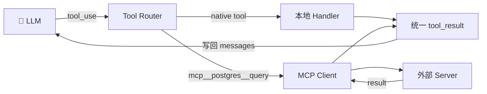

<div class="grid grid-cols-3 gap-3 mt-4 text-sm">
<div v-click class="p-2 bg-gray-50 dark:bg-gray-800 rounded text-center">

**Plugin** — 发现配置

</div>
<div v-click class="p-2 bg-gray-50 dark:bg-gray-800 rounded text-center">

**MCP Server** — 连接进程

</div>
<div v-click class="p-2 bg-gray-50 dark:bg-gray-800 rounded text-center">

**MCP Tool** — 具体调用

</div>
</div>

<div v-click class="mt-3 p-2 bg-red-50 dark:bg-red-900/20 rounded text-sm text-center">

**关键：MCP 工具虽然来自外部，但仍然必须走同一条权限管道和 tool_result 回流！**

</div>

---

# 阶段 4 完成：从单 Agent 到完整平台

<div class="grid grid-cols-5 gap-2 text-sm">

<div v-click class="p-3 bg-red-50 dark:bg-red-900/20 rounded-lg text-center">

**s15 团队**

名册 + 邮箱 + 独立循环

</div>

<div v-click class="p-3 bg-red-50 dark:bg-red-900/20 rounded-lg text-center">

**s16 协议**

request_id 握手

shutdown + plan

</div>

<div v-click class="p-3 bg-red-50 dark:bg-red-900/20 rounded-lg text-center">

**s17 自治**

IDLE 轮询 + 自动认领

身份重注入

</div>

<div v-click class="p-3 bg-red-50 dark:bg-red-900/20 rounded-lg text-center">

**s18 Worktree**

控制面 vs 执行面

git worktree 隔离

</div>

<div v-click class="p-3 bg-red-50 dark:bg-red-900/20 rounded-lg text-center">

**s19 MCP**

统一路由 + 权限一致

mcp__前缀

</div>

</div>

<div v-click class="mt-6 p-3 bg-red-50 dark:bg-red-900/30 rounded-lg text-sm">

| 概念 | 区别 |
|------|------|
| **Subagent** vs **Teammate** | 用完即弃 vs 长期存在、有身份、有邮箱 |
| **Worktree** vs **Task** | "在哪做"（执行车道）vs"做什么"（工作目标） |

</div>

---

# 全景回顾：系统三层架构

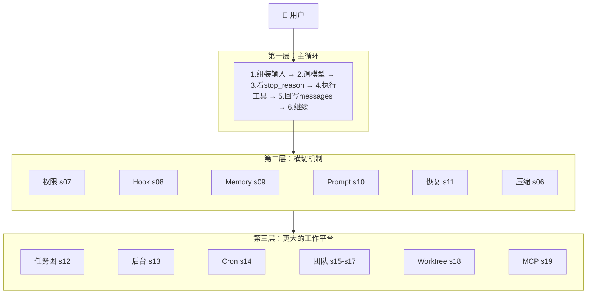

<div class="mt-2 text-sm text-center text-gray-500">

现在再看这张图，每一个方块你都知道它是什么、为什么存在、最小实现长什么样。

</div>

---

# 核心数据结构总览

<div class="text-sm">

| 层次 | 关键结构 | 职责 |
|------|----------|------|
| **对话控制** | `Message` / `QueryState` / `TransitionReason` | 管本轮输入和继续理由 |
| **工具执行** | `ToolSpec` / `DispatchMap` / `ToolUseContext` | 管动作怎么安全执行 |
| **权限 Hook** | `PermissionRule` / `PermissionDecision` / `HookEvent` | 管安全和扩展 |
| **持久工作** | `TaskRecord` / `MemoryEntry` / `ScheduleRecord` | 管跨会话的持久工作 |
| **运行时** | `RuntimeTaskState` / `TeamMember` / `WorktreeRecord` | 管当前执行车道 |
| **外部能力** | `MCPServerConfig` / `MCPToolSpec` | 管系统怎样向外接能力 |

</div>

---

# 最容易混淆的概念对照

<div class="grid grid-cols-2 gap-4 text-sm">

<div>

| 概念对 | 区分方法 |
|--------|----------|
| **Todo** vs **Task** | 临时步骤 vs 持久化工作节点 |
| **Task** vs **Runtime Task** | 目标 vs 执行槽位 |
| **Subagent** vs **Teammate** | 一次性 vs 长期存在 |
| **Memory** vs **Context** | 跨会话 vs 当前轮 |

</div>

<div>

| 概念对 | 区分方法 |
|--------|----------|
| **Prompt** vs **Reminder** | 稳定说明 vs 临时提醒 |
| **Worktree** vs **Task** | 在哪做 vs 做什么 |
| **Tool** vs **Resource** | 动作 vs 可读内容 |
| **Permission** vs **Hook** | 能不能做 vs 额外插入行为 |

</div>

</div>

---

# 四个里程碑

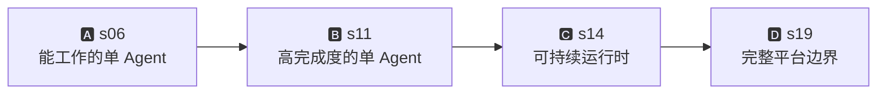

<div class="grid grid-cols-4 gap-3 mt-6 text-sm">

<div class="p-3 bg-blue-50 dark:bg-blue-900/20 rounded-lg text-center">

**A: s06 完成**

主循环 + 工具 + 计划 + 子任务 + 技能 + 压缩

</div>

<div class="p-3 bg-green-50 dark:bg-green-900/20 rounded-lg text-center">

**B: s11 完成**

权限 + Hook + Memory + Prompt + 恢复

</div>

<div class="p-3 bg-amber-50 dark:bg-amber-900/20 rounded-lg text-center">

**C: s14 完成**

持久任务 + 后台执行 + 定时触发

</div>

<div class="p-3 bg-red-50 dark:bg-red-900/20 rounded-lg text-center">

**D: s19 完成**

队友 + 协议 + 自治 + Worktree + MCP

</div>

</div>

---
layout: center
class: text-center
---

# 一句话记住

<div class="text-2xl mt-8 font-bold">

先做出能工作的最小循环

再一层一层给它补上

**规划 → 隔离 → 安全 → 记忆 → 任务 → 协作 → 外部能力**

</div>

<div class="mt-8 text-gray-500">

好的章节顺序，不是把所有机制排成一列，

而是让每一章都像前一章**自然长出来的下一层**。

</div>

<div class="mt-6 text-sm text-gray-400">

如果你能从 s01 开始，不看代码重建到 s19，你就真正理解了这套设计。

</div>

---
layout: end
---

# Thank You!

Learn Claude Code · 从零手搓 AI Coding Agent

<div class="text-sm text-gray-500 mt-4">

GitHub: [shareAI-lab/learn-claude-code](https://github.com/shareAI-lab/learn-claude-code)

</div>
