# Learn Claude Code

## 从零手搓 AI Coding Agent

<div class="pt-8 text-lg text-gray-500">

四阶段 · 19 章 · 从最小循环到完整平台

</div>

<div class="abs-br m-6 flex gap-2">
  <a href="https://github.com/shareAI-lab/learn-claude-code" target="_blank" class="text-xl slidev-icon-btn">
    <carbon-logo-github />
  </a>
</div>

<!--
本教程的目标不是逐行复制某个生产仓库，而是教会开发者从 0 到 1 手搓一个结构完整的 coding agent。
-->

---
layout: center
---

# 架构总览

## 四阶段学习路径

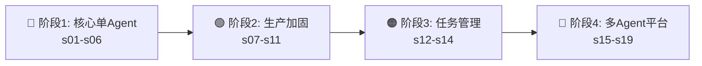

<v-clicks>

- **阶段 1** — 先做出一个真能工作的 agent
- **阶段 2** — 再补安全、扩展、记忆和恢复
- **阶段 3** — 把临时清单升级成持久化任务系统
- **阶段 4** — 从单 agent 升级成真正的平台

</v-clicks>

---

# 系统三层架构

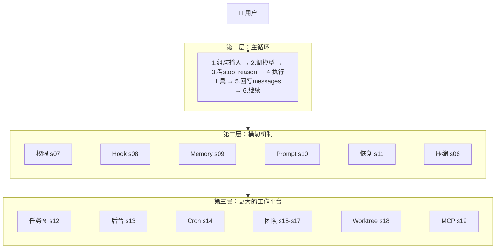

---

# 一条请求的完整流动

<v-clicks>

1. 用户发来任务
2. 组装 system prompt + messages + tools
3. 模型返回文本或 `tool_use`
4. **tool_use** → 权限 → Hook → 执行工具 → tool_result 写回 messages
5. 主循环继续
6. 如果太大 → todo / subagent / compact / background / team / MCP
7. 直到模型结束

</v-clicks>

<div v-click class="mt-4 p-3 bg-blue-50 dark:bg-blue-900/30 rounded-lg text-sm">

**一句话记住全仓库**：先做出能工作的最小循环，再一层一层给它补上规划、隔离、安全、记忆、任务、协作和外部能力。

</div>

---
layout: section
---

# 阶段 1：核心单 Agent

## s01 — s06

<div class="text-gray-500 mt-4">
先让 agent 能跑起来
</div>

---

# s01: 智能体循环 (The Agent Loop)

> 没有循环，就没有 agent

<div class="grid grid-cols-2 gap-6">
<div>

## 最小心智模型

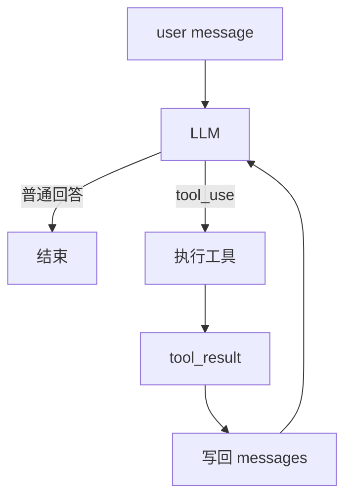

</div>
<div>

## 关键数据结构

```python {all|1-3|4-5|all}
state = {
    "messages": [...],
    "turn_count": 1,
    "transition_reason": None,
}
```

<v-click>

**核心洞察**：工具结果必须重新进入消息历史，成为下一轮推理的输入。

</v-click>

</div>
</div>

---

# s01: 最小 Agent Loop 实现

```python {1-3|5-12|14-16|18-24|all}
def agent_loop(state):
    while True:
        # 1. 调用模型
        response = client.messages.create(
            model=MODEL, system=SYSTEM,
            messages=state["messages"],
            tools=TOOLS, max_tokens=8000,
        )

        # 2. 追加 assistant 回复
        state["messages"].append({
            "role": "assistant", "content": response.content,
        })

        # 3. 如果不是 tool_use，结束
        if response.stop_reason != "tool_use":
            return

        # 4. 执行工具，回写结果
        results = []
        for block in response.content:
            if block.type == "tool_use":
                output = run_tool(block)
                results.append({
                    "type": "tool_result",
                    "tool_use_id": block.id,
                    "content": output,
                })

        # 5. 工具结果作为新消息写回
        state["messages"].append({"role": "user", "content": results})
        state["turn_count"] += 1
```

---
layout: none
---

<EmbedVizFrame url="http://localhost:3000/en/embed/s01/" />

---

# s02: 工具使用 (Tool Use)

> 加一个工具，只加一个 handler —— 循环不用动

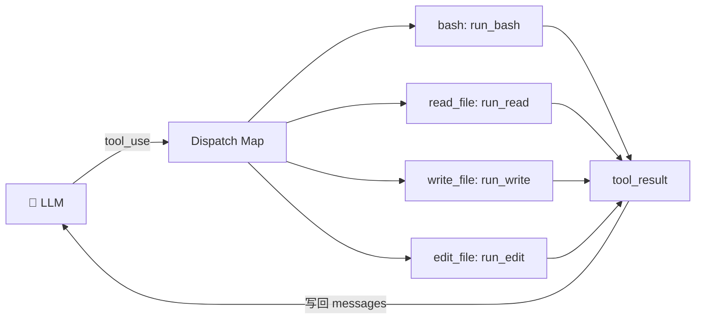

<v-clicks>

- **Dispatch Map** = `{tool_name: handler_function}`
- 一次查找替代所有 if/elif 链
- 新增工具 = 新增 handler + 新增 schema，循环永远不变

</v-clicks>

---

# s02: 核心代码

<div class="grid grid-cols-2 gap-4">
<div>

## 路径沙箱

```python {2-4}
def safe_path(p: str) -> Path:
    path = (WORKDIR / p).resolve()
    if not path.is_relative_to(WORKDIR):
        raise ValueError(f"Path escapes: {p}")
    return path
```

</div>
<div>

## 分发表

```python {1-6|8-12}
TOOL_HANDLERS = {
    "bash":      lambda **kw: run_bash(kw["command"]),
    "read_file": lambda **kw: run_read(kw["path"]),
    "write_file":lambda **kw: run_write(kw["path"],
                                        kw["content"]),
    "edit_file": lambda **kw: run_edit(kw["path"],
                        kw["old_text"], kw["new_text"]),
}

# 循环中按名称查找
handler = TOOL_HANDLERS.get(block.name)
output = handler(**block.input) if handler \
    else f"Unknown tool: {block.name}"
```

</div>
</div>

<div v-click class="mt-3 p-2 bg-green-50 dark:bg-green-900/20 rounded text-sm">

| 组件 | s01 | s02 |
|------|-----|-----|
| Tools | 1 (仅 bash) | 4 (bash, read, write, edit) |
| Dispatch | 硬编码 | `TOOL_HANDLERS` 字典 |
| 路径安全 | 无 | `safe_path()` 沙箱 |
| Agent loop | 不变 | **不变** |

</div>

---
layout: none
---

<EmbedVizFrame url="http://localhost:3000/en/embed/s02/" />

---

# s03: 会话内规划 (TodoWrite)

> 计划不是替模型思考，而是把"正在做什么"明确写出来

<div class="grid grid-cols-2 gap-6">
<div>

## 计划状态

```python {1-5|7-9}
PlanItem = {
    "content": "Read the failing test",
    "status": "pending" | "in_progress"
             | "completed",
    "activeForm": "Reading the failing test",
}

PlanningState = {
    "items": [...],
    "rounds_since_update": 0,
}
```

<v-click>

**约束**：同一时间，最多一个 `in_progress`

</v-click>

</div>
<div>

## 提醒机制

```python {1-4}
# 连续3轮没更新计划 → 提醒
if rounds_since_update >= 3:
    results.insert(0, {
        "type": "text",
        "text": "<reminder>Refresh your "
                "plan before continuing."
                "</reminder>",
    })
```

<v-click>

```text
[ ] 还没做
[>] 正在做
[x] 已完成
```

</v-click>

</div>
</div>

---
layout: none
---

<EmbedVizFrame url="http://localhost:3000/en/embed/s03/" />

---

# s04: 子智能体 (Subagent)

> 一个大任务，不一定要塞进一个上下文里做完

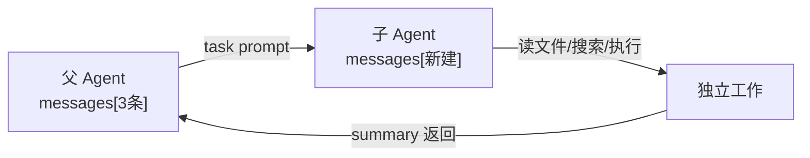

<v-clicks>

- **核心价值**：上下文隔离 — 子 agent 的中间噪声不会污染父上下文
- 子 agent 自己的 `messages[]`，从空白或 fork 父上下文开始
- 只把摘要带回，不是全部历史

</v-clicks>

```python {1-3|4-5}
class SubagentContext:
    messages: list     # 子智能体自己的上下文
    tools: list        # 可调用的工具（通常更少）
    handlers: dict     # 工具对应的函数
    max_turns: int     # 防止无限跑
```

---
layout: none
---

<EmbedVizFrame url="http://localhost:3000/en/embed/s04/" />

---

# s05: 按需知识加载 (Skills)

> 不是把所有知识塞进 prompt，而是需要时再加载

<div class="grid grid-cols-2 gap-6">
<div>

## 两层架构

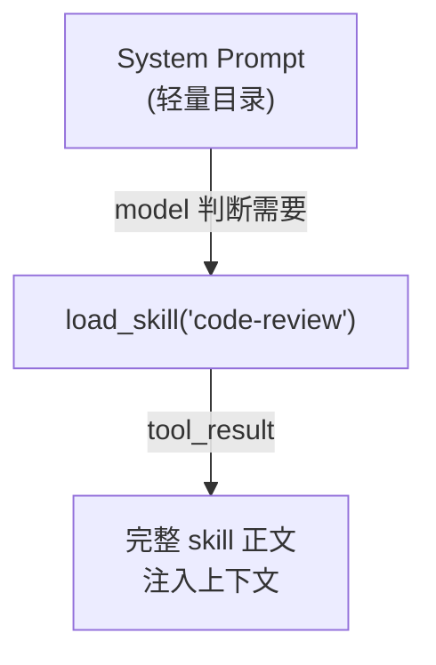

<v-click>

**Layer 1**：目录 — 始终存在，~120 tokens

**Layer 2**：正文 — 按需加载，300-500 tokens

</v-click>

</div>
<div>

## 最小注册表

```python {1-6|8-10}
class SkillRegistry:
    def __init__(self, skills_dir):
        self.skills = {}
        for path in skills_dir.rglob("SKILL.md"):
            meta, body = parse_frontmatter(
                path.read_text())
            name = meta.get("name")
            self.skills[name] = {
                "manifest": {
                    "name": name,
                    "description": meta["description"],
                },
                "body": body,
            }
```

</div>
</div>

---
layout: none
---

<EmbedVizFrame url="http://localhost:3000/en/embed/s05/" />

---

# s06: 上下文压缩 (Context Compact)

> 活跃上下文不是越多越好，而是把仍然有用的部分留下

<div class="grid grid-cols-3 gap-4 mt-4">

<div v-click class="p-3 bg-amber-50 dark:bg-amber-900/20 rounded-lg text-sm">

### 🔶 第 1 层：大结果写磁盘

```python
def persist_large_output(id, output):
    if len(output) <= THRESHOLD:
        return output
    path = save_to_disk(id, output)
    preview = output[:2000]
    return f"<persisted-output>\n"
           f"Saved to: {path}\n"
           f"Preview:\n{preview}\n"
           f"</persisted-output>"
```

</div>

<div v-click class="p-3 bg-blue-50 dark:bg-blue-900/20 rounded-lg text-sm">

### 🔷 第 2 层：旧结果微压缩

```python
def micro_compact(messages):
    tool_results = collect_results(messages)
    for result in tool_results[:-3]:
        result["content"] = \
          "[Earlier result omitted]"
    return messages
```

</div>

<div v-click class="p-3 bg-green-50 dark:bg-green-900/20 rounded-lg text-sm">

### 🟢 第 3 层：整体摘要压缩

```python
def compact_history(messages):
    summary = summarize(messages)
    return [{
      "role": "user",
      "content": "Compacted.\n" + summary
    }]
```

</div>

</div>

<div v-click class="mt-3 text-sm text-center text-gray-500">

压缩后必须保住：当前目标、已完成动作、已修改文件、关键决定、下一步

</div>

---
layout: none
---

<EmbedVizFrame url="http://localhost:3000/en/embed/s06/" />

---
layout: section
---

# 阶段 2：生产加固

## s07 — s11

<div class="text-gray-500 mt-4">
让 agent 不只能跑，而是更安全、更稳、更可扩展
</div>

---

# s07: 权限系统 (Permission System)

> 任何工具调用，都不应该直接执行；中间必须先过权限管道

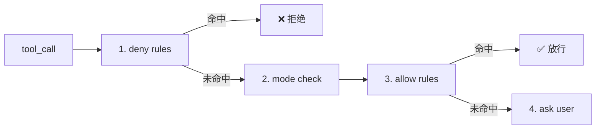

<div class="grid grid-cols-3 gap-3 mt-4">

<div v-click class="p-2 rounded bg-gray-50 dark:bg-gray-800 text-sm">

**default** — 未命中规则时问用户

</div>
<div v-click class="p-2 rounded bg-gray-50 dark:bg-gray-800 text-sm">

**plan** — 只允许读，不允许写

</div>
<div v-click class="p-2 rounded bg-gray-50 dark:bg-gray-800 text-sm">

**auto** — 安全操作自动过，危险再问

</div>

</div>

---

# s07: 权限实现 & Bash 安全

<div class="grid grid-cols-2 gap-4">
<div>

```python {1|2-4|6-9|11-14|16}
def check_permission(tool_name, tool_input):
    # 1. deny rules 优先
    for rule in deny_rules:
        if matches(rule, tool_name, tool_input):
            return {"behavior": "deny"}

    # 2. mode 检查
    if mode == "plan" and tool_name in WRITES:
        return {"behavior": "deny"}
    if mode == "auto" and tool_name in READS:
        return {"behavior": "allow"}

    # 3. allow rules
    for rule in allow_rules:
        if matches(rule, tool_name, tool_input):
            return {"behavior": "allow"}

    # 4. fallback
    return {"behavior": "ask"}
```

</div>
<div>

## Bash 特殊处理

<v-clicks>

- `sudo` — 直接拒绝
- `rm -rf` — 直接拒绝
- 命令替换 — 高风险
- 可疑重定向 — 检查
- shell 元字符拼接 — 检查

</v-clicks>

<div v-click class="mt-3 p-2 bg-red-50 dark:bg-red-900/20 rounded text-sm">

**bash 不是普通文本，而是可执行动作描述。**

</div>

</div>
</div>

---

# s08: Hook 系统

> 不改主循环代码，也能在关键时机插入额外行为

<div class="grid grid-cols-2 gap-6">
<div>

## 3 个核心事件

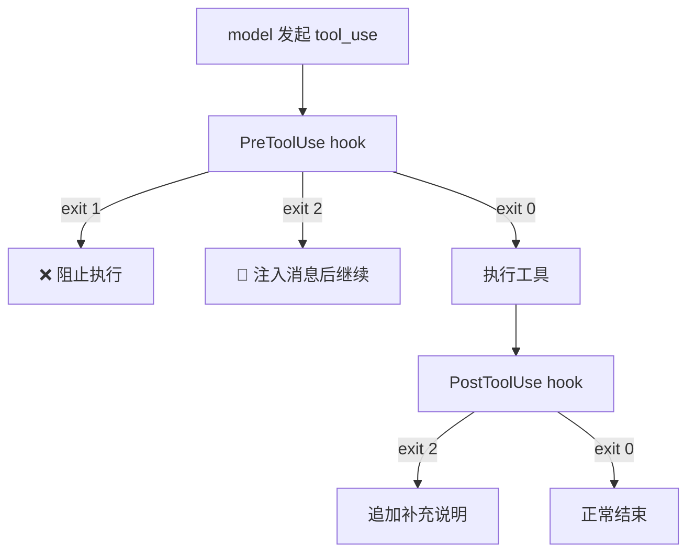

</div>
<div>

## 统一返回约定

| 退出码 | 含义 |
|--------|------|
| `0` | 正常继续 |
| `1` | 阻止当前动作 |
| `2` | 注入补充消息再继续 |

```python
HOOKS = {
    "SessionStart": [on_session_start],
    "PreToolUse":  [pre_tool_guard],
    "PostToolUse": [post_tool_log],
}
```

</div>
</div>

---

# s09: 记忆系统 (Memory)

> 只有跨会话仍然有价值、不能轻易从代码推出来的信息，才值得留下

<div class="grid grid-cols-2 gap-6">
<div>

## 4 类 Memory

<v-clicks>

- **user** — 用户偏好（代码风格、回答偏好）
- **feedback** — 明确纠正（"不要这样改"）
- **project** — 不易从代码看出的约定
- **reference** — 外部资源指针

</v-clicks>

</div>
<div>

## ❌ 不要存的

<v-clicks>

- 文件结构/函数签名 → 可重新读
- 当前任务进度 → 属于 task/plan
- 临时分支名/PR 号 → 会过时
- 修 bug 的具体代码 → 看提交记录
- 密钥/密码 → 安全风险

</v-clicks>

</div>
</div>

<div v-click class="mt-4 p-2 bg-yellow-50 dark:bg-yellow-900/20 rounded text-sm text-center">

**memory 用来提供方向，不用来替代当前观察。** 如果 memory 和当前代码冲突，优先相信你看到的真实状态。

</div>

---

# s10: 系统提示词构建 (System Prompt)

> prompt 不是一整块静态文本，而是一条组装流水线

```python {1-8|10-12}
class SystemPromptBuilder:
    def build(self) -> str:
        parts = []
        parts.append(self._build_core())       # 核心身份
        parts.append(self._build_tools())       # 工具列表
        parts.append(self._build_skills())      # 技能目录
        parts.append(self._build_memory())      # 记忆内容
        parts.append(self._build_claude_md())   # CLAUDE.md 指令
        parts.append(self._build_dynamic())     # 动态环境 (日期/cwd/模式)
        return "\n\n".join(p for p in parts if p)

# 真正送给模型的完整输入管道:
# prompt blocks + normalized messages + attachments + reminders
```

<div v-click class="mt-2 grid grid-cols-2 gap-3 text-sm">
<div class="p-2 bg-gray-50 dark:bg-gray-800 rounded">

**稳定说明** — 身份、规则、工具

</div>
<div class="p-2 bg-blue-50 dark:bg-blue-800/30 rounded">

**动态提醒** — 当前日期、目录、模式

</div>
</div>

---

# s11: 错误恢复 (Error Recovery)

> 错误不是例外，而是主循环必须预留出来的一条正常分支

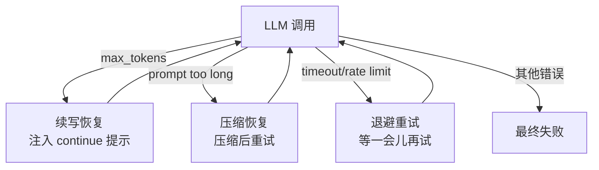

<div class="grid grid-cols-3 gap-3 mt-3 text-sm">
<div v-click class="p-2 bg-amber-50 dark:bg-amber-900/20 rounded">

**续写提示**

```python
"Output limit hit. Continue "
"directly from where you "
"stopped. Do not restart."
```

</div>
<div v-click class="p-2 bg-blue-50 dark:bg-blue-900/20 rounded">

**恢复状态**

```python
recovery_state = {
  "continuation_attempts": 0,
  "compact_attempts": 0,
  "transport_attempts": 0,
}
```

</div>
<div v-click class="p-2 bg-green-50 dark:bg-green-900/20 rounded">

**退避延迟**

```python
def backoff_delay(attempt):
    return min(1.0 * (2 ** attempt),
               30.0) + random(0, 1)
```

</div>
</div>

---
layout: section
---

# 阶段 3：任务管理

## s12 — s14

<div class="text-gray-500 mt-4">
把"聊天中的清单"升级成"磁盘上的任务图"
</div>

---

# s12: 任务系统 (Task System)

> Todo 只能提醒"有事要做"，Task 能告诉你"先做什么、谁在等谁"

<div class="grid grid-cols-2 gap-6">
<div>

## TaskRecord

```python {1-8|10-12}
task = {
    "id": 1,
    "subject": "Write parser",
    "description": "",
    "status": "pending",
    "blockedBy": [],   # 还在等谁
    "blocks": [],      # 它完成后解锁谁
    "owner": "",
}

# 最关键的判断规则
def is_ready(task):
    return (task["status"] == "pending"
            and not task["blockedBy"])
```

</div>
<div>

## 自动解锁

```python {1-7}
def complete(self, task_id):
    task = self._load(task_id)
    task["status"] = "completed"
    self._save(task)
    # 解锁后续任务
    for other in self._all_tasks():
        if task_id in other["blockedBy"]:
            other["blockedBy"].remove(task_id)
            self._save(other)
```

<v-click>

**任务系统不是静态记录表，而是随着完成事件自动推进的工作图。**

</v-click>

</div>
</div>

---
layout: none
---

<EmbedVizFrame url="http://localhost:3000/en/embed/s07/" />

---

# s13: 后台任务 (Background Tasks)

> 主循环仍然只有一条，并行的是等待，不是主循环本身

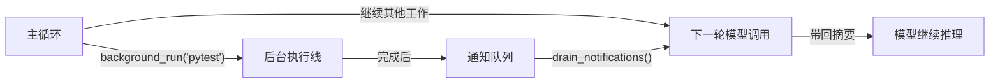

<div class="grid grid-cols-2 gap-4 mt-3">
<div v-click>

```python
# RuntimeTaskRecord
task = {
    "id": "a1b2c3d4",
    "command": "pytest",
    "status": "running",
    "result_preview": "",
    "output_file": "",
}
```

</div>
<div v-click>

```python
# Notification
notification = {
    "type": "background_completed",
    "task_id": "a1b2c3d4",
    "status": "completed",
    "preview": "tests passed",
}
```

<div class="mt-2 text-sm text-gray-500">

通知只放摘要，完整输出放文件

</div>

</div>
</div>

---
layout: none
---

<EmbedVizFrame url="http://localhost:3000/en/embed/s08/" />

---

# s14: 定时调度 (Cron Scheduler)

> 后台任务解决"稍后拿结果"，定时调度解决"将来某时开始做事"

```python {1-8|10-15}
# ScheduleRecord
schedule = {
    "id": "job_001",
    "cron": "0 9 * * 1",              # 每周一9点
    "prompt": "Run weekly status report.",
    "recurring": True,
    "durable": True,
    "last_fired_at": None,
}

# 检查循环
def check_jobs(self, now):
    for job in self.jobs:
        if cron_matches(job["cron"], now):
            self.queue.put({
                "type": "scheduled_prompt",
                "schedule_id": job["id"],
                "prompt": job["prompt"],
            })
```

<div v-click class="mt-3 p-2 bg-orange-50 dark:bg-orange-900/20 rounded text-sm text-center">

**调度器做的是"记住未来"，不是"取代主循环"。** 触发后仍然回到同一条主循环。

</div>

---
layout: section
---

# 阶段 4：多 Agent 与外部系统

## s15 — s19

<div class="text-gray-500 mt-4">
从单 agent 升级成真正的平台
</div>

---

# s15: 智能体团队 (Agent Teams)

> Subagent 适合一次性委派；团队解决"有人长期在线、反复接活"

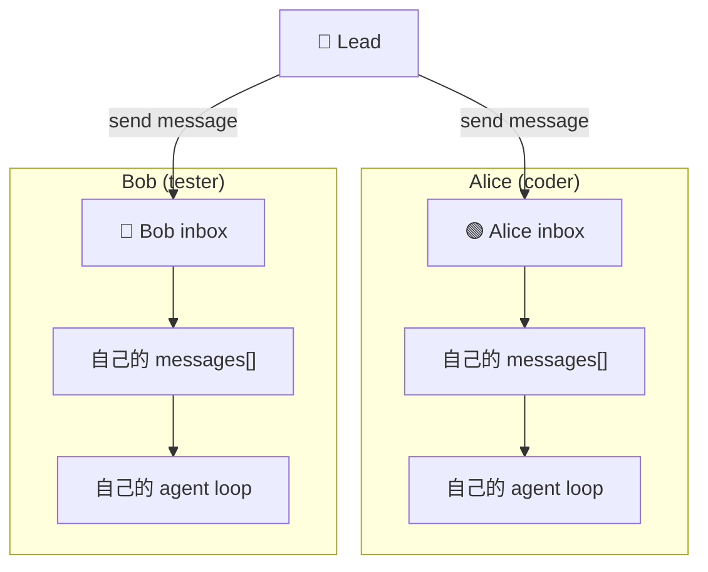

<div class="grid grid-cols-3 gap-3 mt-3 text-sm">
<div v-click class="p-2 bg-gray-50 dark:bg-gray-800 rounded text-center">

**名册** — 成员列表 `.team/config.json`

</div>
<div v-click class="p-2 bg-gray-50 dark:bg-gray-800 rounded text-center">

**邮箱** — JSONL 收件箱 `.team/inbox/alice.jsonl`

</div>
<div v-click class="p-2 bg-gray-50 dark:bg-gray-800 rounded text-center">

**独立循环** — 每个队友自己的 agent loop

</div>
</div>

---
layout: none
---

<EmbedVizFrame url="http://localhost:3000/en/embed/s09/" />

---

# s16: 团队协议 (Team Protocols)

> 从自由聊天升级成结构化协作

<div class="grid grid-cols-2 gap-6">
<div>

## 协议信封

```python {1-7}
message = {
    "type": "shutdown_request",
    "from": "lead",
    "to": "alice",
    "request_id": "req_001",
    "payload": {},
    "timestamp": 1710000000.0,
}
```

</div>
<div>

## 请求状态机

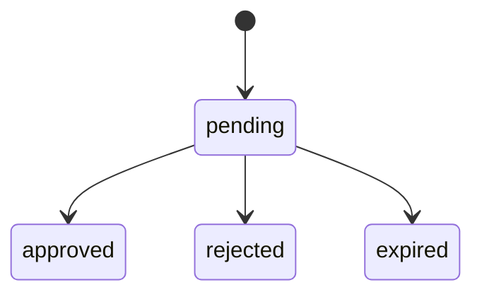

```python
request = {
    "request_id": "req_001",
    "kind": "shutdown",
    "status": "pending",
}
```

</div>
</div>

<div v-click class="mt-2 text-sm text-center text-gray-500">

教学版先做 2 类协议：**shutdown**（优雅关机）和 **plan_approval**（计划审批）

</div>

---
layout: none
---

<EmbedVizFrame url="http://localhost:3000/en/embed/s10/" />

---

# s17: 自治智能体 (Autonomous Agents)

> 空闲的队友会自己去找下一份工作

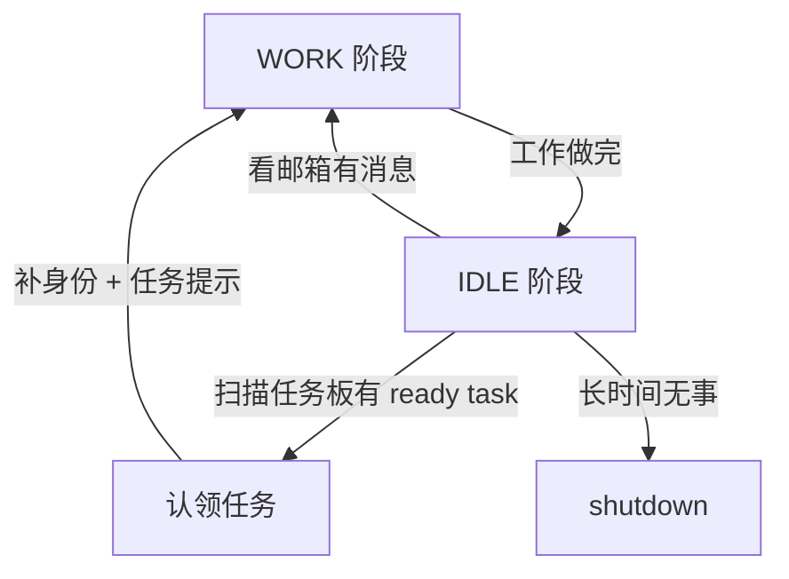

<div v-click>

## 认领条件（缺一不可）

```python {1-6}
def is_claimable_task(task, role=None):
    return (
        task["status"] == "pending"        # 还没开始
        and not task["owner"]              # 还没人认领
        and not task["blockedBy"]          # 没有前置阻塞
        and _task_allows_role(task, role)   # 角色匹配
    )
```

</div>

---
layout: none
---

<EmbedVizFrame url="http://localhost:3000/en/embed/s11/" />

---

# s18: Worktree 任务隔离

> Task 管"做什么"，Worktree 管"在哪做且互不干扰"

<div class="grid grid-cols-2 gap-6">
<div>

## 两张表

```python
# 任务板 (.tasks/)
task = {
    "id": 12,
    "subject": "Refactor auth",
    "worktree": "auth-refactor",
    "worktree_state": "active",
}

# Worktree 注册表 (.worktrees/)
worktree = {
    "name": "auth-refactor",
    "path": ".worktrees/auth-refactor",
    "branch": "wt/auth-refactor",
    "task_id": 12,
    "status": "active",
}
```

</div>
<div>

## 生命周期

<v-clicks>

1. **创建任务** → `tasks.create(...)`
2. **分配 worktree** → `worktrees.create(..., task_id)`
3. **进入车道** → `worktree_enter(name)`
4. **在隔离目录执行** → `subprocess.run(cmd, cwd=wt_path)`
5. **收尾** → `worktree_closeout(action="keep"|"remove")`

</v-clicks>

<div v-click class="mt-3 p-2 bg-yellow-50 dark:bg-yellow-900/20 rounded text-sm">

任务状态和车道状态**不能混成一个字段**！任务可能 `completed` 但 worktree 仍 `kept`

</div>

</div>
</div>

---
layout: none
---

<EmbedVizFrame url="http://localhost:3000/en/embed/s12/" />

---

# s19: MCP 与插件系统

> 工具不必都写死在主程序里。外部进程也可以把能力接进你的 agent

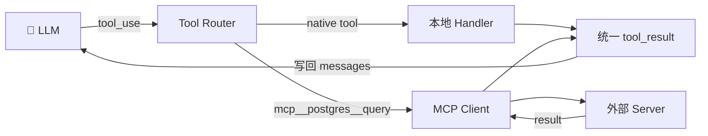

<div class="grid grid-cols-3 gap-3 mt-4 text-sm">
<div v-click class="p-2 bg-gray-50 dark:bg-gray-800 rounded text-center">

**Plugin** — 发现配置

</div>
<div v-click class="p-2 bg-gray-50 dark:bg-gray-800 rounded text-center">

**MCP Server** — 连接进程

</div>
<div v-click class="p-2 bg-gray-50 dark:bg-gray-800 rounded text-center">

**MCP Tool** — 具体调用

</div>
</div>

<div v-click class="mt-3 p-2 bg-red-50 dark:bg-red-900/20 rounded text-sm text-center">

**关键：MCP 工具虽然来自外部，但仍然必须走同一条权限管道和 tool_result 回流！**

</div>

---

# 核心数据结构总览

<div class="text-sm">

| 层次 | 关键结构 | 职责 |
|------|----------|------|
| **对话控制** | `Message` / `QueryState` / `TransitionReason` | 管本轮输入和继续理由 |
| **工具执行** | `ToolSpec` / `DispatchMap` / `ToolUseContext` | 管动作怎么安全执行 |
| **权限 Hook** | `PermissionRule` / `PermissionDecision` / `HookEvent` | 管安全和扩展 |
| **持久工作** | `TaskRecord` / `MemoryEntry` / `ScheduleRecord` | 管跨会话的持久工作 |
| **运行时** | `RuntimeTaskState` / `TeamMember` / `WorktreeRecord` | 管当前执行车道 |
| **外部能力** | `MCPServerConfig` / `MCPToolSpec` | 管系统怎样向外接能力 |

</div>

---

# 最容易混淆的概念对照

<div class="grid grid-cols-2 gap-4 text-sm">

<div>

| 概念对 | 区分方法 |
|--------|----------|
| **Todo** vs **Task** | 临时步骤 vs 持久化工作节点 |
| **Task** vs **Runtime Task** | 目标 vs 执行槽位 |
| **Subagent** vs **Teammate** | 一次性 vs 长期存在 |
| **Memory** vs **Context** | 跨会话 vs 当前轮 |

</div>

<div>

| 概念对 | 区分方法 |
|--------|----------|
| **Prompt** vs **Reminder** | 稳定说明 vs 临时提醒 |
| **Worktree** vs **Task** | 在哪做 vs 做什么 |
| **Tool** vs **Resource** | 动作 vs 可读内容 |
| **Permission** vs **Hook** | 能不能做 vs 额外插入行为 |

</div>

</div>

---

# 四个里程碑

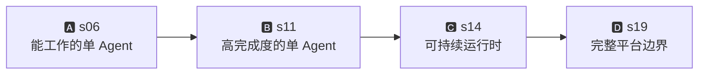

<div class="grid grid-cols-4 gap-3 mt-6 text-sm">

<div class="p-3 bg-blue-50 dark:bg-blue-900/20 rounded-lg text-center">

**A: s06 完成**

主循环 + 工具 + 计划 + 子任务 + 技能 + 压缩

</div>

<div class="p-3 bg-green-50 dark:bg-green-900/20 rounded-lg text-center">

**B: s11 完成**

权限 + Hook + Memory + Prompt + 恢复

</div>

<div class="p-3 bg-amber-50 dark:bg-amber-900/20 rounded-lg text-center">

**C: s14 完成**

持久任务 + 后台执行 + 定时触发

</div>

<div class="p-3 bg-red-50 dark:bg-red-900/20 rounded-lg text-center">

**D: s19 完成**

队友 + 协议 + 自治 + Worktree + MCP

</div>

</div>

---
layout: center
class: text-center
---

# 一句话记住

<div class="text-2xl mt-8 font-bold">

先做出能工作的最小循环

再一层一层给它补上

**规划 → 隔离 → 安全 → 记忆 → 任务 → 协作 → 外部能力**

</div>

<div class="mt-12 text-gray-500">

好的章节顺序，不是把所有机制排成一列，

而是让每一章都像前一章**自然长出来的下一层**。

</div>

---
layout: end
---

# Thank You!

Learn Claude Code · 从零手搓 AI Coding Agent

<div class="text-sm text-gray-500 mt-4">

GitHub: [shareAI-lab/learn-claude-code](https://github.com/shareAI-lab/learn-claude-code)

</div>
