# Build Your Own Agent

## 从 0 到 1 手搓 AI Coding Agent

<div class="text-lg text-gray-500 mt-8">
<p>javayhu</p>
<p>2026/4/13</p>
</div>

<!--
基于开源项目 Learn Claude Code 的教程，分享一个简化版本的 AI Coding Agent 的实现
-->

---
layout: default
class: flex items-center justify-center
---

<style>
@keyframes float1 { 0%,100% { transform: translate(0,0) rotate(var(--r)); } 50% { transform: translate(6px,-8px) rotate(calc(var(--r) + 3deg)); } }
@keyframes float2 { 0%,100% { transform: translate(0,0) rotate(var(--r)); } 50% { transform: translate(-7px,6px) rotate(calc(var(--r) - 4deg)); } }
@keyframes float3 { 0%,100% { transform: translate(0,0) rotate(var(--r)); } 50% { transform: translate(8px,5px) rotate(calc(var(--r) + 5deg)); } }
@keyframes float4 { 0%,100% { transform: translate(0,0) rotate(var(--r)); } 50% { transform: translate(-5px,-7px) rotate(calc(var(--r) - 3deg)); } }
@keyframes float5 { 0%,100% { transform: translate(0,0) rotate(var(--r)); } 50% { transform: translate(4px,9px) rotate(calc(var(--r) + 4deg)); } }
@keyframes pulse-person { 0%,100% { transform: scale(1); } 50% { transform: scale(1.05); } }
.concept-word { position: absolute; font-weight: 700; white-space: nowrap; }
.f1 { animation: float1 3s ease-in-out infinite; }
.f2 { animation: float2 3.5s ease-in-out infinite; }
.f3 { animation: float3 4s ease-in-out infinite; }
.f4 { animation: float4 2.8s ease-in-out infinite; }
.f5 { animation: float5 3.2s ease-in-out infinite; }
</style>

<div class="relative w-full h-full flex items-center justify-center overflow-hidden">

  <!-- 中心困惑的人 -->
  <div class="relative z-10 flex flex-col items-center" style="animation: pulse-person 3s ease-in-out infinite;">
    <div class="text-8xl mb-2">🤯</div>
    <div class="text-2xl font-bold text-gray-400 tracking-widest">???</div>
  </div>

  <!-- 第一圈：紧贴中心 -->
  <span class="concept-word f1 text-2xl text-blue-400" style="--r:-8deg; top:22%; left:33%;">Model</span>
  <span class="concept-word f2 text-xl text-green-400" style="--r:5deg; top:20%; left:52%;">Prompt</span>
  <span class="concept-word f3 text-2xl text-orange-400" style="--r:10deg; top:30%; right:24%;">Context</span>
  <span class="concept-word f4 text-lg text-pink-400" style="--r:-3deg; top:30%; left:26%;">Token</span>
  <span class="concept-word f5 text-xl text-cyan-400" style="--r:12deg; top:62%; left:34%;">MCP</span>
  <span class="concept-word f1 text-xl text-yellow-400" style="--r:-6deg; top:62%; right:30%;">Skill</span>

  <!-- 第二圈：中距离 -->
  <span class="concept-word f3 text-lg text-red-400" style="--r:4deg; top:16%; left:22%;">Harness</span>
  <span class="concept-word f2 text-2xl text-purple-400" style="--r:-12deg; top:18%; right:18%;">Agent</span>
  <span class="concept-word f4 text-lg text-emerald-400" style="--r:-5deg; top:38%; left:14%;">Coding Agent</span>
  <span class="concept-word f5 text-base text-indigo-400" style="--r:8deg; top:40%; right:12%;">Vibe Coding</span>
  <span class="concept-word f1 text-base text-teal-400" style="--r:6deg; top:55%; left:14%;">Prompt Caching</span>
  <span class="concept-word f3 text-lg text-rose-400" style="--r:-10deg; top:52%; right:10%;">Prompt Engineering</span>

  <!-- 第三圈：稍远但仍在视觉范围 -->
  <span class="concept-word f2 text-lg text-violet-400" style="--r:-7deg; top:70%; left:16%;">Context Engineering</span>
  <span class="concept-word f4 text-base text-amber-400" style="--r:6deg; top:68%; right:12%;">Harness Engineering</span>
  <span class="concept-word f5 text-base text-sky-400" style="--r:3deg; top:74%; left:38%;">Hooks</span>
  <span class="concept-word f1 text-lg text-lime-400" style="--r:-9deg; top:72%; right:28%;">Memory</span>
  <span class="concept-word f3 text-sm text-fuchsia-400" style="--r:11deg; top:10%; left:44%;">Commands</span>

  <!-- 第四圈：外围点缀 -->
  <span class="concept-word f4 text-lg text-orange-300" style="--r:-4deg; top:82%; left:22%;">Plugins</span>
  <span class="concept-word f2 text-xl text-blue-300" style="--r:7deg; top:12%; right:32%;">OpenClaw</span>
  <span class="concept-word f5 text-lg text-green-300" style="--r:-8deg; top:82%; right:22%;">OpenHarness</span>
  <span class="concept-word f1 text-xl text-red-300" style="--r:5deg; top:8%; left:12%;">Hermes Agent</span>

</div>

<!--
这半年来 AI 领域概念爆炸，各种新名词层出不穷，让人目不暇接
今天我们就来梳理这些概念，理清脉络，帮大家建立清晰的认知框架
-->


---
layout: two-cols
---

<template v-slot:default>

# (1/2) 大模型基础概念

- <span class="text-orange-500 font-bold">LLM</span>
- Prompt
- Token
- Context
- Tools
- MCP

<div class="concept-slide-image">
  
</div>

</template>

<template v-slot:right>

## 近半年进展

<div v-click>

### 1、主流模型竞赛

[models.dev](https://models.dev) 记录主流模型的发布时间、知识库时间、性能、价格和能力

- OpenAI GPT 5.4 / Google Gemini 3.1 / Anthropic Claude Opus 4.6

- GLM 5.1 / Kimi K2.5 / MiniMax M2.7

</div>

<div v-click>

### 2、主流模型调用量

[openrouter.ai](https://openrouter.ai/rankings) 调用量前十中除了国外三家模型，国产开源模型也表现亮眼

<div class="concept-slide-image">
  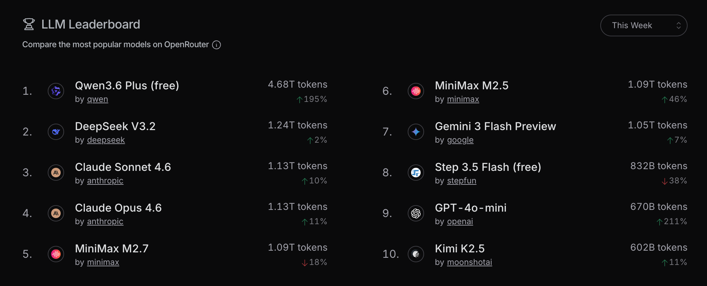
</div>

</div>

</template>

<!-- LLM -->

---
layout: two-cols
---

<template v-slot:default>

# (1/2) 大模型基础概念

- LLM
- <span class="text-orange-500 font-bold">Prompt</span>
- Token
- Context
- Tools
- MCP

<div class="concept-slide-image">
  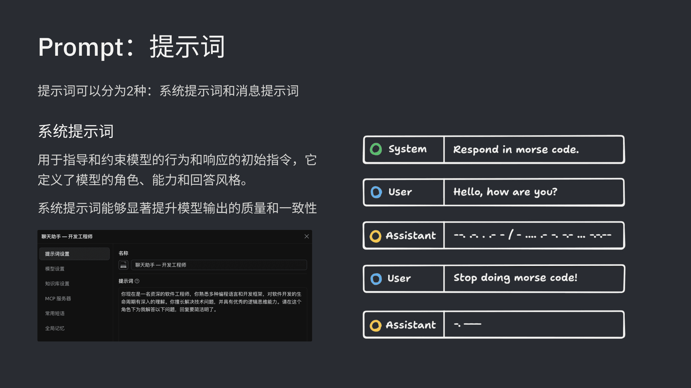
</div>

</template>

<template v-slot:right>

## 近半年进展

<div v-click>

### 1、提示词缓存（Prompt Caching）

如果当前请求的输入前缀和之前的请求完全一致，模型商就可以直接从缓存中读取结果，效率更高，成本更低

<div class="slide-image">
  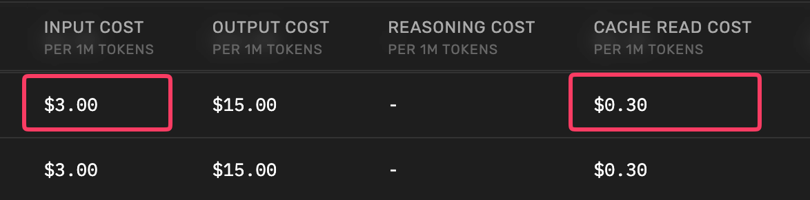
</div>

</div>

<div v-click>

### 2、设计提示词的核心原则

<span class="text-orange-500">常驻内容要短且稳定，把不变的放前面，把变化的放后面</span>

- 前面放基本不变的内容：系统提示、工具列表、技能列表等

- 后面放动态变化的内容：当前时间、用户输入、工具调用结果等

</div>

</template>

<!-- Prompt -->

---
layout: two-cols
---

<template v-slot:default>

# (1/2) 大模型基础概念

- LLM
- Prompt
- <span class="text-orange-500 font-bold">Token</span>
- Context
- Tools
- MCP

<div class="concept-slide-image">
  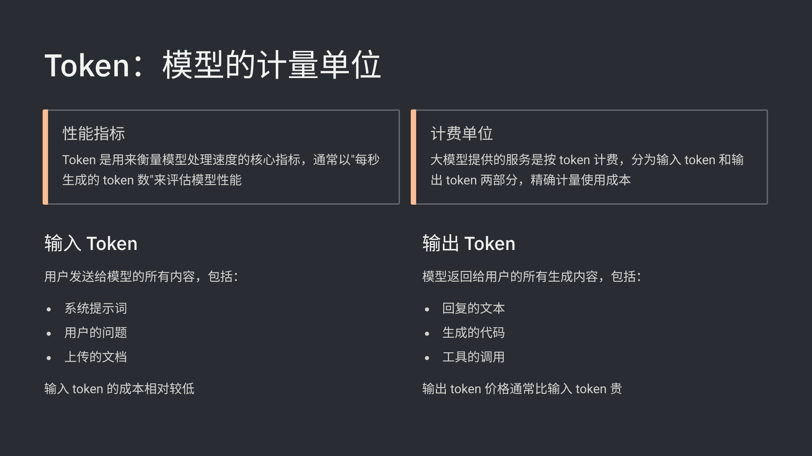
</div>

</template>

<template v-slot:right>

## 近半年进展

<div v-click>

### 1、中文名：<span class="text-orange-500">词元</span>

Token是大模型处理信息的最小信息单元，也是结算单位

信息时代的基础单位是 Bit，而 AI 时代的基础单位是 Token

</div>

<div v-click>

### 2、Token Plan

模型服务商从提供 Coding Plan 到提供 Token Plan，满足用户多模态输入输出的需求

- Tencent Token Plan
- MiniMax Token Plan

<div class="slide-image" style="margin-top: 8px">
  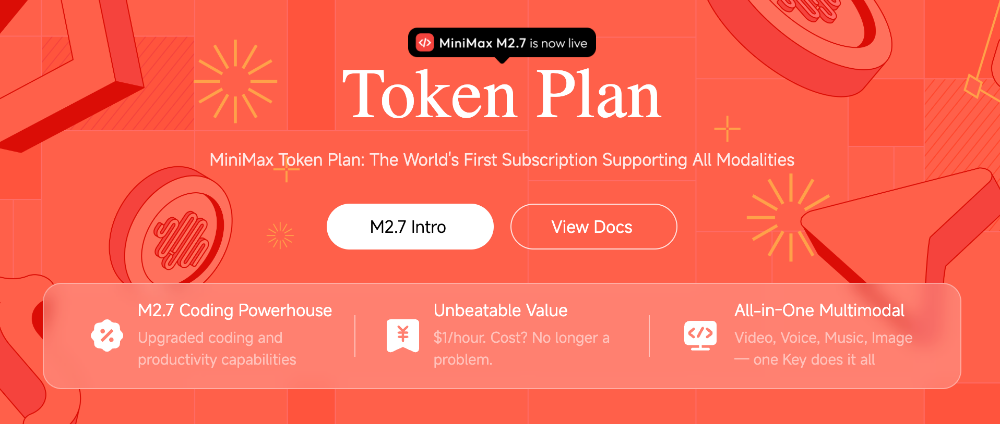
</div>

</div>

</template>

<!-- Token -->

---
layout: two-cols
---

<template v-slot:default>

# (1/2) 大模型基础概念

- LLM
- Prompt
- Token
- <span class="text-orange-500 font-bold">Context</span>
- Tools
- MCP

<div class="concept-slide-image">
  
</div>

</template>

<template v-slot:right>

## 近半年进展

<div v-click>

### 1、工程化的演进

<div class="mt-4 mb-8">
  <table class="w-full">
    <thead>
      <tr class="">
        <th class="w-28 text-left pb-2"></th>
        <th class="w-28 text-left pb-2">时间</th>
        <th class="text-left pb-2">解决的问题</th>
      </tr>
    </thead>
    <tbody>
      <tr>
        <td class="pr-2 pb-2 align-center">提示词工程</td>
        <td class="pr-2 pb-2 align-center">2023-2024</td>
        <td class="pb-2 align-top">怎么跟模型说，<span class="text-orange-500">侧重于措辞和结构化、单轮 AI 交互</span></td>
      </tr>
      <tr>
        <td class="pr-2 pb-2 align-center">上下文工程</td>
        <td class="pr-2 pb-2 align-center">2025</td>
        <td class="pb-2 align-top">给模型什么信息，<span class="text-orange-500">侧重于上下文信息编排、多轮 AI 交互</span></td>
      </tr>
      <tr>
        <td class="pr-2 align-center">驾驭工程</td>
        <td class="pr-2 align-center">2026+</td>
        <td class="align-top">如何搭建运行环境、设计约束规则、建立反馈循环，<span class="text-orange-500">侧重于运行环境的设计</span></td>
      </tr>
    </tbody>
  </table>
</div>

<div class="slide-image">
  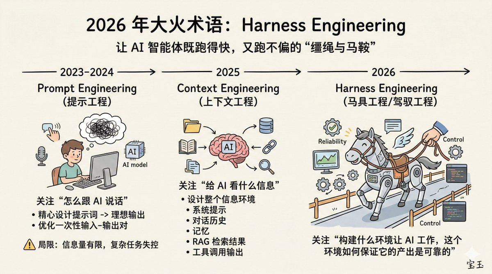
</div>

</div>

</template>

<!-- Context -->

---
layout: two-cols
---

<template v-slot:default>

# (1/2) 大模型基础概念

- LLM
- Prompt
- Token
- Context
- <span class="text-orange-500 font-bold">Tools</span>
- MCP

<div class="concept-slide-image">
  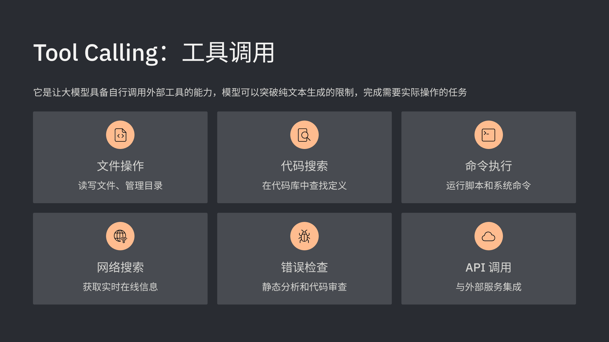
</div>

</template>

<template v-slot:right>

## 近半年进展

<div v-click>

### 1、<a href="https://youtu.be/TqC1qOfiVcQ" target="_blank"><span class="text-orange-500">Bash is all you need</span></a>

- HCI (Human Computer Interface) 向 ACI (Agent Computer Interface) 转化

- GUI 是给人看的 (Chrome)，Agent 只需要 bash 工具就行 (Headless Chrome)

</div>

<div v-click>

### 2、为什么选择 bash？

- bash 能读写文件、管理文件系统、编写脚本并执行

- bash 可以利用其他三方工具，比如 ffmpeg/git/grep

- 增加工具不会解锁新能力，只会增加模型需要理解的接口

</div>

<div v-click>

### 3、CLI 工具的兴起

- 飞书推出 CLI，钉钉推出 CLI，企微推出 CLI

- Google Workspace 推出 CLI，Obsidian 推出 CLI

```bash
# Send an email
gws gmail +send --to alice@example.com --subject "Hello" --body "Hi there"

# Create a new note
obsidian create name="Trip to Paris"
```

</div>

</template>

<!-- Tools -->

---
layout: two-cols
---

<template v-slot:default>

# (1/2) 大模型基础概念

- LLM
- Prompt
- Token
- Context
- Tools
- <span class="text-orange-500 font-bold">MCP + Skill</span>

<div class="concept-slide-image">
  
</div>

</template>

<template v-slot:right>

## 近半年进展

<div v-click>

### 1、<a href="https://youtu.be/CEvIs9y1uog" target="_blank"><span class="text-orange-500">Don't build agents, build skills instead</span></a>

- Claude Code 证明：不同领域的 Agent 底层可以完全一样（通用 Agent + 通用工具）

- 构建 Skills 生态，让通用 Agent 通过可积累、可复用的 Skills 变成各领域的专业工具

</div>

<div v-click>

### 2、理解 Skill

- <span class="text-orange-500">Agent = 系统，Tools = 系统接口，Skills = 安装在系统上的应用</span>

- Claude Code/Cowork = iOS 系统，OpenClaw = Android 系统

- ClawHub = 国外应用商店，SkillsHub = 国内应用商店，有毒的 Skill = 恶意应用

</div>

<div v-click>

### 3、理解 MCP 和 Skill

- 对于 Agent 而言，MCP 和 Skill 都在工具层，都是为了扩展 Agent 的能力

- MCP 和 Skill 不是竞争关系，而是互补关系，Skills + MCP = 专业知识 + 外部连接

<div class="mt-3">
  <table class="w-full">
    <thead>
      <tr class="text-orange-500">
        <th class="w-32 text-left"></th>
        <th class="text-left">MCP</th>
        <th class="text-left">Skill</th>
      </tr>
    </thead>
    <tbody>
      <tr>
        <td class="pr-2 pb-2 align-top">解决的问题</td>
        <td class="pr-2 pb-2 align-top">把外部能力接进来给 Agent 用</td>
        <td class="pb-2 align-top">把做事的方法和步骤教给 Agent</td>
      </tr>
      <tr>
        <td class="pr-2 pb-2 align-top">内容形态</td>
        <td class="pr-2 pb-2 align-top">tools / resources / prompts</td>
        <td class="pb-2 align-top">Skill.md / scripts / references</td>
      </tr>
      <tr>
        <td class="pr-2 pb-2 align-top">加载方式</td>
        <td class="pr-2 pb-2 align-top">连接 server 后暴露能力</td>
        <td class="pb-2 align-top">按需加载正文和脚本</td>
      </tr>
      <tr>
        <td class="pr-2 align-top">上下文成本</td>
        <td class="pr-2 align-top">工具定义和结果可能太大</td>
        <td class="align-top">分层设计，按需加载</td>
      </tr>
    </tbody>
  </table>
</div>

</div>

</template>

<!-- MCP -->

---
layout: two-cols
---

<template v-slot:default>

# (2/2) AI 编程工具的演进和经验

- Chat：ChatGPT
- VS Code 插件：Copilot
- AI IDE：Cursor、Windsurf
- AI Coding Agent：Claude Code、Codex

<div class="concept-slide-image">
  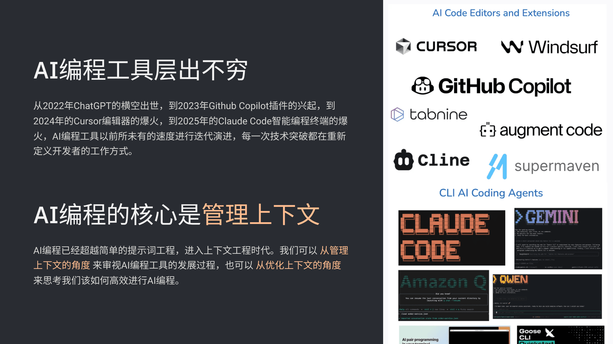
</div>

</template>

<template v-slot:right>

## 近半年进展

<div v-click>

### 1、CodeBuddy 逐渐完善

- AI IDE：CodeBuddy IDE
- VS Code 插件：CodeBuddy 插件
- Coding Agent：CodeBuddy Code
- 底层共享通用的 CodeBuddy Agent SDK

</div>

<div v-click>

### 2、Claude Code 源码泄漏

国内外各种源码分析

[Claude Code Upacked](https://ccunpacked.dev/)

[Claude Code From Source](https://claude-code-from-source.com/)

</div>

<div v-click>

### 3、Learn Claude Code

通过学习这个<a href="https://learn.shareai.run/" target="_blank">教程</a>，了解 AI Coding Agent 的架构设计

</div>

</template>

<!-- AI Coding-->


---
layout: section
---

# Agent 框架实现

<div class="text-gray-500 mt-4">
跟着 Learn Claude Code 教程实现简易的 AI Coding Agent
</div>

---
layout: default
---

# <span class="text-orange-500">Agent = Model + Harness</span>

<div class="grid grid-cols-[1fr_700px] gap-8 mt-8">
<div>

- Agent 是大脑和身体的结合

- Model 是大脑，负责思考+推理

- Harness 是身体，负责感知+执行

<div v-click>

- <span class="text-orange-500">如何设计并实现一个 Agent 框架？</span>

[Mini-Agent](https://github.com/MiniMax-AI/Mini-Agent)

[OpenHarness](https://github.com/HKUDS/OpenHarness)

</div>

</div>
<div v-click>

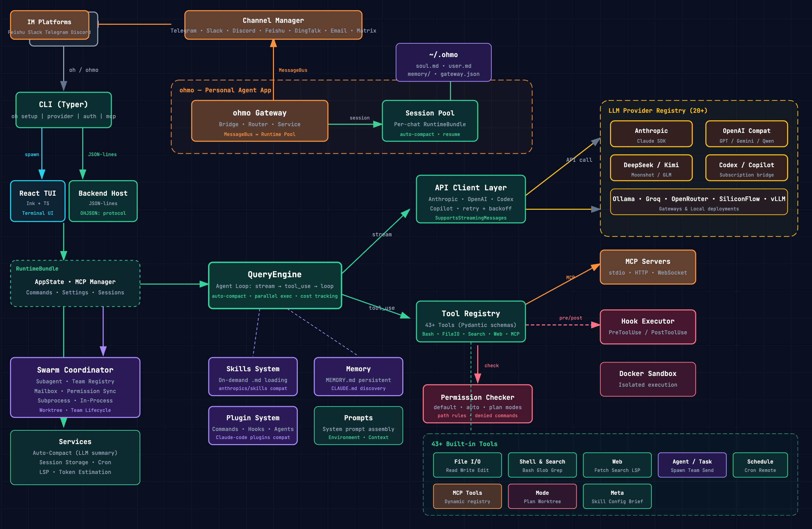

</div>
</div>

---
layout: default
---

# Learn Claude Code

- 教程在 Claude Code 源码泄漏之前就存在，并不是 Claude Code 源码分析教程

- 教程在 Claude Code 源码泄漏之后，新增了 7 个章节，可能是受泄漏的源码启发

- 它是 Coding Agent 简化版实现，跟实际生产环境的 Agent 有差异，但很值得学习

<div class="mt-32 flex items-start justify-center gap-2">

  <div v-click class="flex items-center gap-2">
    <div class="px-5 py-4 rounded-xl bg-blue-500/15 border-2 border-blue-400 text-center" style="min-width:180px;">
      <div class="text-blue-300 font-bold text-base">🔵 阶段1: 核心单Agent</div>
      <div class="text-blue-400/60 text-xs mt-1">s01 - s06</div>
      <div class="text-blue-200/80 text-sm mt-2">先做出一个真能工作的 agent</div>
    </div>
  </div>

  <div v-click class="flex items-center gap-2">
    <div class="text-gray-500 text-2xl mt-2">→</div>
    <div class="px-5 py-4 rounded-xl bg-green-500/15 border-2 border-green-400 text-center" style="min-width:180px;">
      <div class="text-green-300 font-bold text-base">🟢 阶段2: 生产加固</div>
      <div class="text-green-400/60 text-xs mt-1">s07 - s11</div>
      <div class="text-green-200/80 text-sm mt-2">再补安全、扩展、记忆和恢复</div>
    </div>
  </div>

  <div v-click class="flex items-center gap-2">
    <div class="text-gray-500 text-2xl mt-2">→</div>
    <div class="px-5 py-4 rounded-xl bg-orange-500/15 border-2 border-orange-400 text-center" style="min-width:180px;">
      <div class="text-orange-300 font-bold text-base">🟠 阶段3: 任务管理</div>
      <div class="text-orange-400/60 text-xs mt-1">s12 - s14</div>
      <div class="text-orange-200/80 text-sm mt-2">临时清单升级成持久化任务系统</div>
    </div>
  </div>

  <div v-click class="flex items-center gap-2">
    <div class="text-gray-500 text-2xl mt-2">→</div>
    <div class="px-5 py-4 rounded-xl bg-red-500/15 border-2 border-red-400 text-center" style="min-width:180px;">
      <div class="text-red-300 font-bold text-base">🔴 阶段4: 多Agent平台</div>
      <div class="text-red-400/60 text-xs mt-1">s15 - s19</div>
      <div class="text-red-200/80 text-sm mt-2">从单 agent 升级成多 agent 平台</div>
    </div>
  </div>

</div>

<div v-click class="mt-32 text-xl text-orange-500 w-full text-center">

每一章节都是上一章节自然迭代出来的，从最小的单 Agent 开始，到复杂的多 Agent 平台

</div>

---
layout: section
---

# 阶段 1：核心单 Agent

## s01 — s06

<div class="text-gray-500 mt-4">
先让 agent 能跑起来
</div>

<!-- s01 agent loop -->

---
layout: default
---

# s01: 智能体循环 (The Agent Loop)

> 真正的 agent 起点，是把真实工具结果重新喂回模型，而不只是输出一段文本

<div class="grid grid-cols-[1fr_600px] gap-8">
<div>

<div v-click>

**问题**：模型能思考但不能动手，不能打开文件、不能跑命令，每一步都需要人复制粘贴结果

</div>

<div v-click>

**方案**：给模型接上工具，让思考、调用、拿结果形成自动循环，这就是最小的 Agent Loop

</div>

<div v-after>

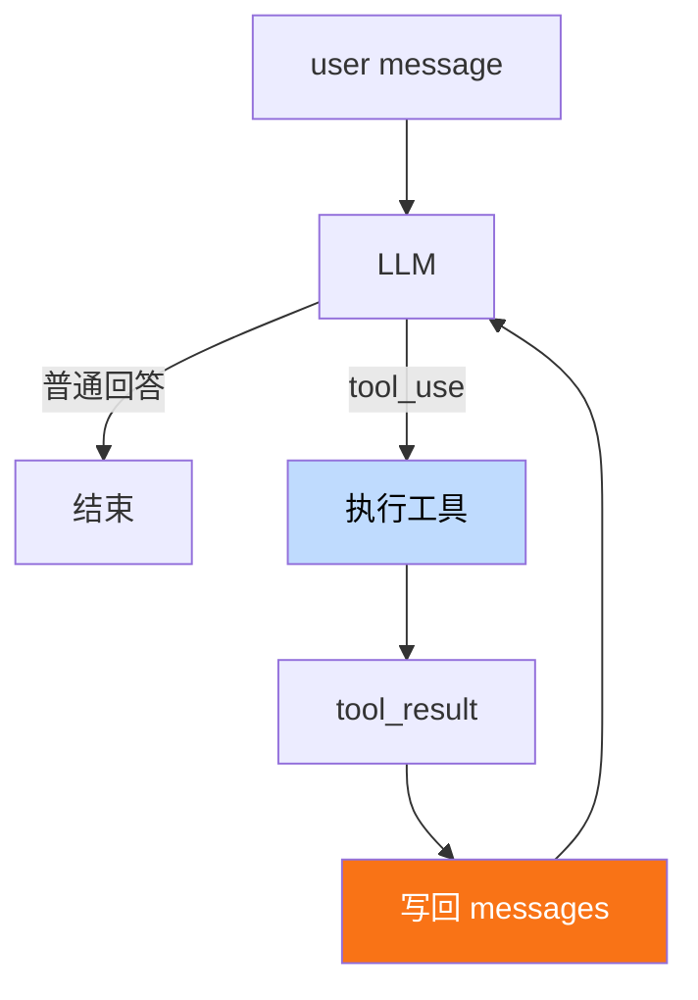

</div>

</div>

<div v-click class="embed-viz">
<iframe src="https://build-your-own-agent.vercel.app/en/embed/s01/" />
</div>

</div>

---
layout: default
---

# s01: 最小 Agent Loop 实现

<div class="grid grid-cols-[1.3fr_1fr] gap-4">
<div>

```python {1|3-4|5-18|20-23|25-34|36-39|all}
messages = [{"role": "user", "content": query}]

def agent_loop(state):
    while True:
        # 1. 调用模型
        response = client.messages.create(
            model=MODEL, 
            system=SYSTEM,
            tools=TOOLS, 
            messages=state["messages"],
            max_tokens=8000,
        )

        # 2. 追加 assistant 回复
        state["messages"].append({
            "role": "assistant", 
            "content": response.content,
        })

        # 3. 如果不是 tool_use，结束
        if response.stop_reason != "tool_use":
          state["transition_reason"] = None
          return

        # 4. 执行工具，回写结果
        results = []
        for block in response.content:
            if block.type == "tool_use":
                output = run_tool(block)
                results.append({
                    "type": "tool_result",
                    "tool_use_id": block.id,
                    "content": output,
                })

        # 5. 工具结果作为新消息写回
        state["messages"].append({"role": "user", "content": results})
        state["turn_count"] += 1
        state["transition_reason"] = "tool_result"
```

</div>
<div>

**系统提示词**和**工具**定义

```python
SYSTEM = (
    f"You are a coding agent at {os.getcwd()}. "
    "Use bash to inspect and change the workspace. Act first, then report clearly."
)

TOOLS = [{
    "name": "bash",
    "description": "Run a shell command in the current workspace.",
    "input_schema": {...},
}]
```

**Message**：消息历史不是聊天记录展示层，而是模型下一轮要读的上下文

```python
{"role": "user", "content": "..."}
{"role": "assistant", "content": [...]}
{"role": "tool_result", "content": [...]}
```

**Tool Result**：模型返回的工具结果

```python
{
    "type": "tool_result",
    "tool_use_id": "...",
    "content": "...",
}
```

**LoopState**：显式收拢循环状态

```python
state = {
    "messages": [...],
    "turn_count": 1,
    "transition_reason": None,
}
```

</div>
</div>

---
layout: default
---

# s02: 工具使用 (Tool Use)

> 主循环本身不用变复杂；工具能力靠一层清晰的路由面增长

<div class="grid grid-cols-[1fr_600px] gap-8">
<div>

<div v-click>

**问题**：循环跑起来了，但只有一个 bash 工具，所有操作都走 shell，路径逃逸和危险命令都拦不住

</div>

<div v-click>

**方案**：为高频操作定义专用工具，在工具层面做路径沙箱，新增工具只需新增一行路由，核心循环不变

</div>

<div v-after>

<div class="relative flex flex-col items-center gap-2 mt-16">

  <!-- SVG 回环曲线：从 tool_result 右侧绕回 LLM -->
  <svg class="absolute -right-2 top-0 h-full w-16 pointer-events-none" viewBox="0 0 60 320" fill="none" xmlns="http://www.w3.org/2000/svg">
    <path d="M 8 275 Q 55 275, 55 160 Q 55 45, 8 45" stroke="#60a5fa" stroke-width="1.5" stroke-dasharray="5 3" fill="none" />
    <path d="M 14 40 L 6 45 L 14 50" stroke="#60a5fa" stroke-width="1.5" fill="none" />
  </svg>

  <div class="px-6 py-3 rounded-xl bg-blue-500/15 border-2 border-blue-400 text-blue-300 font-bold text-base text-center w-56">
    🤖 LLM
  </div>
  <div class="text-gray-500 text-base">↓ <span class="text-sm text-blue-400">tool_use</span></div>

  <div class="px-6 py-3 rounded-xl bg-gray-500/15 border-2 border-gray-400 text-gray-300 font-bold text-base text-center w-56">
    Dispatch Map
  </div>

  <div class="flex items-start justify-center gap-4 mt-2">
    <div class="flex flex-col items-center">
      <div class="text-gray-500">↓</div>
      <div class="px-4 py-2 rounded-xl bg-cyan-500/15 border-2 border-cyan-400 text-cyan-300 font-bold text-sm text-center">bash</div>
    </div>
    <div class="flex flex-col items-center">
      <div class="text-gray-500">↓</div>
      <div class="px-4 py-2 rounded-xl bg-orange-500/20 border-2 border-orange-400 text-orange-300 font-bold text-sm text-center">read_file</div>
    </div>
    <div class="flex flex-col items-center">
      <div class="text-gray-500">↓</div>
      <div class="px-4 py-2 rounded-xl bg-orange-500/20 border-2 border-orange-400 text-orange-300 font-bold text-sm text-center">write_file</div>
    </div>
    <div class="flex flex-col items-center">
      <div class="text-gray-500">↓</div>
      <div class="px-4 py-2 rounded-xl bg-orange-500/20 border-2 border-orange-400 text-orange-300 font-bold text-sm text-center">edit_file</div>
    </div>
  </div>

  <div class="text-gray-500 text-base mt-2">↓</div>

  <div class="px-6 py-3 rounded-xl bg-green-500/15 border-2 border-green-400 text-green-300 font-bold text-base text-center w-56">
    tool_result
  </div>

</div>

</div>

</div>

<div v-click class="embed-viz">
<iframe src="https://build-your-own-agent.vercel.app/en/embed/s02/" style="--viz-h: 1000px; --viz-scale: 0.45" />
</div>

</div>

---
layout: default
---

# s02: 核心代码

<div class="grid grid-cols-2 gap-4">
<div>

## 工具分发 + 路径沙箱

注册新的工具，并补充安全路径检查，防止逃逸出工作目录

```python {1-8|10-15|22-27,29-30}
# s02 新增：工具注册表
TOOL_HANDLERS = {
    "bash":       lambda **kw: run_bash(kw["command"]),
    "read_file":  lambda **kw: run_read(kw["path"], kw.get("limit")),
    "write_file": lambda **kw: run_write(kw["path"], kw["content"]),
    "edit_file":  lambda **kw: run_edit(kw["path"], kw["old_text"],
                                        kw["new_text"]),
}

# s02 循环中按名称查找对应的工具
for block in response.content:
    if block.type == "tool_use":
        handler = TOOL_HANDLERS.get(block.name)
        output = handler(**block.input) if handler \
            else f"Unknown tool: {block.name}"
        results.append({
            "type": "tool_result",
            "tool_use_id": block.id,
            "content": output,
        })

# s02 路径沙箱，防止逃逸出工作目录
def safe_path(p: str) -> Path:
    path = (WORKDIR / p).resolve()
    if not path.is_relative_to(WORKDIR):
        raise ValueError(f"Path escapes workspace: {p}")
    return path

def run_read(path: str, limit: int = None) -> str:
    text = safe_path(path).read_text()
    lines = text.splitlines()
    if limit and limit < len(lines):
        lines = lines[:limit]
    return "\n".join(lines)[:50000]
```

</div>
<div>

## 对比

新增工具 = 新增 handler + 新增 schema，核心的循环永远不变

<div class="mt-4 p-2 rounded text-sm">

| 组件 | s01 | s02 |
|------|-----|-----|
| Tools | 1 (仅 bash) | <span class="text-orange-500">4 (bash, read, write, edit)</span> |
| Dispatch | 硬编码 | 工具注册表 |
| 路径安全 | 无 | 路径安全校验 |
| Agent loop | 不变 | <span class="text-orange-500">不变</span> |

</div>

</div>
</div>

---
layout: default
---

# s03: 会话内规划 (TodoWrite)

> 对多步骤任务来说，可见计划不是装饰，而是防止会话漂移的稳定器

<div class="grid grid-cols-[1fr_600px] gap-8">
<div>

<div v-click>

**问题**：工具多了能干的事也多了，但大任务做着做着方向就漂了，没有计划全凭即兴发挥

</div>

<div v-click>

**方案**：让 Agent 先写任务清单再动手，每完成一步更新状态，清单会话内可见防止漂移

- 不是任务系统，只是当前会话的计划外显

- **约束**：同一时间最多一个任务正在执行

- **提醒**：连续 3 轮不更新状态 → 注入提醒

</div>

</div>

<div v-click class="embed-viz">
<iframe src="https://build-your-own-agent.vercel.app/en/embed/s03/" />
</div>

</div>

---
layout: default
---

# s03: 核心代码

<div class="grid grid-cols-[1.3fr_1fr] gap-4">
<div>

## agent_loop 变更

```python {9-19|21-28}{at:1}
def agent_loop(messages: list) -> None:
    while True:
        response = client.messages.create(...)
        messages.append({"role": "assistant", "content": response.content})
        if response.stop_reason != "tool_use":
            return

        results = []
        # s03 新增：跟踪本轮是否调用了 todo
        used_todo = False
        for block in response.content:
            if block.type != "tool_use":
                continue
            handler = TOOL_HANDLERS.get(block.name)
            output = handler(**block.input) if handler else ...
            results.append({"type": "tool_result",
                "tool_use_id": block.id, "content": str(output)})
            if block.name == "todo":
                used_todo = True

        # s03 新增：注入更新执行计划的提醒
        if used_todo:
            TODO.state.rounds_since_update = 0
        else:
            TODO.note_round_without_update()
            reminder = TODO.reminder()
            if reminder:
                results.insert(0, {"type": "text", "text": reminder})

        messages.append({"role": "user", "content": results})
```

</div>
<div>

## 新增数据结构

```python {all|18-24}{at:3}
@dataclass
class PlanItem:
    content: str
    status: str = "pending"       # pending | in_progress | completed
    active_form: str = ""

@dataclass
class PlanningState:
    items: list[PlanItem] = field(default_factory=list)
    rounds_since_update: int = 0  # 连续多少轮过去了，模型还没有更新这份计划

class TodoManager:
    def __init__(self):
        self.state = PlanningState()
    def update(self, items) -> str: ...   # 校验 + 重写整份计划
    def render(self) -> str: ...          # [ ] [>] [x] 渲染

    # s03 新增：注入更新执行计划的提醒
    def reminder(self) -> str | None:
        if not self.state.items:
            return None
        if self.state.rounds_since_update < PLAN_REMINDER_INTERVAL:
            return None
        return "<reminder>Refresh your current plan.</reminder>"
```

## 注册新工具

```python
TOOL_HANDLERS = {
    ...,
    # s03 新增工具 todo
    "todo": lambda **kw: TODO.update(kw["items"]),
}
```

</div>
</div>

---

# s04: 子智能体 (Subagent)

> 把探索性工作移进干净上下文后，父 agent 才能持续盯住主目标

<div class="grid grid-cols-[1fr_600px] gap-8">
<div>

<div v-click>

**问题**：探索性工作的中间结果全留在上下文里，噪声越积越多，主任务反而做不好

</div>

<div v-click>

**方案**：把局部任务交给 subagent 在独立上下文里做，做完只带必要结果回来，保持主 agent 上下文干净

- Subagent 有独立的消息列表和工具列表

- 完成后只返回摘要，不污染父 agent 上下文

- Subagent 没有 task 工具，防止递归创建 Subagent

</div>

</div>

<div v-click class="embed-viz">
<iframe src="https://build-your-own-agent.vercel.app/en/embed/s04/" />
</div>

</div>

---
layout: default
---

# s04: 核心代码

<div class="grid grid-cols-[1.3fr_1fr] gap-4">
<div>

## agent_loop 变更

```python {7-8|16-22}
def agent_loop(messages: list):
    while True:
        response = client.messages.create(
            model=MODEL, 
            system=SYSTEM, 
            messages=messages,
            # s04 变更：使用 PARENT_TOOLS
            tools=PARENT_TOOLS, 
            max_tokens=8000,
        )
        messages.append({"role": "assistant", "content": response.content})
        if response.stop_reason != "tool_use":
            return
        results = []
        for block in response.content:
            if block.type == "tool_use":
                # s04 新增：处理 task 工具调用，创建 Subagent
                if block.name == "task":
                    desc = block.input.get("description", "subtask")
                    prompt = block.input.get("prompt", "")
                    print(f"> task ({desc}): {prompt[:80]}")
                    output = run_subagent(prompt)
                else:
                    handler = TOOL_HANDLERS.get(block.name)
                    output = handler(**block.input) if handler 
                    else f"Unknown tool: {block.name}"
                print(f"  {str(output)[:200]}")
                results.append({"type": "tool_result", 
                "tool_use_id": block.id, "content": str(output)})
        messages.append({"role": "user", "content": results})
```

</div>
<div>

## Subagent 实现

```python {all|2-3|9-10|17-19}{at:3}
def run_subagent(prompt: str) -> str:
    # Subagent 独立的消息列表
    sub_messages = [{"role": "user", "content": prompt}]
    for _ in range(30):  # 安全上限
        response = client.messages.create(
            model=MODEL, 
            system=SUBAGENT_SYSTEM,
            messages=sub_messages,
            # Subagent 独立的工具列表
            tools=CHILD_TOOLS, 
            max_tokens=8000,
        )
        sub_messages.append({"role": "assistant", "content": response.content})
        if response.stop_reason != "tool_use":
            break
        ...  # 执行工具，写回 sub_messages
    # 最终只把结果带回主 agent 上下文
    return "".join(b.text for b in response.content
                   if hasattr(b, "text")) or "(no summary)"
```

## 注册新工具

```python
# 子智能体：基础工具，没有 task 工具
CHILD_TOOLS = [bash, read_file, write_file, edit_file]

# 父智能体：基础工具 + task 工具分派任务给 Subagent
PARENT_TOOLS = CHILD_TOOLS + [
    {
      "name": "task", 
      "description": "Spawn a subagent with fresh context.",
      "input_schema": {"type": "object", "properties": {...}}, 
      "required": ["prompt"]}
    },
]
```

</div>
</div>

---

# s05: 技能系统  (Skills)

> 专门知识不该一开始全部塞进上下文，而该在需要时被轻量发现、按需展开

<div class="grid grid-cols-[1fr_600px] gap-4">
<div>

<div v-click>

**问题**：代码审查、提交约定等领域知识全塞进系统提示词，上下文很快就满了，还不一定用得上

</div>

<div v-click>

**方案**：技能拆成两层，系统提示词只放摘要目录，模型按需加载完整技能说明

- **第 1 层**：技能摘要始终在 system prompt，约 120 tokens

- **第 2 层**：模型调用 `load_skill` 工具按需加载完整正文

- 新增工具 load_skill，核心循环保持不变

</div>

</div>

<div v-click class="embed-viz">
<iframe src="https://build-your-own-agent.vercel.app/en/embed/s05/" />
</div>

</div>

---
layout: default
---

# s05: 核心代码

<div class="grid grid-cols-[1.3fr_1fr] gap-4">
<div>

## agent_loop 不变

```python {1-10|16,18}
# s05 新增：技能注册表，从 skills 目录发现所有技能
SKILL_REGISTRY = SkillRegistry(WORKDIR / "skills")

# s05 新增：system prompt 注入 skill 列表
SYSTEM = f"""You are a coding agent at {WORKDIR}.
Use load_skill when a task needs specialized instructions.

Skills available:
{SKILL_REGISTRY.describe_available()}
"""

def agent_loop(messages: list) -> None:
    while True:
        response = client.messages.create(
            model=MODEL, 
            system=SYSTEM,
            messages=messages, 
            tools=TOOLS, 
            max_tokens=8000,
        )
        
        # 标准循环：append → stop_reason → dispatch → results
        ...  
```

</div>
<div>

## 新增数据结构

```python
@dataclass
class SkillManifest:
    name: str
    description: str
    path: Path

@dataclass
class SkillDocument:
    manifest: SkillManifest
    body: str
```

## SkillRegistry

```python
class SkillRegistry:
    def __init__(self, skills_dir: Path):
        self.skills_dir = skills_dir
        self.documents: dict[str, SkillDocument] = {}
        self._load_all()

    # Layer 1 目录：返回技能列表
    def describe_available(self) -> str: ...   

    # Layer 2 正文：返回技能正文
    def load_full_text(self, name) -> str: ... 
```

## 注册新工具

```python
TOOL_HANDLERS = {
    ...,
    # s05 新增工具 load_skill
    "load_skill": lambda **kw: SKILL_REGISTRY.load_full_text(kw["name"]),
}
```

</div>
</div>

---

# s06: 上下文压缩 (Context Compact)

> 压缩的目标不是删历史，而是保住连续性和下一步所需的工作记忆

<div class="grid grid-cols-[1fr_600px] gap-4">
<div>

<div v-click>

**问题**：读了大量文件、跑了很多命令，上下文不断膨胀，Token 都烧完了，活儿才干一半

</div>

<div v-click>

**方案**：三层压缩策略，保住任务连续性的同时给上下文腾出空间

- 第 1 层：大结果写磁盘，只留预览（`persist_large_output`）

- 第 2 层：旧工具结果替换为占位符（`micro_compact`）

- 第 3 层：消息历史太长时整体摘要压缩（`compact_history`）

- 新增工具 compact，上下文超阈值自动触发，也可手动触发

</div>

</div>

<div v-click class="embed-viz">
<iframe src="https://build-your-own-agent.vercel.app/en/embed/s06/" />
</div>

</div>

---
layout: default
---

# s06: 核心代码

<div class="grid grid-cols-[1.3fr_1fr] gap-4">
<div>

## agent_loop 变更

```python {2-4|6-9|17-27,30-34}
def agent_loop(messages: list, state: CompactState) -> None:
    while True:
        # s06 新增：每轮开始前微压缩，将旧结果替换为占位符
        messages[:] = micro_compact(messages)

        # s06 新增：超阈值自动压缩，总结消息列表为摘要
        if estimate_context_size(messages) > CONTEXT_LIMIT:
            print("[auto compact]")
            messages[:] = compact_history(messages, state)

        response = client.messages.create(...)
        messages.append({"role": "assistant", "content": response.content})
        if response.stop_reason != "tool_use":
            return

        results = []
        # s06 新增：标记本轮中模型是否触发了压缩
        manual_compact = False
        for block in response.content:
            if block.type != "tool_use":
                continue

            output = execute_tool(block, state)
            results.append(...)
            # s06 新增：模型主动触发压缩
            if block.name == "compact":
                manual_compact = True

        messages.append({"role": "user", "content": results})

        # s06 新增：本轮结束前，执行模型触发的压缩
        if manual_compact:
            print("[manual compact]")
            messages[:] = compact_history(messages, state)
```

</div>
<div>

## 新增数据结构

```python
@dataclass
class CompactState:
    has_compacted: bool = False
    last_summary: str = ""
    recent_files: list[str] = field(default_factory=list)

# 常量
CONTEXT_LIMIT = 50000         # 上下文空间占用阈值，50 万 tokens
PERSIST_THRESHOLD = 30000     # 工具调用输出结果阈值，3 万 tokens
KEEP_RECENT_TOOL_RESULTS = 3  # 保留最近 3 个工具调用结果
```

## 三级压缩函数

```python
# Level 1: 大输出结果写磁盘
# 替换内容："<persisted-output>Full output saved to:... Preview:... </persisted-output>"
def persist_large_output(tool_use_id, output): ...

# Level 2: 旧结果替换占位符
# 替换内容："[Earlier tool result compacted...]"
def micro_compact(messages): ...

# Level 3: 消息历史摘要压缩
# 替换内容："This conversation was compacted so the agent can continue working, summary:..."
def compact_history(messages, state): ...
```

## 注册新工具

```python
TOOL_HANDLERS = {
    ...,
    # s06 新增工具 compact
    "compact": lambda **kw: "Summarize earlier conversation ...",
}
```

</div>
</div>

---
layout: section
---

# 阶段 2：生产加固

## s07 — s11

<div class="text-gray-500 mt-4">
能跑 ≠ 能上线，让 agent 更安全、更稳定、更可扩展
</div>

---

# s07: 权限系统 (Permission System)

> 模型产生的执行意图，必须先通过清晰的权限门，再变成真正动作

<div v-click>

**问题**：Agent 能工作了，但模型可能幻觉出错误路径，写错文件、删错目录，意图直接执行很危险

</div>


<div v-click>

**方案**：工具调用前必须先经过权限管控，四级管道：deny rules、mode check、allow rules、ask user

</div>

<div class="grid grid-cols-4 gap-4 mt-8 mb-16">
<div v-click="4" class="p-2 bg-red-50 dark:bg-red-900/20 rounded text-center">

**deny rules**

sudo、rm -rf → 绝对禁止

</div>
<div v-click="5" class="p-2 bg-blue-50 dark:bg-blue-900/20 rounded text-center">

**mode check**

plan / auto / default

</div>
<div v-click="6" class="p-2 bg-green-50 dark:bg-green-900/20 rounded text-center">

**allow rules**

规则匹配 → 放行

</div>
<div v-click="7" class="p-2 bg-orange-50 dark:bg-orange-900/20 rounded text-center">

**ask user**

都没命中 → 问用户

</div>
</div>

<div v-click="3">

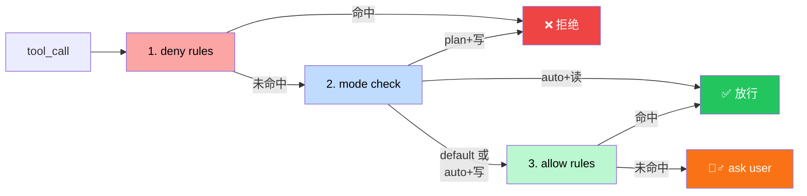

</div>

---
layout: default
---

# s07: 核心代码

<div class="grid grid-cols-[1.3fr_1fr] gap-4">
<div>

## agent_loop 变更

```python {1,15-32}
perms = PermissionManager(mode)

def agent_loop(messages: list, perms: PermissionManager):
    while True:
        response = client.messages.create(...)
        messages.append({"role": "assistant", "content": response.content})
        if response.stop_reason != "tool_use":
            return

        results = []
        for block in response.content:
            if block.type != "tool_use":
                continue

            # s07 新增：权限管道
            decision = perms.check(block.name, block.input or {})

            if decision["behavior"] == "deny": # 拒绝执行
                output = f"Permission denied: {decision['reason']}"
                print(f"  [DENIED] {block.name}: {decision['reason']}")
            elif decision["behavior"] == "ask": # 询问用户
                if perms.ask_user(block.name, block.input or {}):
                    handler = TOOL_HANDLERS.get(block.name)
                    output = handler(**(block.input or {})) if handler else f"Unknown: {block.name}"
                    print(f"> {block.name}: {str(output)[:200]}")
                else:
                    output = f"Permission denied by user for {block.name}"
                    print(f"  [USER DENIED] {block.name}")
            else:  # 允许执行
                handler = TOOL_HANDLERS.get(block.name)
                output = handler(**(block.input or {})) if handler else f"Unknown: {block.name}"
                print(f"> {block.name}: {str(output)[:200]}")

            results.append({...})

        messages.append({"role": "user", "content": results})
```

</div>
<div>

## PermissionManager

```python
# plan：最严格，所有写操作直接禁止，只允许读
# default：最保守，没有命中规则的操作，一律问用户
# auto：半自动，读文件、搜索这类安全操作自动过，写文件、执行命令要走规则或问用户
MODES = ("default", "plan", "auto")

class PermissionManager:
    def __init__(self, mode="default", rules=None):
        self.mode = mode
        self.rules = rules or DEFAULT_RULES

    def check(self, tool_name, tool_input) -> dict:
        # 1. deny rules
        # 2. mode check (plan/auto)
        # 3. allow rules
        # 4. ask user
        return {"behavior": "allow|deny|ask", "reason": "..."}
```

## BashSecurityValidator（Step 0）

bash 命令是自由文本，四级管道之前先过一遍正则检查

```python
class BashSecurityValidator:
    VALIDATORS = [
        ("shell_metachar", r"[;&|`$]"),
        ("sudo", r"\bsudo\b"),
        ("rm_rf", r"\brm\s+(-[a-zA-Z]*)?r"),
        ("cmd_substitution", r"\$\("),
    ]
    def validate(self, command) -> list: ...
    def is_safe(self, command) -> bool: ...
```

</div>
</div>

---

# s08: Hook 系统 (Hooks)

> Hook 让系统围绕主循环生长，而不是不断重写主循环本身

<div v-click>

**问题**：安全审计、自动 lint、操作日志，每加一个横切需求都要改主循环，越改越重，小改动就可能影响全局

</div>


<div v-click>

**方案**：主循环在关键节点暴露生命周期事件，附加行为写成独立的 hook 脚本，通过配置文件注册，在事件触发时执行

</div>


<div class="grid grid-cols-3 gap-4 mt-8 mb-16">
<div v-click="4" class="p-2 bg-blue-50 dark:bg-blue-900/20 rounded text-center">

**3 个生命周期事件**

SessionStart · PreToolUse · PostToolUse

</div>
<div v-click="5" class="p-2 bg-amber-50 dark:bg-amber-900/20 rounded text-center">

**统一退出码协议**

`0` 继续 · `1` 阻止 · `2` 追加信息

</div>
<div v-click="6" class="p-2 bg-green-50 dark:bg-green-900/20 rounded text-center">

**核心原则**

hook 不替代主循环，只在固定时机做旁路扩展

</div>
</div>

<div v-click="3">

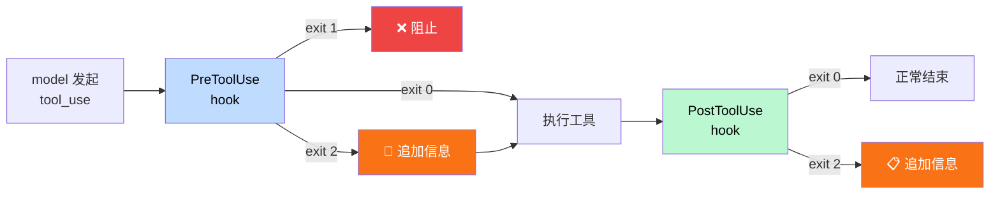

</div>


---
layout: default
---

# s08: 核心代码

<div class="grid grid-cols-[1.3fr_1fr] gap-4">
<div>

## agent_loop 变更

```python {4-7|9-20|25-27|29-31}
    while True:
        response = client.messages.create(...)
        ...
        for block in response.content:
            ...
            # s08 新增：执行 PreToolUse hooks
            pre_result = hooks.run_hooks("PreToolUse", ctx)

            # s08 新增：注入 hook 的信息
            for msg in pre_result.get("messages", []):
                results.append({
                    "type": "tool_result", "tool_use_id": block.id,
                    "content": f"[Hook message]: {msg}",
                })

            if pre_result.get("blocked"):
                reason = pre_result.get("block_reason", "Blocked by hook")
                output = f"Tool blocked by PreToolUse hook: {reason}"
                results.append(...)
                continue

            # 正常执行工具
            ...

            # s08 新增：执行 PostToolUse hooks
            ctx["tool_output"] = output
            post_result = hooks.run_hooks("PostToolUse", ctx)

            # s08 新增：注入 hook 的信息
            for msg in post_result.get("messages", []):
                output += f"\n[Hook note]: {msg}"

            results.append(...)

        messages.append({"role": "user", "content": results})
```

</div>
<div>

## 新增常量

```python
HOOK_EVENTS = ("PreToolUse", "PostToolUse", "SessionStart")
```

## HookEvent

```python
event = {
    "name": "PreToolUse",
    "payload": {
        "tool_name": "bash",
        "input": {"command": "pytest"},
    },
}
```

## HookResult

```python
result = {
    "exit_code": 0, # 0 继续 · 1 阻止 · 2 追加信息
    "message": "",
}
```

## 配置文件 `.hooks.json`

```json
{
  "hooks": {
    "PreToolUse": [
      {"matcher": "bash", "command": "audit.sh"}
    ],
    "PostToolUse": [
      {"matcher": "*", "command": "log.sh"}
    ]
  }
}
```

</div>
</div>

---

# s09: 记忆系统 (Memory)

> 只有跨会话、无法从当前工作重新推导的知识，才值得进入 memory

<div class="grid grid-cols-[1fr_500px] gap-8">
<div>

<div v-click>

**问题**：每次开新会话从零开始，用户偏好、纠正过的错误、项目约定全部丢失

</div>

<div v-click>

**方案**：持久化记忆文件到磁盘，每轮会话开始时自动注入记忆内容到系统提示词

- **user** — 用户偏好（tabs还是space、简洁回答）

- **feedback** — 纠正的错误（"不要改 snapshots"）

- **project** — 非显然约定（合规要求、不能动的旧模块）

- **reference** — 外部参考（项目文档、设计规范等）

</div>

<div v-click="4" class="mt-8 text-orange-500 text-lg">

只有跨会话仍有价值，且不能轻易直接推出来的信息，才适合进入记忆

</div>

</div>

<div v-click="3" style="width: 300px; margin: auto;">

<div class="text-xs space-y-2 mt-2">

<div class="grid grid-cols-2 gap-4">

<div class="space-y-2">
<div class="text-gray-400 text-center mb-1 font-bold">写入流程</div>
<div class="px-3 py-2 rounded-lg bg-gray-500/15 border border-gray-400/50 text-gray-300 text-center">用户提到长期信息</div>
<div class="text-center text-gray-500">↓</div>
<div class="px-3 py-2 rounded-lg bg-orange-500/20 border border-orange-400 text-orange-300 text-center font-bold">模型调用 save_memory</div>
<div class="text-center text-gray-500">↓</div>
<div class="px-3 py-2 rounded-lg bg-gray-500/15 border border-gray-400/50 text-gray-300 text-center">写入 .memory/{name}.md</div>
<div class="text-center text-gray-500">↓</div>
<div class="px-3 py-2 rounded-lg bg-gray-500/15 border border-gray-400/50 text-gray-300 text-center">重建 MEMORY.md 索引</div>
</div>

<div class="space-y-2">
<div class="text-gray-400 text-center mb-1 font-bold">读取流程（每轮会话）</div>
<div class="px-3 py-2 rounded-lg bg-gray-500/15 border border-gray-400/50 text-gray-300 text-center">build_system_prompt()</div>
<div class="text-center text-gray-500">↓</div>
<div class="px-3 py-2 rounded-lg bg-green-500/15 border border-green-400 text-green-300 text-center font-bold">load_memory_prompt()</div>
<div class="text-center text-gray-500">↓</div>
<div class="px-3 py-2 rounded-lg bg-gray-500/15 border border-gray-400/50 text-gray-300 text-center">按 type 分组拼接</div>
<div class="text-center text-gray-500">↓</div>
<div class="px-3 py-2 rounded-lg bg-blue-500/15 border border-blue-400 text-blue-300 text-center font-bold">注入 system prompt</div>
</div>

</div>

<div class="text-center text-gray-500 mt-2">↓</div>
<div class="px-3 py-2 rounded-lg bg-purple-500/15 border border-purple-400 text-purple-300 text-center font-bold">
.memory/ 磁盘（写入 ← → 读取）
</div>

</div>

</div>
</div>

---
layout: default
---

# s09: 核心代码

<div class="grid grid-cols-[1.3fr_1fr] gap-4">
<div>

## agent_loop 变更

```python {1-4}
def agent_loop(messages: list):
    while True:
      # s09 变更：每轮重建 system prompt，含最新记忆
      system = build_system_prompt()
      response = client.messages.create(...)
      messages.append({"role": "assistant", "content": response.content})

      ... # 核心循环保持不变

      messages.append({"role": "user", "content": results})
```

## build_system_prompt

组装系统提示词，其中包含记忆内容，和指导模型 何时保存记忆 和 何时不保存记忆

```python
# s09 新增：注入记忆内容
def build_system_prompt() -> str:
    parts = [f"You are a coding agent at {WORKDIR}."]
    memory_section = memory_mgr.load_memory_prompt()
    if memory_section:
        parts.append(memory_section)
    parts.append(MEMORY_GUIDANCE)   # 指导模型何时存/不存
    return "\n\n".join(parts)
```

## 注册新工具

```python
TOOL_HANDLERS = {
    ...,
    # s09 新增工具 save_memory
    "save_memory": lambda **kw: memory_mgr.save_memory(...),
}
```

</div>
<div>

## 新增数据结构

```python
MEMORY_TYPES = ("user", "feedback", "project", "reference")
```

## MemoryManager

```python
class MemoryManager:
    # 1、 启动时加载 .memory/*.md
    def load_all(self): ...
   
    # 2、按 type 分组，拼成 memory section 注入 system prompt
    def load_memory_prompt(self) -> str:
   
    # 3、保存记忆，写入 .memory/{name}.md 文件，重建 MEMORY.md
    def save_memory(self, name, desc, mem_type, content) -> str:
```

## 记忆文件存储结构

```text
.memory/
  MEMORY.md          ← 索引（≤200行）
  prefer_tabs.md     ← 单条记忆
  review_style.md
```

## 单条记忆文件格式

```md
---
name: prefer_tabs
description: User prefers tabs for indentation
type: user
---
The user explicitly prefers tabs over spaces.
```

</div>
</div>

---

# s10: 系统提示词 (System Prompt)

> 模型看到的不是一坨固定 prompt，而是一条按阶段拼装的输入流水线

<div class="grid grid-cols-[1fr_500px] gap-8">
<div>

<div v-click>

**问题**：系统提示词是一整块硬编码的字符串，来源越来越多，无法分段维护和缓存

</div>

<div v-click>

**方案**：把系统提示词拆成静态段和动态段，按来源分段组装，静态前缀可缓存复用

- 启发：JSON序列化的结果要按照 key 进行排序，否则没法命中缓存

</div>


</div>

<div v-click="3" style="width: 300px; margin: auto;">

<div class="text-sm space-y-2 mt-2">

<div class="rounded-xl border-2 border-blue-400/50 p-3">
<div class="text-blue-400 text-center mb-2 font-bold text-xs">静态段（可缓存复用）</div>
<div class="space-y-2">
<div class="px-3 py-1.5 rounded-lg bg-blue-500/10 border border-blue-400/30 text-blue-300 text-xs">1. core — 身份 + 规则</div>
<div class="px-3 py-1.5 rounded-lg bg-blue-500/10 border border-blue-400/30 text-blue-300 text-xs">2. tools — 工具列表</div>
<div class="px-3 py-1.5 rounded-lg bg-blue-500/10 border border-blue-400/30 text-blue-300 text-xs">3. skills — 技能列表</div>
<div class="px-3 py-1.5 rounded-lg bg-blue-500/10 border border-blue-400/30 text-blue-300 text-xs">4. memory — 记忆内容</div>
<div class="px-3 py-1.5 rounded-lg bg-blue-500/10 border border-blue-400/30 text-blue-300 text-xs">5. CLAUDE.md — 规则文件</div>
</div>
</div>

<div class="text-center text-gray-500">↓</div>

<div class="px-3 py-2 rounded-lg bg-orange-500/20 border-2 border-orange-400 text-orange-300 text-center font-bold text-xs">DYNAMIC_BOUNDARY</div>

<div class="text-center text-gray-500">↓</div>

<div class="rounded-xl border-2 border-green-400/50 p-3">
<div class="text-green-400 text-center mb-2 font-bold text-xs">动态段（每轮会话重建）</div>
<div class="space-y-2">
<div class="px-3 py-1.5 rounded-lg bg-green-500/10 border border-green-400/30 text-green-300 text-xs">1. 当前日期</div>
<div class="px-3 py-1.5 rounded-lg bg-green-500/10 border border-green-400/30 text-green-300 text-xs">2. 工作目录</div>
<div class="px-3 py-1.5 rounded-lg bg-green-500/10 border border-green-400/30 text-green-300 text-xs">3. 当前模式</div>
<div class="px-3 py-1.5 rounded-lg bg-green-500/10 border border-green-400/30 text-green-300 text-xs">4. 操作系统</div>
<div class="px-3 py-1.5 rounded-lg bg-green-500/10 border border-green-400/30 text-green-300 text-xs">5. 本轮提醒</div>
</div>
</div>

<div class="text-center text-gray-500">↓</div>

<div class="px-3 py-2 rounded-xl bg-cyan-500/15 border-2 border-cyan-400 text-cyan-300 text-center font-bold text-xs">最终系统提示词</div>

</div>

</div>

</div>

---
layout: default
---

# s10: 核心代码

<div class="grid grid-cols-[1.3fr_1fr] gap-4">
<div>

## agent_loop 变更

```python {3-4}
def agent_loop(messages: list):
    while True:
        # s10 新增：用 builder 组装系统提示词
        system = prompt_builder.build()
        response = client.messages.create(
            model=MODEL, 
            system=system,
            messages=messages, 
            tools=TOOLS, 
            max_tokens=8000,
        )
        ...  # 标准循环
```

## build 方法

```python
def build(self) -> str:
    sections = []
    core = self._build_core()                # 1、core 身份 + 规则
    if core: sections.append(core)
    tools = self._build_tool_listing()       # 2、tools 工具列表
    if tools: sections.append(tools)
    skills = self._build_skill_listing()     # 3、skills 技能列表
    if skills: sections.append(skills)
    memory = self._build_memory_section()    # 4、memory 记忆内容
    if memory: sections.append(memory)
    claude_md = self._build_claude_md()      # 5、CLAUDE.md 规则文件
    if claude_md: sections.append(claude_md)
    sections.append(DYNAMIC_BOUNDARY)        # 6、分隔线
    dynamic = self._build_dynamic_context()  # 7、动态内容 日期/目录
    if dynamic: sections.append(dynamic)
    return "\n\n".join(sections)
```

</div>
<div>

## _build_claude_md

规则文件，三级查找叠加

```python
def _build_claude_md(self) -> str:
    sources = []
    # 1. 用户全局级
    user_claude = Path.home() / ".claude" / "CLAUDE.md"
    if user_claude.exists():
        sources.append(("user global", user_claude.read_text()))
    # 2. 项目根目录级
    project_claude = self.workdir / "CLAUDE.md"
    if project_claude.exists():
        sources.append(("project root", project_claude.read_text()))
    # 3. 当前子目录级
    if cwd != self.workdir:
        subdir_claude = cwd / "CLAUDE.md"
        if subdir_claude.exists():
            sources.append(("subdir", subdir_claude.read_text()))
    ...  # 全部拼接，不覆盖
```

## _build_dynamic_context

动态内容，每轮会话重建

```python
def _build_dynamic_context(self) -> str:
    lines = [
        f"Current date: {datetime.date.today().isoformat()}",
        f"Working directory: {self.workdir}",
        f"Model: {MODEL}",
        f"Platform: {os.uname().sysname}",
    ]
    return "# Dynamic context\n" + "\n".join(lines)
```

</div>
</div>

---

# s11: 错误恢复 (Error Recovery)

> 系统必须清楚自己此刻是在继续、重试，还是处于恢复流程

<div v-click>

**问题**：输出截断、上下文爆了、API 超时，遇到错误主循环直接停住，用户不敢再用

</div>

<div v-click>

**方案**：先对错误分类，再选恢复路径，每条路径有独立重试预算，全部耗尽才真正失败

</div>


<div class="grid grid-cols-3 gap-4 mt-8">

<div v-click class="p-3 rounded-lg border border-blue-300 dark:border-blue-700">

<div class="text-center mb-2 text-sm text-gray-500">错误问题 1</div>

**输出被截断**：模型还没说完，但 `max_tokens` 用完了

<div class="mt-4 p-2 bg-blue-50 dark:bg-blue-900/20 rounded text-center">

**续写恢复**

注入续写消息："不要重来，直接从中断点接着写"

最多重试 **3 次**

</div>
</div>

<div v-click class="p-3 rounded-lg border border-green-300 dark:border-green-700">

<div class="text-center mb-2 text-sm text-gray-500">错误问题 2</div>

**上下文爆了**：对话历史太长，`prompt_too_long` 请求直接失败

<div class="mt-4 p-2 bg-green-50 dark:bg-green-900/20 rounded text-center">

**压缩恢复**

`auto_compact()` 把旧对话总结为摘要，缩短后重试

最多重试 **3 次**

</div>
</div>

<div v-click class="p-3 rounded-lg border border-amber-300 dark:border-amber-700">

<div class="text-center mb-2 text-sm text-gray-500">错误问题 3</div>

**网络抖动**：网络超时 (timeout)、限流 (rate limit)、服务抖动

<div class="mt-4 p-2 bg-amber-50 dark:bg-amber-900/20 rounded text-center">

**退避重试**

`backoff_delay()` 指数等待 + 随机 jitter，不要立刻连续重试

最多重试 **3 次**

</div>
</div>

</div>

<div v-click class="mt-8 p-2 bg-red-50 dark:bg-red-900/20 rounded text-sm text-center">

**全部耗尽才是真正失败**

每条路径都有独立的重试预算（默认 3 次），三条路径互不干扰

</div>


---
layout: default
---

# s11: 核心代码

<div class="grid grid-cols-[1.3fr_1fr] gap-4">
<div>

## agent_loop 变更

```python {4-10|11-14|16-19|21-27}
def agent_loop(messages: list):
    max_output_recovery_count = 0
    while True:
        # s11 新增：API 调用 + 重试包装
        response = None
        for attempt in range(MAX_RECOVERY_ATTEMPTS + 1):
            try:
                response = client.messages.create(...)
                break
            except APIError as e:
                # 恢复路径 2: prompt_too_long → 压缩重试
                if "prompt" in str(e) and "long" in str(e):
                    messages[:] = auto_compact(messages)
                    continue
                
                # 恢复路径 3: 请求失败 → 退避重试
                delay = backoff_delay(attempt)
                time.sleep(delay)
                continue
        ...
        # 恢复路径 1: max_tokens → 注入续写提示消息
        if response.stop_reason == "max_tokens":
            max_output_recovery_count += 1
            if max_output_recovery_count <= MAX_RECOVERY_ATTEMPTS:
                messages.append({"role": "user", "content": CONTINUATION_MESSAGE})
                continue
        max_output_recovery_count = 0
        ...  
        # 正常执行循环
```

</div>
<div>

## 恢复常量

```python
MAX_RECOVERY_ATTEMPTS = 3
BACKOFF_BASE_DELAY = 1.0   # seconds
BACKOFF_MAX_DELAY = 30.0   # seconds

CONTINUATION_MESSAGE = (
    "Output limit hit. Continue directly from where you stopped. "
    "Do not restart or repeat."
)
```

## 退避函数

```python
def backoff_delay(attempt: int) -> float:
    delay = min(BACKOFF_BASE_DELAY * (2 ** attempt),
                BACKOFF_MAX_DELAY)
    jitter = random.uniform(0, 1)
    return delay + jitter
```

## 自动压缩

```python
def auto_compact(messages: list) -> list:
    summary = client.messages.create(
        model=MODEL,
        messages=[{"role": "user",
                   "content": "Summarize this conversation for continuity..."}],
    ).content[0].text
    return [{"role": "user", "content": summary}]
```

</div>
</div>

---
layout: section
---

# 阶段 3：任务管理

## s12 — s14

<div class="text-gray-500 mt-4">
把"聊天中的清单"升级成"磁盘上的任务图"
</div>

---
layout: default
---

# s12: 任务系统 (Task System)

> Todo 适合会话内规划，持久任务图才负责跨步骤、跨阶段协调工作

<div class="grid grid-cols-[1fr_600px] gap-8">
<div>

<div v-click>

**问题**：s03 的 Todo 是会话内临时清单，压缩一次就丢，任务之间也没有依赖关系

</div>

<div v-click>

**方案**：持久化任务图，写入磁盘文件，支持双向依赖关系，完成一个任务自动解锁下游任务

- 每个 task 有 `blockedBy` / `blocks` 依赖关系
- `is_ready(task)` = pending + 没有前置阻塞
- 完成一个 task → 自动从下游的 `blockedBy` 移除
- 每个任务的状态持久化到 `.tasks/task_N.json`
- 核心循环不变，新增工具：`task_create` / `task_update` / `task_list` / `task_get`

</div>

<div v-click="4" class="mt-8 text-orange-500 text-lg">

todo 更像本轮任务计划，task 更像长期工作面板

</div>

</div>

<div v-click="3">

<div v-click class="embed-viz">
<iframe src="https://build-your-own-agent.vercel.app/en/embed/s07/" />
</div>

</div>
</div>

---
layout: default
---

# s12: 核心代码

<div class="grid grid-cols-[1.3fr_1fr] gap-4">
<div>

## 新增工具

```python
TOOL_HANDLERS = {
    "bash":        ...,
    "read_file":   ...,
    "write_file":  ...,
    "edit_file":   ...,
    # s12 新增工具
    "task_create": lambda **kw: TASKS.create(kw["subject"], ...),
    "task_update": lambda **kw: TASKS.update(kw["task_id"], ...),
    "task_list":   lambda **kw: TASKS.list_all(),
    "task_get":    lambda **kw: TASKS.get(kw["task_id"]),
}
```

## 任务存储结构

```text
.tasks/
  task_1.json  {"id":1, "status":"completed", ...}
  task_2.json  {"id":2, "blockedBy":[1], ...}
```

## TaskRecord

```python
task = {
    "id": 1,
    "subject": "Write parser",
    "description": "",
    "status": "pending",    # pending | in_progress | completed
    "blockedBy": [],        # 它还在等谁完成
    "blocks": [],           # 它完成后解锁谁
    "owner": "",
}
```

</div>
<div>

## TaskManager

```python
class TaskManager:
    def __init__(self, tasks_dir: Path):
        self.dir = tasks_dir
    def create(self, subject, desc) -> str: ...
    def get(self, task_id) -> str: ...
    def update(self, task_id, status=None, ...) -> str:
        ...
        if status == "completed":
            self._clear_dependency(task_id)
    def list_all(self) -> str: 
        ...
```

## 自动解锁

```python
def _clear_dependency(self, completed_id: int):
    for f in self.dir.glob("task_*.json"):
        task = json.loads(f.read_text())
        if completed_id in task.get("blockedBy", []):
            task["blockedBy"].remove(completed_id)
            self._save(task)
```

</div>
</div>

---

# s13: 后台任务 (Background Tasks)

> 持久任务描述要完成什么，运行槽位描述谁在跑、跑到哪里；两者相关但不是一回事

<div class="grid grid-cols-[1fr_600px] gap-8">
<div>

<div v-click>

**问题** build 要跑 10 分钟，同步执行会卡住主循环，模型和用户都在空等

</div>

<div v-click>

**方案**：慢命令放到后台线程执行，主循环立即拿到 task_id 继续干别的事

- 后台任务启动 daemon 线程，立即返回 task_id
- 完整输出写入磁盘，通知只带 preview 摘要
- 主循环仍然只有一条，并行的是执行与等待
- 新增工具：`background_run` / `check_background`

</div>

<div v-click="4" class="mt-8 text-orange-500 text-lg">

调度器做的是"记住未来"，触发后仍然回到同一条主循环

</div>

</div>

<div v-click="3">

<div v-click class="embed-viz">
<iframe src="https://build-your-own-agent.vercel.app/en/embed/s08/" />
</div>

</div>
</div>

---
layout: default
---

# s13: 核心代码

<div class="grid grid-cols-[1.3fr_1fr] gap-4">
<div>

## agent_loop 变更

```python {3-14}
BG = BackgroundManager()

def agent_loop(messages: list):
    while True:
        # s13 新增：每轮开始前，检查后台通知，如果有通知，就注入到上下文
        # 教程为了简单，没有做 user 和 assistant 消息配对，可能有问题
        notifs = BG.drain_notifications()
        if notifs and messages:
            notif_text = "\n".join(
                f"[bg:{n['task_id']}] {n['status']}: {n['preview']}"
                for n in notifs
            )
            messages.append({"role": "user",
                "content": f"<background-results>\n{notif_text}\n</background-results>"})

        response = client.messages.create(...)
        # 正常执行循环
        ...  
```

## 注册新工具

```python
TOOL_HANDLERS = {
    ...,
    # s13 新增工具：启动后台任务
    "background_run":   lambda **kw: BG.run(kw["command"]),
    # s13 新增工具：检测后台任务状态
    "check_background": lambda **kw: BG.check(kw.get("task_id")),
}
```

</div>
<div>

## BackgroundManager

```python
class BackgroundManager:
    def run(self, command) -> str:
        # 启动 daemon 线程，立即返回 task_id
        task_id = str(uuid.uuid4())[:8]
        thread = threading.Thread(
            target=self._execute,
            args=(task_id, command), daemon=True)
        thread.start()
        return f"Background task {task_id} started"

    def _execute(self, task_id, command):
        # daemon 线程：执行命令，写输出，推通知
        r = subprocess.run(command, shell=True, ...)
        with self._lock:
            self._notification_queue.append({
                "task_id": task_id, "status": status,
                "preview": preview, "output_file": ...})

    def drain_notifications(self) -> list:
        # 返回通知队列，并清空队列
        with self._lock:
            notifs = list(self._notification_queue)
            self._notification_queue.clear()
        return notifs
```

## RuntimeTaskRecord

```python
task = {
    "id": "a1b2c3d4",
    "command": "pytest",
    "status": "running",      # running | completed | error
    "result_preview": "",
    "output_file": ".runtime-tasks/a1b2c3d4.log",
}
```

</div>
</div>

---

# s14: 定时调度 (Cron Scheduler)

> 当任务能后台运行以后，时间本身也会变成另一种启动入口

<div class="grid grid-cols-[1fr_600px] gap-8">
<div>

<div v-click>

**问题**：后台任务解决了"现在启动的慢命令"，但"每周一 9 点跑报告"怎么办？

</div>

<div v-click>

**方案**：cron 表达式 + 后台检查线程 + 通知注入，时间到了自动触发回到主循环

- `cron_create("0 9 * * 1", "Run report")` 注册调度记录
- 后台线程每分钟检查一次是否匹配当前时间
- 到期 → 推入通知队列 → 主循环注入为 user message
- 支持 recurring（反复触发）/ one-shot（触发一次自动删除）
- 支持 durable（落盘持久化，重启后仍在）
- 新增工具：`cron_create` / `cron_delete` / `cron_list`

</div>

<div v-click="4" class="mt-8 text-orange-500 text-lg">

后台任务是在"等结果"，定时调度是在"等开始"

</div>

</div>

<div v-click="3">

<div class="flex flex-col items-center gap-0 mt-2">

  <div class="px-4 py-2 rounded-lg bg-orange-500/20 border border-orange-400 text-orange-300 font-bold text-sm text-center w-56">
    cron_create()<br/><span class="font-normal text-xs opacity-70">"0 9 * * 1", "Run report"</span>
  </div>
  <div class="text-gray-500 text-lg">↓</div>

  <div class="px-4 py-2 rounded-lg bg-purple-500/15 border border-purple-400 text-purple-300 font-bold text-sm text-center w-56">
    ScheduleRecord<br/><span class="font-normal text-xs opacity-70">cron + prompt + recurring + durable</span>
  </div>
  <div class="text-gray-500 text-lg">↓</div>

  <div class="px-4 py-2 rounded-lg bg-green-500/15 border border-green-400 text-green-300 font-bold text-sm text-center w-56 relative">
    后台检查线程<br/><span class="font-normal text-xs opacity-70">每分钟检查 cron_matches</span>
    <div class="absolute -right-20 top-1/2 -translate-y-1/2 text-gray-600 text-xs">↻ 不匹配<br/>继续等</div>
  </div>
  <div class="text-gray-500 text-lg">↓ <span class="text-xs text-green-400">时间匹配</span></div>

  <div class="px-4 py-2 rounded-lg bg-blue-500/15 border border-blue-400 text-blue-300 font-bold text-sm text-center w-56">
    通知队列<br/><span class="font-normal text-xs opacity-70">queue.put(notification)</span>
  </div>
  <div class="text-gray-500 text-lg">↓ <span class="text-xs text-blue-400">drain()</span></div>

  <div class="px-4 py-2 rounded-lg bg-cyan-500/15 border border-cyan-400 text-cyan-300 font-bold text-sm text-center w-56">
    主循环注入<br/><span class="font-normal text-xs opacity-70">append as user message</span>
  </div>
  <div class="text-gray-500 text-lg">↓</div>

  <div class="px-4 py-2 rounded-lg bg-amber-500/15 border border-amber-400 text-amber-300 font-bold text-sm text-center w-56">
    模型处理<br/><span class="font-normal text-xs opacity-70">LLM 接手执行任务</span>
  </div>

</div>

</div>
</div>

---
layout: default
---

# s14: 核心代码

<div class="grid grid-cols-[1.3fr_1fr] gap-4">
<div>

## agent_loop 变更

```python {3-6}
def agent_loop(messages: list):
    while True:
        # s14 新增：drain 定时任务通知
        notifications = scheduler.drain_notifications()
        for note in notifications:
            messages.append({"role": "user", "content": note})

        response = client.messages.create(...)
        # 正常执行循环
        ...
```

## 注册新工具

```python
TOOL_HANDLERS = {
    ...,
    # s14 新增工具
    "cron_create": lambda **kw: scheduler.create(
        kw["cron"], kw["prompt"],
        kw.get("recurring", True), kw.get("durable", False)),
    "cron_delete": lambda **kw: scheduler.delete(kw["id"]),
    "cron_list":   lambda **kw: scheduler.list_tasks(),
}
```

## 调度存储结构

```text
.claude/
  scheduled_tasks.json   # durable 任务持久化
  cron.lock              # PID 锁，防多进程重复触发
```

</div>
<div>

## CronScheduler

```python
class CronScheduler:
    def start(self):
        self._load_durable()          # 加载持久化记录
        Thread(target=self._check_loop, daemon=True).start()

    def _check_loop(self):
        while not self._stop_event.is_set():
            now = datetime.now()
            if current_minute != self._last_check_minute:
                self._check_tasks(now)  # 每分钟检查一次
            self._stop_event.wait(timeout=1)

    def _check_tasks(self, now):
        for task in self.tasks:
            if cron_matches(task["cron"], now):
                self.queue.put(f"[Scheduled:{task['id']}] {task['prompt']}")
                if not task["recurring"]:
                    fired_oneshots.append(task["id"])  # 一次性任务触发后删除
```

## ScheduleRecord

```python
schedule = {
    "id": "job_001",
    "cron": "0 9 * * 1",       # 每周一 9 点
    "prompt": "Run weekly status report.",
    "recurring": True,          # recurring / one-shot
    "durable": True,            # 是否落盘持久化
    "last_fired": None,
}
```

</div>
</div>

---
layout: section
---

# 阶段 4：多 Agent 与外部系统

## s15 — s19

<div class="text-gray-500 mt-4">
从单 agent 升级成真正的平台
</div>

---
layout: default
---

# s15: 智能体团队 (Agent Teams)

> 系统一旦长期运行，就需要有名字、有身份、可持续存在的队友，而不只是一次性子任务

<div class="grid grid-cols-[1fr_600px] gap-8">
<div>

<div v-click>

**问题**：s04 的 Subagent 用完就消失，无法长期分工协作，复杂项目需要持久团队

</div>

<div v-click>

**方案**：持久化名册 + JSONL 邮箱 + 每个队友独立线程运行自己的 agent loop

- **名册** `.team/config.json`：成员列表、角色、状态
- **邮箱** `.team/inbox/alice.jsonl`：append-only 收件箱
- 每个队友有自己的 `messages[]` 和 agent loop
- 每轮先 drain inbox，再继续工作
- 新增工具：`spawn_teammate` / `send_message` / `read_inbox` / `broadcast`

</div>

<div v-click="4" class="mt-8 text-orange-500 text-lg">

subagent 是一次性外包，teammate 是长期在线队友

</div>

</div>

<div v-click="3">

<div class="flex flex-col items-center gap-1 mt-4">
  <div class="px-5 py-3 rounded-xl bg-orange-500/20 border-2 border-orange-400 text-orange-300 font-bold text-sm text-center w-44">Lead</div>
  <div class="flex items-center gap-12 mt-1">
    <div class="text-gray-500 text-sm">↙ spawn</div>
    <div class="text-gray-500 text-sm">↘ spawn</div>
  </div>
  <div class="flex items-start gap-8">
    <div class="flex flex-col items-center gap-1">
      <div class="px-4 py-2 rounded-xl bg-blue-500/15 border-2 border-blue-400 text-blue-300 font-bold text-xs text-center">Alice (coder)<br/><span class="font-normal opacity-70">独立 loop</span></div>
      <div class="text-xs text-gray-500">↕ inbox</div>
      <div class="px-3 py-1 rounded bg-blue-500/10 border border-blue-400/50 text-blue-400 text-xs">alice.jsonl</div>
    </div>
    <div class="flex flex-col items-center gap-1">
      <div class="px-4 py-2 rounded-xl bg-green-500/15 border-2 border-green-400 text-green-300 font-bold text-xs text-center">Bob (tester)<br/><span class="font-normal opacity-70">独立 loop</span></div>
      <div class="text-xs text-gray-500">↕ inbox</div>
      <div class="px-3 py-1 rounded bg-green-500/10 border border-green-400/50 text-green-400 text-xs">bob.jsonl</div>
    </div>
  </div>
  <div class="flex items-center gap-6 mt-2">
    <div class="text-gray-500 text-xs">↘ send_message</div>
    <div class="text-gray-500 text-xs">↙ send_message</div>
  </div>
  <div class="px-3 py-1 rounded bg-orange-500/10 border border-orange-400/50 text-orange-400 text-xs">lead.jsonl</div>
</div>

</div>
</div>

---
layout: default
---

# s15: 核心代码

<div class="grid grid-cols-[1.3fr_1fr] gap-4">
<div>

## agent_loop 变更（Lead 循环）

```python {3-7}
def agent_loop(messages: list):
    while True:
        # s15 新增：每轮 drain lead 的邮箱
        inbox = BUS.read_inbox("lead")
        if inbox:
            messages.append({"role": "user",
                "content": f"<inbox>{json.dumps(inbox)}</inbox>"})

        response = client.messages.create(...)
        ...  # 标准循环
```

## Lead 工具（9 个）

```python
TOOL_HANDLERS = {
    "bash": ..., "read_file": ..., "write_file": ..., "edit_file": ...,
    # s15 新增
    "spawn_teammate":  lambda **kw: TEAM.spawn(kw["name"], kw["role"], kw["prompt"]),
    "list_teammates":  lambda **kw: TEAM.list_all(),
    "send_message":    lambda **kw: BUS.send("lead", kw["to"], kw["content"]),
    "read_inbox":      lambda **kw: json.dumps(BUS.read_inbox("lead")),
    "broadcast":       lambda **kw: BUS.broadcast("lead", kw["content"], ...),
}
```

</div>
<div>

## MessageBus（JSONL 邮箱）

```python
class MessageBus:
    def send(self, sender, to, content, msg_type="message"):
        msg = {"type": msg_type, "from": sender,
               "content": content, "timestamp": time.time()}
        # append 到 .team/inbox/{to}.jsonl

    def read_inbox(self, name) -> list:
        # 读取并清空 .team/inbox/{name}.jsonl
```

## TeammateManager

```python
class TeammateManager:
    def spawn(self, name, role, prompt) -> str:
        # 写入 config.json
        # 启动独立线程 → _teammate_loop
        ...

    def _teammate_loop(self, name, role, prompt):
        messages = [{"role": "user", "content": prompt}]
        for _ in range(50):
            inbox = BUS.read_inbox(name)
            ...  # 标准 agent loop
```

</div>
</div>

---

# s16: 团队协议 (Team Protocols)

> 团队只有在协作遵守共同消息模式时，才会变得可理解、可调试、可扩展

<div class="grid grid-cols-[1fr_600px] gap-8">
<div>

<div v-click>

**问题**：队友之间自由发消息，但"请停下"可以被无视，多个请求并存时无法对号

</div>

<div v-click>

**方案**：结构化协议，每个请求带 request_id，响应必须关联同一个 id

- **shutdown 协议**：Lead 发请求 → 队友 approve/reject
- **plan_approval 协议**：队友提交计划 → Lead 审批
- 统一模板：request_id + 状态机 = 可复用的协议模式
- 新增工具：`shutdown_request` / `shutdown_response` / `plan_approval`

</div>

<div v-click="4" class="mt-8 text-orange-500 text-lg">

自由聊天靠默契，结构化协议靠协定

</div>

</div>

<div v-click="3">

<div class="flex flex-col items-center gap-1 mt-6">
  <div class="text-gray-400 text-xs mb-1">shutdown 协议流程</div>
  <div class="flex items-center gap-3">
    <div class="px-4 py-2 rounded-xl bg-orange-500/20 border-2 border-orange-400 text-orange-300 font-bold text-sm text-center">Lead</div>
    <div class="text-gray-500 text-sm">→ <span class="text-xs text-orange-400">shutdown_request</span> →</div>
    <div class="px-4 py-2 rounded-xl bg-blue-500/15 border-2 border-blue-400 text-blue-300 font-bold text-sm text-center">Alice inbox</div>
  </div>
  <div class="text-gray-500 text-sm ml-32">↓ drain</div>
  <div class="flex items-center gap-3">
    <div class="px-4 py-2 rounded-xl bg-green-500/15 border-2 border-green-400 text-green-300 font-bold text-sm text-center">Lead 确认关闭</div>
    <div class="text-gray-500 text-sm">← <span class="text-xs text-green-400">approve req_001</span> ←</div>
    <div class="px-4 py-2 rounded-xl bg-blue-500/15 border-2 border-blue-400 text-blue-300 font-bold text-sm text-center">Alice 处理</div>
  </div>

  <div class="text-gray-400 text-xs mt-6 mb-1">plan_approval 协议流程</div>
  <div class="flex items-center gap-3">
    <div class="px-4 py-2 rounded-xl bg-blue-500/15 border-2 border-blue-400 text-blue-300 font-bold text-sm text-center">Bob</div>
    <div class="text-gray-500 text-sm">→ <span class="text-xs text-blue-400">submit plan</span> →</div>
    <div class="px-4 py-2 rounded-xl bg-orange-500/20 border-2 border-orange-400 text-orange-300 font-bold text-sm text-center">Lead inbox</div>
  </div>
  <div class="text-gray-500 text-sm ml-32">↓ review</div>
  <div class="flex items-center gap-3">
    <div class="px-4 py-2 rounded-xl bg-green-500/15 border-2 border-green-400 text-green-300 font-bold text-sm text-center">Bob 执行</div>
    <div class="text-gray-500 text-sm">← <span class="text-xs text-green-400">approved</span> ←</div>
    <div class="px-4 py-2 rounded-xl bg-orange-500/20 border-2 border-orange-400 text-orange-300 font-bold text-sm text-center">Lead 审批</div>
  </div>
</div>

</div>
</div>

---
layout: default
---

# s16: 核心代码

<div class="grid grid-cols-[1.3fr_1fr] gap-4">
<div>

## Lead 新增工具（+3 个）

```python
TOOL_HANDLERS = {
    ...  # s15 的 9 个
    # s16 新增
    "shutdown_request": lambda **kw:
        handle_shutdown_request(kw["teammate"]),
    "shutdown_response": lambda **kw:
        _check_shutdown_status(kw["request_id"]),
    "plan_approval": lambda **kw:
        handle_plan_review(kw["request_id"],
            kw["approve"], kw.get("feedback", "")),
}
```

## shutdown 流程

```python
def handle_shutdown_request(teammate: str) -> str:
    req_id = str(uuid.uuid4())[:8]
    REQUEST_STORE.create({
        "request_id": req_id, "kind": "shutdown",
        "from": "lead", "to": teammate,
        "status": "pending", ...
    })
    BUS.send("lead", teammate, "Please shut down.",
             "shutdown_request", {"request_id": req_id})
    return f"Shutdown request {req_id} sent"
```

</div>
<div>

## RequestStore

```python
class RequestStore:
    def __init__(self, base_dir: Path):
        self.dir = base_dir   # .team/requests/

    def create(self, record: dict) -> dict:
        # 写 {request_id}.json
    def get(self, request_id) -> dict | None: ...
    def update(self, request_id, **changes): ...
```

## 协议信封

```python
# shutdown_request
message = {
    "type": "shutdown_request",
    "from": "lead", "to": "alice",
    "request_id": "req_001",
    "timestamp": 1710000000.0,
}

# shutdown_response
response = {
    "request_id": "req_001",
    "approve": True,
    "reason": "Work complete",
}
```

## 队友新增工具

```python
# 队友可以：
"shutdown_response"  # 回应关机请求
"plan_approval"      # 提交计划审批
```

</div>
</div>

---

# s17: 自治智能体 (Autonomous Agents)

> 自主性开始于：队友能安全找到可做的事、认领它，并带着正确身份继续执行

<div class="grid grid-cols-[1fr_600px] gap-8">
<div>

<div v-click>

**问题**：任务板上 10 个待办，全靠 Lead 手动分配，Lead 成了瓶颈

</div>

<div v-click>

**方案**：WORK/IDLE 双阶段循环，空闲时自动扫描任务板，按角色认领可做的任务

- **WORK 阶段**：标准 agent loop，执行具体任务
- **IDLE 阶段**：每 5 秒轮询邮箱 + 任务板
- 有消息 → 恢复 WORK；有 unclaimed ready task → 认领 → WORK
- 60 秒无事 → 自动 shutdown
- 认领需原子锁 + 角色匹配
- 压缩后自动重注入 `<identity>` block

</div>

<div v-click="4" class="mt-8 text-orange-500 text-lg">

Lead 负责拆任务，队友负责自己找活干

</div>

</div>

<div v-click="3">

<div class="flex flex-col items-center gap-1 mt-6">

  <div class="px-5 py-3 rounded-xl bg-green-500/15 border-2 border-green-400 text-green-300 font-bold text-sm text-center w-48">WORK 阶段<br/><span class="font-normal text-xs opacity-70">标准 agent loop</span></div>
  <div class="text-gray-500">↓ <span class="text-xs text-gray-400">工作做完</span></div>

  <div class="px-5 py-3 rounded-xl bg-blue-500/15 border-2 border-blue-400 text-blue-300 font-bold text-sm text-center w-48">IDLE 阶段<br/><span class="font-normal text-xs opacity-70">每 5s 轮询</span></div>

  <div class="flex items-start justify-center gap-6 mt-2">
    <div class="flex flex-col items-center">
      <div class="text-gray-500 text-sm">↓</div>
      <div class="px-3 py-2 rounded-lg bg-blue-500/10 border border-blue-400/50 text-blue-400 text-xs text-center">邮箱有消息</div>
      <div class="text-green-400 text-xs mt-1">↑ 恢复 WORK</div>
    </div>
    <div class="flex flex-col items-center">
      <div class="text-gray-500 text-sm">↓</div>
      <div class="px-3 py-2 rounded-lg bg-orange-500/10 border border-orange-400/50 text-orange-400 text-xs text-center">有 ready task</div>
      <div class="text-xs text-gray-500 mt-1">↓ 认领</div>
      <div class="px-3 py-2 rounded-lg bg-orange-500/20 border border-orange-400 text-orange-300 text-xs text-center mt-1">补身份 + 任务提示</div>
      <div class="text-green-400 text-xs mt-1">↑ 恢复 WORK</div>
    </div>
    <div class="flex flex-col items-center">
      <div class="text-gray-500 text-sm">↓</div>
      <div class="px-3 py-2 rounded-lg bg-gray-500/10 border border-gray-400/50 text-gray-400 text-xs text-center">60s 无事</div>
      <div class="text-gray-500 text-xs mt-1">↓</div>
      <div class="px-3 py-2 rounded-lg bg-gray-600/20 border border-gray-500 text-gray-400 text-xs text-center">shutdown</div>
    </div>
  </div>

</div>

</div>
</div>

---
layout: default
---

# s17: 核心代码

<div class="grid grid-cols-[1.3fr_1fr] gap-4">
<div>

## 队友循环变更（WORK → IDLE → WORK）

```python {3-8|10-19}
def _loop(self, name, role, prompt):
    messages = [{"role": "user", "content": prompt}]
    while True:
        # WORK 阶段：标准 agent loop
        for _ in range(50):
            ...  # 正常执行，直到 stop_reason != tool_use
            if idle_requested:
                break

        # IDLE 阶段：轮询
        self._set_status(name, "idle")
        for _ in range(IDLE_TIMEOUT // POLL_INTERVAL):
            time.sleep(POLL_INTERVAL)
            inbox = BUS.read_inbox(name)
            if inbox:
                ensure_identity_context(messages, ...)
                resume = True; break
            unclaimed = scan_unclaimed_tasks(role)
            if unclaimed:
                claim_task(unclaimed[0]["id"], name, ...)
                resume = True; break

        if not resume:
            self._set_status(name, "shutdown"); return
        self._set_status(name, "working")
```

</div>
<div>

## 认领条件

```python
def is_claimable_task(task: dict, role=None) -> bool:
    return (
        task.get("status") == "pending"
        and not task.get("owner")
        and not task.get("blockedBy")
        and _task_allows_role(task, role)
    )
```

## 身份重注入

```python
def ensure_identity_context(messages, name, role, team):
    if "<identity>" in str(messages[0].get("content", "")):
        return  # 已有身份
    messages.insert(0, {
        "role": "user",
        "content": f"<identity>You are '{name}', "
                   f"role: {role}, team: {team}."
                   f"</identity>"
    })
```

## 新增工具

```python
# 队友新增
"idle":       # 信号：进入 IDLE 阶段
"claim_task": # 手动认领任务
```

</div>
</div>

---

# s18: Worktree 任务隔离 (Worktree)

> task 管目标，worktree 管隔离执行车道和收尾状态；两者不能混成一个概念

<div class="grid grid-cols-[1fr_600px] gap-8">
<div>

<div v-click>

**问题**：多个队友在同一目录工作，Alice 改了 config.py，Bob 也在改，文件冲突了

</div>

<div v-click>

**方案**：git worktree 给每个任务一个隔离目录，Task 管"做什么"，Worktree 管"在哪做"

- `worktree_create` → `git worktree add -b wt/{name}`
- `worktree_run` → `subprocess.run(cmd, cwd=wt_path)`
- `worktree_closeout` → keep（保留）或 remove（删除）
- 任务状态和车道状态**分开管理**，通过 `task_id` 关联
- 新增工具：`worktree_create` / `worktree_run` / `worktree_closeout` / `worktree_status`

</div>

<div v-click="4" class="mt-8 text-orange-500 text-lg">

任务 completed 但 worktree kept 是完全合理的（保留给 reviewer 看）

</div>

</div>

<div v-click="3">

<div class="flex flex-col items-center gap-1 mt-4">

  <div class="px-5 py-3 rounded-xl bg-orange-500/20 border-2 border-orange-400 text-orange-300 font-bold text-sm text-center w-52">task_create()<br/><span class="font-normal text-xs opacity-70">"Refactor auth"</span></div>
  <div class="text-gray-500">↓</div>

  <div class="px-5 py-3 rounded-xl bg-purple-500/15 border-2 border-purple-400 text-purple-300 font-bold text-sm text-center w-52">task_bind_worktree()</div>
  <div class="text-gray-500">↓</div>

  <div class="px-5 py-3 rounded-xl bg-blue-500/15 border-2 border-blue-400 text-blue-300 font-bold text-sm text-center w-52">worktree_create()<br/><span class="font-normal text-xs opacity-70">git worktree add</span></div>
  <div class="text-gray-500">↓</div>

  <div class="px-5 py-3 rounded-xl bg-cyan-500/15 border-2 border-cyan-400 text-cyan-300 font-bold text-sm text-center w-52">worktree_enter()</div>
  <div class="text-gray-500">↓</div>

  <div class="px-5 py-3 rounded-xl bg-green-500/15 border-2 border-green-400 text-green-300 font-bold text-sm text-center w-52">worktree_run()<br/><span class="font-normal text-xs opacity-70">cwd=wt_path</span></div>
  <div class="text-gray-500">↓</div>

  <div class="flex items-center gap-4">
    <div class="px-4 py-2 rounded-xl bg-amber-500/15 border-2 border-amber-400 text-amber-300 font-bold text-xs text-center">keep<br/><span class="font-normal opacity-70">保留目录</span></div>
    <div class="text-gray-400 text-sm">closeout?</div>
    <div class="px-4 py-2 rounded-xl bg-gray-500/15 border-2 border-gray-400 text-gray-400 font-bold text-xs text-center">remove<br/><span class="font-normal opacity-70">删除目录</span></div>
  </div>

</div>

</div>
</div>

---
layout: default
---

# s18: 核心代码

<div class="grid grid-cols-[1.3fr_1fr] gap-4">
<div>

## 主循环无本质变化（新增工具）

```python
TOOL_HANDLERS = {
    ...,  # 基础 4 个 + task 4 个
    # s18 新增：worktree 系列
    "worktree_create":   lambda **kw: WORKTREES.create(kw["name"], ...),
    "worktree_list":     lambda **kw: WORKTREES.list_all(),
    "worktree_enter":    lambda **kw: WORKTREES.enter(kw["name"]),
    "worktree_run":      lambda **kw: WORKTREES.run(kw["name"], kw["command"]),
    "worktree_closeout": lambda **kw: WORKTREES.closeout(
        kw["name"], kw["action"], ...),
    "worktree_status":   lambda **kw: WORKTREES.status(kw["name"]),
    "worktree_events":   lambda **kw: EVENTS.list_recent(...),
    "task_bind_worktree": ...,
}
```

## 生命周期

```text
1. task_create("Refactor auth")
2. worktree_create("auth-refactor", task_id=12)
3. worktree_enter("auth-refactor")
4. worktree_run("auth-refactor", "pytest")
5. worktree_closeout("auth-refactor", "keep"|"remove")
```

</div>
<div>

## 两张注册表

```python
# .tasks/task_12.json
task = {
    "id": 12,
    "subject": "Refactor auth",
    "worktree": "auth-refactor",
    "worktree_state": "active",  # 独立于 status
}

# .worktrees/index.json
worktree = {
    "name": "auth-refactor",
    "path": ".worktrees/auth-refactor",
    "branch": "wt/auth-refactor",
    "task_id": 12,
    "status": "active",  # active | kept | removed
}
```

## WorktreeManager

```python
class WorktreeManager:
    def create(self, name, task_id=None, base_ref="HEAD"):
        # git worktree add -b wt/{name} ...
        # 写入 index.json
        # 绑定 task
    def run(self, name, command) -> str:
        # subprocess.run(cmd, cwd=wt_path)
    def closeout(self, name, action, ...):
        # action="keep" | "remove"
```

## EventBus

```python
class EventBus:
    def emit(self, event, task_id=None, wt_name=None): ...
    # worktree.create / worktree.run / worktree.remove
```

</div>
</div>

---

# s19: MCP 与插件系统 (MCP & Plugin)

> 外部能力系统不该是外挂；它们应和原生工具一起处在同一控制面上

<div class="grid grid-cols-[1fr_600px] gap-8">
<div>

<div v-click>

**问题**：想查数据库写个工具，想操作浏览器再写个工具，每次加能力都要改主程序代码

</div>

<div v-click>

**方案**：支持 MCP 协议，外部进程自己暴露提供的工具，统一命名、统一路由、统一权限

- **Plugin 发现**：`plugin.json` → server 启动命令
- **MCP Server 连接**：`connect()` → `list_tools()`
- **MCP 工具名字格式**：`mcp__{server}__{tool}`
- **统一权限**：MCP + native 工具走同一条鉴权通道
- **统一路由**：`mcp__` 前缀走 MCPClient，其余走本地 handler

</div>

<div v-click="4" class="mt-8 text-orange-500 text-lg">

MCP 不是替代工具系统，是让工具系统可以被外部扩展

</div>

</div>

<div v-click="3" style="width: 300px; margin: auto;">

<div class="flex flex-col items-center gap-1 mt-6">

  <div class="px-5 py-3 rounded-xl bg-blue-500/15 border-2 border-blue-400 text-blue-300 font-bold text-sm text-center w-52">LLM tool_use</div>
  <div class="text-gray-500">↓</div>

  <div class="px-5 py-3 rounded-xl bg-gray-500/15 border-2 border-gray-400 text-gray-300 font-bold text-sm text-center w-52">Tool Router<br/><span class="font-normal text-xs opacity-70">前缀判断分发</span></div>

  <div class="flex items-start justify-center gap-6 mt-2">
    <div class="flex flex-col items-center">
      <div class="text-gray-500 text-sm">↓ <span class="text-xs text-green-400">native</span></div>
      <div class="px-4 py-2 rounded-xl bg-green-500/15 border-2 border-green-400 text-green-300 font-bold text-xs text-center">本地 Handler<br/><span class="font-normal opacity-70">bash / read / write</span></div>
    </div>
    <div class="flex flex-col items-center">
      <div class="text-gray-500 text-sm">↓ <span class="text-xs text-orange-400">mcp__</span></div>
      <div class="px-4 py-2 rounded-xl bg-orange-500/20 border-2 border-orange-400 text-orange-300 font-bold text-xs text-center">MCPClient<br/><span class="font-normal opacity-70">mcp__pg__query</span></div>
      <div class="text-gray-500 text-xs mt-1">↕</div>
      <div class="px-4 py-2 rounded-xl bg-purple-500/15 border-2 border-purple-400 text-purple-300 font-bold text-xs text-center">外部 Server<br/><span class="font-normal opacity-70">独立进程</span></div>
    </div>
  </div>

  <div class="text-gray-500 mt-2">↓</div>

  <div class="px-5 py-3 rounded-xl bg-cyan-500/15 border-2 border-cyan-400 text-cyan-300 font-bold text-sm text-center w-52">统一 tool_result</div>

</div>

</div>
</div>

---
layout: default
---

# s19: 核心代码

<div class="grid grid-cols-[1.3fr_1fr] gap-4">
<div>

## agent_loop 变更

```python {2|8-9|11-15}
def agent_loop(messages: list):
    # s19 新增：合并 native + MCP 工具
    tools = build_tool_pool()
    while True:
        response = client.messages.create(
            model=MODEL, system=system,
            messages=messages, tools=tools, max_tokens=8000)
        ...
        for block in response.content:
            # s19 新增：统一权限检查
            decision = permission_gate.check(block.name, block.input)
            if decision["behavior"] == "deny":
                output = f"Permission denied"
            elif decision["behavior"] == "ask" and not ...:
                output = f"Permission denied by user"
            else:
                # s19 新增：统一路由
                output = handle_tool_call(block.name, block.input)
            results.append({...})
```

## 统一路由

```python
def handle_tool_call(tool_name, tool_input) -> str:
    if mcp_router.is_mcp_tool(tool_name):   # mcp__ 前缀
        return mcp_router.call(tool_name, tool_input)
    handler = NATIVE_HANDLERS.get(tool_name)
    return handler(**tool_input) if handler else "Unknown"
```

</div>
<div>

## MCPClient

```python
class MCPClient:
    def __init__(self, server_name, command, args):
        ...
    def connect(self): ...         # 启动进程 + initialize
    def list_tools(self) -> list:  # tools/list
    def call_tool(self, name, args) -> str:  # tools/call
    def get_agent_tools(self) -> list:
        # 给每个 tool 加 mcp__{server}__{tool} 前缀
```

## MCPToolRouter

```python
class MCPToolRouter:
    def __init__(self):
        self.clients = {}  # server_name -> MCPClient
    def is_mcp_tool(self, name) -> bool:
        return name.startswith("mcp__")
    def call(self, tool_name, args) -> str:
        _, server, tool = tool_name.split("__", 2)
        return self.clients[server].call_tool(tool, args)
```

## CapabilityPermissionGate

```python
class CapabilityPermissionGate:
    def check(self, tool_name, tool_input) -> dict:
        intent = self.normalize(tool_name, tool_input)
        # read → allow; write → ask; high → ask
        # MCP 和 native 走同一条管道
```

</div>
</div>

---

# 系统三层架构

<div class="flex flex-col items-center gap-0 mt-4">

  <!-- 用户入口 -->
  <div class="px-6 py-2 rounded-full bg-gray-500/15 border-2 border-gray-400 text-gray-300 font-bold text-sm">👤 用户</div>
  <div class="text-gray-500">↓</div>

  <!-- 第一层：主循环 -->
  <div class="w-full rounded-xl border-2 border-blue-400/60 bg-blue-500/5 p-4">
    <div class="text-blue-400 font-bold text-xs text-center mb-3">第一层：主循环 — Agent Loop</div>
    <div class="flex items-center justify-center gap-2 flex-wrap">
      <div class="px-3 py-1.5 rounded-lg bg-blue-500/15 border border-blue-400/50 text-blue-300 text-xs font-bold">1. 组装输入</div>
      <div class="text-blue-400/50">→</div>
      <div class="px-3 py-1.5 rounded-lg bg-blue-500/15 border border-blue-400/50 text-blue-300 text-xs font-bold">2. 调大模型</div>
      <div class="text-blue-400/50">→</div>
      <div class="px-3 py-1.5 rounded-lg bg-blue-500/15 border border-blue-400/50 text-blue-300 text-xs font-bold">3. 看 stop_reason</div>
      <div class="text-blue-400/50">→</div>
      <div class="px-3 py-1.5 rounded-lg bg-blue-500/15 border border-blue-400/50 text-blue-300 text-xs font-bold">4. 执行工具</div>
      <div class="text-blue-400/50">→</div>
      <div class="px-3 py-1.5 rounded-lg bg-blue-500/15 border border-blue-400/50 text-blue-300 text-xs font-bold">5. 回写消息</div>
      <div class="text-blue-400/50">→</div>
      <div class="px-3 py-1.5 rounded-lg bg-blue-500/15 border border-blue-400/50 text-blue-300 text-xs font-bold">6. 继续循环</div>
    </div>
    <div class="flex items-center justify-center gap-3 mt-3">
      <div class="px-3 py-2 rounded-lg bg-blue-500/15 border border-blue-400/50 text-blue-300 text-xs text-center font-bold">智能体循环<br/><span class="font-normal opacity-60">s01</span></div>
      <div class="px-3 py-2 rounded-lg bg-blue-500/15 border border-blue-400/50 text-blue-300 text-xs text-center font-bold">工具使用<br/><span class="font-normal opacity-60">s02</span></div>
      <div class="px-3 py-2 rounded-lg bg-blue-500/15 border border-blue-400/50 text-blue-300 text-xs text-center font-bold">会话内规划<br/><span class="font-normal opacity-60">s03</span></div>
      <div class="px-3 py-2 rounded-lg bg-blue-500/15 border border-blue-400/50 text-blue-300 text-xs text-center font-bold">子智能体<br/><span class="font-normal opacity-60">s04</span></div>
      <div class="px-3 py-2 rounded-lg bg-blue-500/15 border border-blue-400/50 text-blue-300 text-xs text-center font-bold">技能系统<br/><span class="font-normal opacity-60">s05</span></div>
      <div class="px-3 py-2 rounded-lg bg-blue-500/15 border border-blue-400/50 text-blue-300 text-xs text-center font-bold">上下文压缩<br/><span class="font-normal opacity-60">s06</span></div>
    </div>
  </div>

  <div class="text-gray-500 my-1">↓ <span class="text-xs text-gray-400">横切增强</span></div>

  <!-- 第二层：横切机制 -->
  <div class="w-full rounded-xl border-2 border-green-400/60 bg-green-500/5 p-4">
    <div class="text-green-400 font-bold text-xs text-center mb-3">第二层：横切机制 — 给主循环加 buff</div>
    <div class="flex items-center justify-center gap-3">
      <div class="px-3 py-2 rounded-lg bg-green-500/15 border border-green-400/50 text-green-300 text-xs text-center font-bold">权限系统<br/><span class="font-normal opacity-60">s07</span></div>
      <div class="px-3 py-2 rounded-lg bg-green-500/15 border border-green-400/50 text-green-300 text-xs text-center font-bold">Hook 系统<br/><span class="font-normal opacity-60">s08</span></div>
      <div class="px-3 py-2 rounded-lg bg-green-500/15 border border-green-400/50 text-green-300 text-xs text-center font-bold">记忆系统<br/><span class="font-normal opacity-60">s09</span></div>
      <div class="px-3 py-2 rounded-lg bg-green-500/15 border border-green-400/50 text-green-300 text-xs text-center font-bold">系统提示词<br/><span class="font-normal opacity-60">s10</span></div>
      <div class="px-3 py-2 rounded-lg bg-green-500/15 border border-green-400/50 text-green-300 text-xs text-center font-bold">错误恢复<br/><span class="font-normal opacity-60">s11</span></div>
    </div>
  </div>

  <div class="text-gray-500 my-1">↓ <span class="text-xs text-gray-400">能力扩展</span></div>

  <!-- 第三层：更大的工作平台 -->
  <div class="w-full rounded-xl border-2 border-orange-400/60 bg-orange-500/5 p-4">
    <div class="text-orange-400 font-bold text-xs text-center mb-3">第三层：更大的工作平台 — 从单 Agent 到多 Agent 平台</div>
    <div class="flex items-center justify-center gap-3">
      <div class="px-3 py-2 rounded-lg bg-orange-500/15 border border-orange-400/50 text-orange-300 text-xs text-center font-bold">任务系统<br/><span class="font-normal opacity-60">s12</span></div>
      <div class="px-3 py-2 rounded-lg bg-orange-500/15 border border-orange-400/50 text-orange-300 text-xs text-center font-bold">后台任务<br/><span class="font-normal opacity-60">s13</span></div>
      <div class="px-3 py-2 rounded-lg bg-orange-500/15 border border-orange-400/50 text-orange-300 text-xs text-center font-bold">定时调度<br/><span class="font-normal opacity-60">s14</span></div>
      <div class="px-3 py-2 rounded-lg bg-orange-500/15 border border-orange-400/50 text-orange-300 text-xs text-center font-bold">智能体团队<br/><span class="font-normal opacity-60">s15</span></div>
      <div class="px-3 py-2 rounded-lg bg-orange-500/15 border border-orange-400/50 text-orange-300 text-xs text-center font-bold">团队协议<br/><span class="font-normal opacity-60">s16</span></div>
      <div class="px-3 py-2 rounded-lg bg-orange-500/15 border border-orange-400/50 text-orange-300 text-xs text-center font-bold">自治智能体<br/><span class="font-normal opacity-60">s17</span></div>
      <div class="px-3 py-2 rounded-lg bg-orange-500/15 border border-orange-400/50 text-orange-300 text-xs text-center font-bold">任务隔离<br/><span class="font-normal opacity-60">s18</span></div>
      <div class="px-3 py-2 rounded-lg bg-orange-500/15 border border-orange-400/50 text-orange-300 text-xs text-center font-bold">MCP 插件<br/><span class="font-normal opacity-60">s19</span></div>
    </div>
  </div>

</div>

<div class="mt-3 text-sm text-center text-gray-500">

核心循环始终不变，每一章都是上一章自然迭代出来的，从最小的单 Agent 开始，到复杂的多 Agent 平台

</div>

---
layout: end
---

# Thank You!
